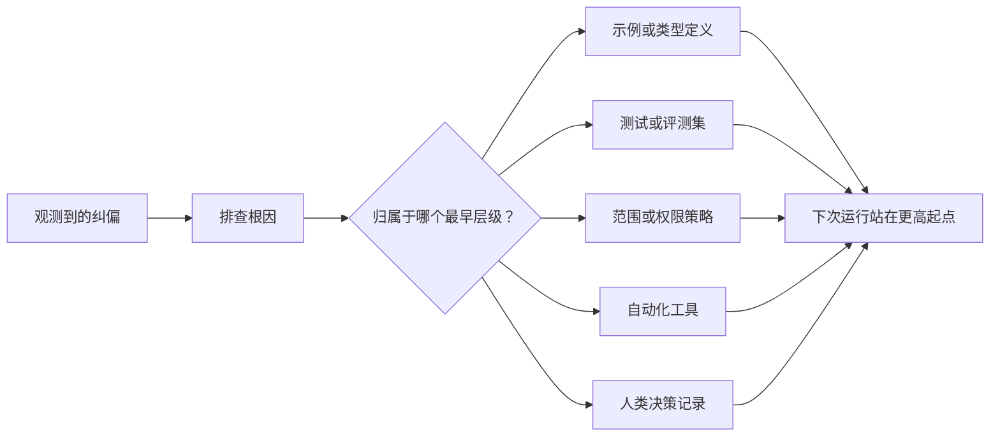

# 将每次代理转换为系统改进

> 仅仅停留在聊天记录中的纠正偏好只能修复当前运行.而沉浸在测试,边界策略,示例或工具中的控制机制,则可以使每次后续运行都变得更好.

**Type:** Learn + Build
**Languages:** Python (stdlib)
**Prerequisites:** Phase 14 第 37 至 41 课
**Time:** ~65 分钟

## 学习目标

- 将针对智能体的临时纠正转变为长期有效的系统控制机制.
- 控制机制将放在最早的层面,以防止问题复发.
- 使用稳定的指纹特征进行重复吸收的训练.
- 及时退役那些不再应对现实风险的旧控制规则.

## 纠偏本身就是宝贵的证据

当你对智能体说不要编辑文件时,你实际上已经发现:现有范围边界 (范围边界) 缺乏可执行的约束.当你指出输出格式错误时,你实际上发现缺乏标准示例或自动化测试.当环境配置再次报错时,你意识到环境初始知识应该沉重在自动化脚本中.

应将智能体的纠正偏好视为对工作系统本身的缺陷的观测洞察,而不是当成写作时的单次语法失误.

## 提升重量到最早的有效级别

遵循以下控制优先级:

| 频发故障类型 | 长效沉淀去处 |
|---|---|
| 错误计算结果或代码回归 | 自动化测试或评测集（Test / Evaluation） |
| 超范围越界或不安全操作 | 范围契约或权限策略（Scope / Permission Policy） |
| 重复出现的环境配置或命令错误 | 自动化脚本或专用工具（Automation / Tool） |
| 重复出现的输出格式错误 | 标准规范示例外加数据校验器（Canonical Example + Validator） |
| 模糊不清的本地工程惯例 | 附带具体场景检查的指令（Instruction + Scenario Check） |
| 产品层面的分歧与争议 | 人类决策记录（Human Decision Record） |

越早有效的控制机制成本越低. 从类型系统层面上,一个类型的定义绝对无效状态,远远比后续代码评审时的批评提醒更坚固;一个针对性的单元测试,也远远比在快速的苦口婆心写一段长篇大论要求智能体牢记更有效.



## 反棘轮记录 (子记录)

完整的记录应包含:

- 故障表象(症状);
- 根因分析 (根因分析)
- 造成的后果;
- 重复出现次数 (重复出现次数)
- 选择控制机制 (选择控制);
- 控制机制的验证方式 (验证);
- 责任人(所有者);
- 审查或退役日期 (复习/退休日期)

只有当问题复发频率或潜在后果严重程度足以证明增加长期维护复杂性的合理性时,才可以将其提升为永久控制机制.

## 区分根因与表现

智能体修改了阅读 只是表现.

- 任务框架允许修改整个代码库根目录;
- 文件被认为总是可以安全编辑的;
- 执行计划将与文件编写捆绑在一起实现功能;
- 两个工作智能体存在重叠文件所有权.

不同的根源对应完全不同的控制手段. 如果只机械地禁止写一条照抄表象,下一次出现类似问题以稍微变化的形式,系统仍然会再次失效.

## 控制规则同样会衰退

旧的控制规则会产生冲突,膨胀下文窗口,并固化那些早已不存在的旧系统包──每条升级的重规则都需要定期退役检查──在以下情况下应决定删除或重写:

- 基础架构已发生变化;
- 现实更强的可执行控制机制将取代它;
- 在相当长的时间窗口内故障从未复发;
- 规则造成的阻碍和摩擦已经超过了它所防范的风险本身.

工程的目标绝不是写出最长的指令文件,而是使用最小化系统机制来保护那些不容易的工程判断力.

## 构建它

本课程的实验程序将对纠正偏差进行分类,将其升级为控制机制,重复项目的生成指纹重重,并将结果记录在内.`outputs/feedback-ratchet.json`,我知道.

运行命令:

```bash
python3 code/main.py
python3 -m unittest discover code/tests -v
```

尝试输入两种表述的不同,但根源于相同的纠正偏差记录.

## 练习

1. 分析并归纳到它们的真正落脚层次.
2. 将散文式文本规则重构为可执行的自动化测试.
3. 增加后果权重 (后果权重) 评估,使严重的高危首发错误也可以立即升级为常设控制.
4. 在实验输出中,每条控制机制的补充负责人与退役时间.
5. 审查现有智能体指令,并证明已经存在更强的控制机制,以此取消其.

## 延伸阅读

- [Basili, Caldiera, and Rombach, The Goal Question Metric Approach](https://www.cs.toronto.edu/~sme/CSC444F/handouts/GQM-paper.pdf)探讨如何将高阶目标转化为可操作的测量指标.
- [Shinn et al., Reflexion](https://arxiv.org/abs/2303.11366)介绍如何利用反追踪提升后续决策质量,而无需微调模型权重
- [Madaan et al., Self-Refine](https://arxiv.org/abs/2303.17651)任务的关闭环节内实施 代式反与自我修改.

## 交付物与沉

请妥善保留生成的`outputs/feedback-ratchet.json`是智能体辅助工程路径的长效果,也是未来进一步发展的核心输入.
