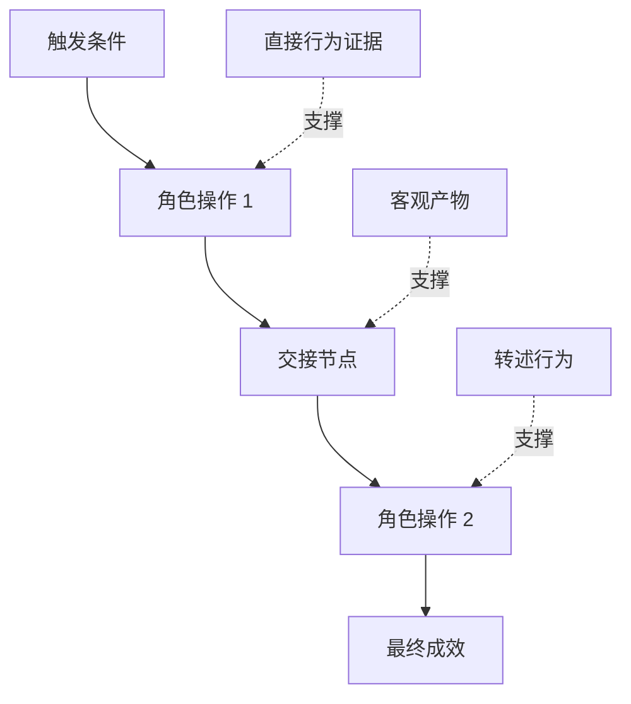

# 发掘人们真正执行的工作流

> 实际需求永远不会老实上坐在会议室里,你来收集它们.

**Type:** Learn + Build
**Languages:** Python (stdlib)
**Prerequisites:** Phase 14 第 47 课
**Time:** ~70 分钟

## 学习目标

- 建立现有工作流程以确定证据支的序列.
- 严格区分直接观察事实与转述或推断行为.
- 定位流程中的摩擦阻力 (摩擦阻力) 摩擦 (摩擦) 交接节点 (交接节点) 交付 (交付) 审批权限 (审批权限) 权威 (权威) 和隐性状态 (隐性状态) 隐性状态 (隐性状态)
- 保持主张的明显可见性,而不轻率直接转变为硬性需求.

## 从现有系统发出

切勿一开始就问用户想要什么功能.

针对工作流中的每一步,记录以下段落:

| 字段 | 示例 |
|---|---|
| 执行角色（Actor） | 值班工程师 |
| 触发条件（Trigger） | 生产环境告警到达 |
| 具体操作（Action） | 打开告警详情，随后在监控看板中搜索 |
| 输入信息（Input） | 告警 Payload 与发布记录 |
| 产出结果（Output） | 疑似故障服务及责任人 |
| 摩擦阻力（Friction） | 在三个不同运维工具之间来回切换上下文 |
| 审批权限（Authority） | 事故指挥官批准执行写入操作 |
| 支撑证据（Evidence） | 屏幕录像、事故复盘日志、运维手册 |

实际工作流程远远比屏幕上看到的界面更广. 它包括等待时间,复制粘贴,线下私聊,审批流程,错误恢复以及人们已经习惯甚至不注意的碎片动作.

## 证据是有强弱的层次

建立简单的证据阶梯:

1. **直接行为（Direct behavior）：**现场观测、系统调用追踪(追踪) 、屏幕录屏或系统事件日志。
2. **客观产物（Artifact）：**工单记录,运维手册,审计日志,表单或完成成果文件.
3. **转述行为（Reported behavior）：**人们口头描述他们通常做什么.
4. **主观推断（Inference）：**团队推断了什么会发生的概率

这四种信息来源有价值,但只有前两种可以直接证实当前的实际行为.



## 重点搜索四大要素

- **摩擦阻力（Friction）：**重复繁劳动"",无需等待延迟"",数据重复录入或繁故障恢复"",
- **隐性状态（Hidden state）：**仅存于员工脑海,即时通讯聊天记录或个人私人笔记中的信息事实.
- **审批权限（Authority）：**有权做出重大决定,
- **异常分支（Exceptions）：**正常流程发生中断,不再按班运行边缘情况.

由于人工智能功能经常在与异常处理时崩,往往是因为最初仅针对一切顺利的理想路径 (快乐路径) 进行设计.

## 切勿通过 求平均 抹杀分歧

两个用户采用截然不同的操作流程,往往有极其合理的理由. 在充分理解其深层成因之前,应完全保留这些分支变体,因为它们可能代表:

- 组织角色和责任不同;
- 不同风险耐受级别;
- 遗留旧流程与当前新流程的交换;
- 专业经验与熟练度的差异;
- 真正的业务策略与管理分歧.

一个被强迫平均折中的工作流,往往无法描述任何一个真实的人.

## 构建它

本课程的实验程序为工作流的每一步记录证据证据,校验执行顺序与信任,计算直接证据占比,并将结果写入`outputs/workflow-evidence.json`,我知道.

运行命令:

```bash
python3 code/main.py
python3 -m unittest discover code/tests -v
```

尝试增加一条部署记录缺失的异常分支路径――保持主流的顺序不变,并清晰记录该分支的起点位置――

## 练习

1. 没有人面试,只需一个系统运行日志,才能完成工作流.
2. 面试一位真实用户,标注其主张中所有内容仍缺乏直接客观证据支的陈述.
3. 增加一处权限审批边界 (权限边界) 和步骤故障恢复流程.
4. 针对同一场景,形成两种不同的流程变体,而不强制它们合并.
5. 找出一个提议的新功能:虽然表面上消除了可见的操作,但完全没有触及后面的隐性工作.

## 延伸阅读

- [Nuseibeh and Easterbrook, Requirements Engineering: A Roadmap](https://www.cs.toronto.edu/~sme/papers/2000/ICSE2000.pdf)特别重点是关于需求获取的深入论述,而不是简单的信息获取.
- [Gotel and Finkelstein, An Analysis of the Requirements Traceability Problem](https://doi.org/10.1109/ICRE.1994.292398)分析维护需求与其源源依据之间的追踪关系的严峻挑战.

## 交付物与沉

请妥善保留生成的`outputs/workflow-evidence.json`在下一节课中,它将所观察到的摩擦阻力与不确定性转化为假设图谱 (假设图)
