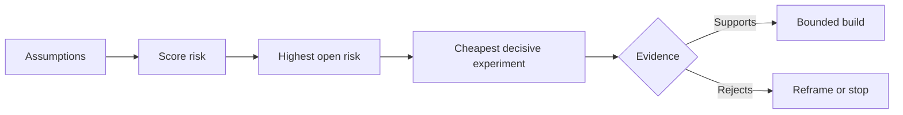

# 理假设并优先化解最高风险

> 产品路线图 (路线图) 往往隐藏在功能列表中不确定性;而假设图谱 (假设图) 则会揭示:在这些功能值得构建之前,必须先证实哪些前提条件是存在的.

**Type:** Learn + Build
**Languages:** Python (stdlib)
**Prerequisites:** Phase 14 lesson 48
**Time:** ~65 minutes

## 学习目标

- 将拟议的工作拆解并转化为明确的假设 (假设).
- 分别对影响程度 影响程度 不确定性 不确定性 不逆转性 不逆转性 进行多维独立评分
- 根据风险排序选择下一个实验,而不是基于主观热情驱动.
- 用实证和确定决策结论代替已测试的假设.

## 每次建构都是一个投注.

一套故障排查工具 (故障排查工具) 的价值,可能取决于下列每项前置假设是否全部成立:

- 警报上下文包含足够的信息,以识别故障服务;
- 工程师信任他们并非亲自推得出的推结果;
- 预期响应时间在运营层面确实至关重要;
- 根据不引入不安全权限的前提下可访问所需数据;
- 工作流发生频率足够高,可以证明维护系统的成本是合理的.

这些都不是单纯的代码实现任务,而是让构建变得有价值的,可用的,可行的,可行的,可行的,安全的前提条件.

## 假设的类别

| 类别 | 核心问题 |
|---|---|
| 价值（Value） | 产出的最终结果是否足够重要？ |
| 可用性（Usability） | 用户能否理解并据此采取行动？ |
| 可行性（Feasibility） | 现有系统能否利用可获取的数据和约束产出该结果？ |
| 存续性（Viability） | 组织能否长期承受其成本、归属权与运维负担？ |
| 安全性（Safety） | 系统出现故障时是否不会造成无法接受的后果？ |

将假设写成可证伪的陈述. 假设是通过推翻逻辑上可以被明确的观测事实所推断的假设. 假设是非常有用的,无法被测试的.

## 风险并非单一维度的数字

这项实验从1到5分钟内评估了三个维度:

- **影响（Impact）：**如果假设不成立,对系统或业务造成的破坏程度.
- **不确定性（Uncertainty）：**据了解,目前证据的薄弱程度.
- **不可逆性（Irreversibility）：**在做出重大承诺或投入后才发现错误的回报成本.

例子评分将影响不确定性,再加上不可逆性.



## 设计实验而不是确认仪式

一个真正有价值的实验具有以下因素:

- 一个可能被伪证的主张;
- 实际受众群体或具有代表性的采样;
- 一个可观测的客观结果;
- 在看到结果前就预先确定评判值;
- 针对通过失败和模糊证据,各自明确下一步决策路径.

避免设计的只是为了证明团队有能力把这个想法做出来的确认仪式式测试.

## 可逆性会改变构建顺序

后果严重且不可逆的选择需要更早获得证据支持. 仅阅读重放 (只阅读重播) 应先进行生产环境集成; 临时适配器可以先进行大规模数据迁移; 经过人工审批的建议应先进行全自动执行.

系统构建的推进节奏应与不确定性化解的节奏保持一致.

## 动手实现

本实验对假设进行排序,区分已验证和未决断言,挑选风险最高的未决假设,并生成`outputs/assumption-map.json`,我知道.

```bash
python3 code/main.py
python3 -m unittest discover code/tests -v
```

修改最高风险假设的证据状态,观察系统推的下一个实验将如何动态调整――

## 课后练习

1. 为你准备构建一个功能写出五个关键假设.
2. 补充一条你原本的功能列表中遗漏的安全假设──
3. 设定一个让你决定终止这个构建的硬性值.
4. 换成一个原本庞大的验证实验,以更低成本且具有决定性测试.
5. 对于风险优先级与原产品路线图优先级,并解释为什么存在错误的原因.

## 延伸阅读

- [Barry Boehm, A Spiral Model of Software Development and Enhancement](https://dl.acm.org/doi/10.1145/12944.12948)探讨更深层次的投入前的风险驱动发展循环.
- [Dardenne, van Lamsweerde, and Fickas, Goal-Directed Requirements Acquisition](https://doi.org/10.1016/0167-6423(93)分析系统目标,同时探讨逐步暴露障碍和约束.

## 交付物沉

留下`outputs/assumption-map.json`△下一节课程将借助该文件选择能够产生决定性证据的最小片段.
