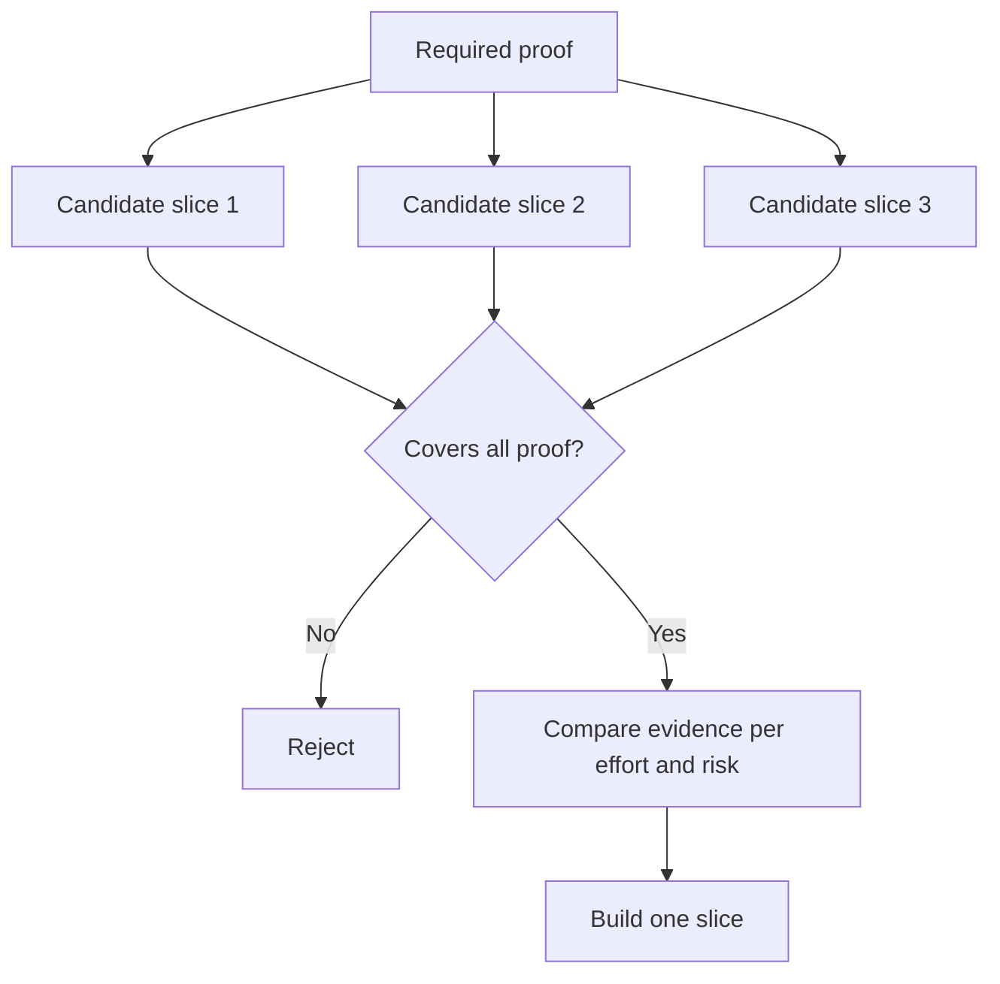

# 选择能改变决策的最小片段

> 只有当小小能证明关键问题时,精简才具有价值――一个无法改变下一步决策的小构建,充满其量只是一个半成品――

**Type:** Learn + Build
**Languages:** Python (stdlib)
**Prerequisites:** Phase 14 lesson 49
**Time:** ~65 minutes

## 学习目标

- 根据切片所能证明的核心假设来定义切片 (切片) 
- 权衡结果价值 (值) 无确定性化解,研发投入与潜在后果――
- 优先选择可逆的实证证据,而不是过早生育环境承诺.
- 决策否决那些刻意避免工作流高风险环节的伪切片

## 垂直切片意味着端到端的实证

垂直切片 (垂直切片) 是跨越观测某个结果所需的最小真实工作流.它在用户数量,数据规模,运行周期和功能范围方面可以非常狭窄,但绝不能为了偷而除你恰恰需要测试的核心不确定性.

示例:

- 基于10起真实故障的仅读重放,能够检查服务识别准确性和操作员的信任性.
- 基于合成数据的精致仪表盘,可能可以检查界面理解度,但完全无法检测获取数据的可行性.
- 试图一次性测试所有环节,但带来了无法承受的巨大破坏风险.

## 预确必要证据集

提取风险最高的未决假设,将其转化为必需证据集 (需证据集) ──候选片只在完全覆盖该证据集时才有入选资格 (合格) ──

随后,通过的片段进行了比较评估:

| 评估维度 | 期望方向 |
|---|---|
| 产出价值（Outcome value） | 越大越好 |
| 化解的不确定性（Uncertainty reduced） | 越多越好 |
| 研发投入（Effort） | 越小越好 |
| 潜在后果（Consequence） | 越轻越好 |
| 可逆性（Reversibility） | 越高越好 |

由于资格准入门 (资格入门) 比数字运算本身更重要.



## 常见的伪极小值陷

- **纯界面极小值（UI-only minimum）：**避免了最关键的数据获取和运维不确定性.
- **纯基础设施极小值（Infrastructure-only minimum）：**证明技术可行性,但无法检查用户价值.
- **纯顺境极小值（Happy-path minimum）：**意图省略构成大部分风险的异常边界处理.
- **演示极小值（Demo minimum）：**产出了极具说服力的演示产品,但无法提供可复制的量化评估.
- **平台化极小值（Platform minimum）：**在单个工作流尚未证实其价值之前,

## 预先设定停止规则

在开始实现之前,必须提前书面写明如果该片测试失败将采取的对策:

- 放弃该预期结果;
- 改变目标用户群体或业务场景;
- 测试替代技术机制;
- 收集更高质量的底层证据;
- 进一步缩小系统的执行权限

如果每种测试结果最终都向继续构建,那么这片根本不是一个真正的实验.

## 动手实现

本实验根据必要证据进行评分,并输出`outputs/slice-decision.json`,我知道.

```bash
python3 code/main.py
python3 -m unittest discover code/tests -v
```

尝试增加一个成本较低的候选片,但只能验证单项必要假设的候选片.

## 课后练习

1. 针对相同的预期成果,设计三个应对不同后果风险等级的验证片.
2. 在评分前,清晰列出其必要证据.
3. 尝试删除一个功能,同时确保能够保留关键决定性证据.
4. 为试点方案补充一条切实可行的停止规则
5. 找出应延迟切片验证后重新启动通用平台组件的原因.

## 延伸阅读

- [Barry Boehm, A Spiral Model of Software Development and Enhancement](https://dl.acm.org/doi/10.1145/12944.12948)探讨如何使每个发展周期与当前必须解决的风险相匹配.
- [Lenarduzzi and Taibi, MVP Explained: A Systematic Mapping Study on the Definitions of Minimal Viable Product](https://arxiv.org/abs/1609.07592)分析软件工程实践中对最小与可行的定义模糊性

## 交付物沉

留下`outputs/slice-decision.json`△文件记录了这一片的原因,是根据证据能够改变决策的最小片的原因.
