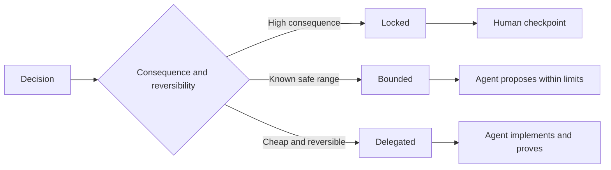

# 编写保留自主裁决权的任务规范

> 值观规范应与验证证实保持固定,同时对可逆实现选择保持开放.

**Type:** Learn + Build
**Languages:** Python (stdlib)
**Prerequisites:** Phase 14 lesson 50
**Time:** ~75 minutes

## 学习目标

- 将预期产出、不变量(变量) 范例、非目标(非目标) 与验证证清晰分层――
- 将决策划分为锁定 锁定 受限 绑定 委托 委托 委托 三种模式
- 在选择成本低且可逆的环节中,充分保留代理人的自主裁决权.
- 在涉及严重后果或破坏公共行为的节点,强制设置人工审核检查点 (Human Checkpoints).

## 两种糟糕的极端

规范不足 (未指定) 的任务迫使代理人 凭空猜测系统行为;而过度规范 (过度规范) 的任务则让代理人 机械照抄可能本身存在缺陷的具体设计.

经营有效的折扣方案是**可执行契约（Executable Contract）**其他:

| 规范要素 | 核心作用 |
|---|---|
| 预期产出（Outcome） | 可直接观测的最终交付结果 |
| 不变量（Invariants） | 必须始终严格成立的前置与后置约束 |
| 范例（Examples） | 能够直观展现真实意图的具体用例 |
| 非目标（Non-goals） | 明确刻意排除在外的周边行为 |
| 决策策略（Decision policy） | 标明哪些选择属于锁定、受限或完全委派 |
| 验证证据（Proof） | 任务验收前必须提供的测试或观测实据 |

## 三种决策模式

- **锁定（Locked）：**严禁代理 擅自选择――适用于公共兼容性,写权,安全红线,不可逆成本或核心产品承诺――
- **受限（Bounded）：**允许代理在明确的安全区内自主选择.适用于搜索预算,重试次数上限,白名单依赖库或既定接口族.
- **委派（Delegated）：**授权代理 全权裁量并附解释说明――适用于局部代码结构、命名规范、可逆重构及内部实现细节――



## 通过具体范例界定行为

通过具体例例传递意图,远远比堆形容词高效多. 友好的、健壮的、生产的都不是可执行的标准. 一组精炼的常规例例,边缘例,故障例和严禁例,能够为开发人员和校验器提供明确的依据.

范例不能替代不变量:单次通过成功例,不能证明通用全局安全规则得到保证.

## 验证证必须符合声明级别

- 单元测试 (单元测试) 用于证明局部函数契约.
- 传输协议测试 (Wire Test) 用于证明序列化与网络通信行为.
- 浏览器旅程 (浏览器旅程) 用于证明端到端的用户界面路径.
- 重放测试集(反弹集) 用于证明系统在代表性场景中的整体表现.
- 审计日志 审计日志 用于证明系统权限边界始终生效.

绝对不要把低层次的考试作为高层声明的验证.

## 刻意保留合理的未知的空间

规范可以明确声明: 具体实现可选满足时间延长预算的任意读取数据源.

随着认知证的积累,规范应与时俱进.记录锁定与限制选择背后的底层原因,后者团队才能在无需代码考古的情况下清晰调整决策.

## 动手实现

实验规范协议的每一个维度,检查决策模式的合法性,并产生`outputs/executable-specification.json`,我知道.

```bash
python3 code/main.py
python3 -m unittest discover code/tests -v
```

试图将生产环境写权从锁定调整为委派──分析为什么数据方案能够通过校验,而产品层面风险控制却决不允许这种变化──

## 课后练习

1. 转换一个遗留的待工单为规范契约的六大维度.
2. 用一个不变量规则加两个典型范例,替换掉三条繁的指令描述.
3. 标记任务中的每项决策,并为每一个被锁定或限制的选择说明说明理由.
4. 为规范中的每条不变量补充应对证据证据.
5. 找出既无实证支又不论根据的冗余约束并将其删除.

## 延伸阅读

- [Nuseibeh and Easterbrook, Requirements Engineering: A Roadmap](https://www.cs.toronto.edu/~sme/papers/2000/ICSE2000.pdf)论述目标,精确规范,验证,共识演进之间的系统关系.
- [Zave and Jackson, Four Dark Corners of Requirements Engineering](https://doi.org/10.1145/237432.237434)系统需求与技术规范的本质区别.
- [Gotel and Finkelstein, An Analysis of the Requirements Traceability Problem](https://doi.org/10.1109/ICRE.1994.292398)探讨如何保留需求的原因及其可追溯性.

## 交付物沉

留下`outputs/executable-specification.json`将成为编码代理与人类评审人员共同遵循的协作协议.
