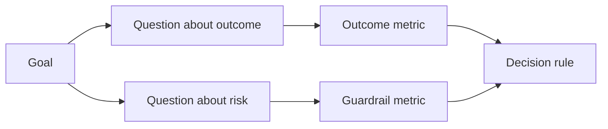

# 在结果产生前设计成功指标

> 量标应服务于行动决策,而不是仅仅作为仪表盘的装饰.

**Type:** Learn + Build
**Languages:** Python (stdlib)
**Prerequisites:** Phase 14 lessons 47 and 51
**Time:** ~70 minutes

## 学习目标

- 从预期成果目标推出核心问题和度量指标.
- 在观测到实际结果之前,先确定值,时间窗口,数据来源和优化方向.
- 产出标志与护标志 护标志及制衡标志 计量标志 结对设计
- 评估证据与本次建设所需的具体决策相匹配.

## 目标、问题与标志 (GQM)

从目标 (目标) 出发:

> 缩短定位受影响服务所需时间,同时不增加任何不安全操作.

推导出问题:

- 定位正确服务速度快吗?
- 定位服务准确率高吗?
- 诊断过程是否始终保持纯粹的阅读?
- 工作流程是否导致警报经常被忽视或增加操作员负担?

随后挑选将这些问题操作化 (操作化) 的指标 (测量) 



## 每个指标都需要规范协议

每个标志都必须具备:

| 契约字段 | 示例 |
|---|---|
| 指标名称（Name） | `median_identification_seconds` |
| 方向（Direction） | 至多不超过（at most） |
| 阈值（Threshold） | 120 |
| 窗口（Window） | 10 次故障事件重放 |
| 数据源（Source） | 重放事件日志 |
| 统计样本（Population） | 参与试点的在岗工程师 |
| 类别（Kind） | 成果指标（outcome）或护栏指标（guardrail） |

如果缺少数据来源和统计窗口,任何数字都无法复制;如果缺少预设值,指标就无法驱动明确的决策.

## 成果指标,护指标和衡量指标

- **成果指标（Outcome metric）：**期望改善的情况是否真的升级?
- **护栏指标（Guardrail）：**固定的安全红线与约束条件是否始终遵守?
- **制衡指标（Counter-metric）：**局部优化将转移到其他环节的隐性成本或破坏?

对于故障排查工作流,光速是不够的.准确率,生产写作操作拦截率,操作员工作负荷和警报遗漏率,共同构成防止快速得出灾难性错误结论的安全屏障.

## 离线证据与在线证据

离线重放 (离线重放) 非常适合检验可复现性与边缘场景覆盖率;受控试点 (受控试点) 绑定飞行员)则擅长检验真实人类行为、信任建立与工作流上下游影响──二者互补,不可替代──

始终选择能够支当前决策的最低成本证据――绝不能仅仅因为代码已经写得好 对于贸易而言,真实用户将暴露于未知风险――

## 首先是量度决策

在看到统计结果之前,必须先书面确定通过失败和模糊场景下的行动路径.否则,团队很容易通过临时修改值来实现现有的建设成果.

示例规则:

- 通过:服务定位准确率不低于0.9,定位耗时中位数不超过120秒;
- 失败:出现任何非法生产写作操作,或定位准确率低于0.75;
- 模糊:虽然性能有所提升,但差异极大,需要扩大重复测试.

## 动手实现

本实验中,测量计划的完整性,评估包括边界值,记录缺失指标,并输出`outputs/measurement-report.json`,我知道.

```bash
python3 code/main.py
python3 -m unittest discover code/tests -v
```

试图删除测量计划中的护指标,观察为什么即使结果指标仍然存在,整个计划仍然会被系统定为非法.

## 课后练习

1. 根据一个目标,推出了三个重点问题.
2. 补充一条能够捕获其他角色负担加重的衡量指标,因为目前的优化导致了重.
3. 为了每个标志,确定其数据源,统计样本群和时间窗口.
4. 在生成实际数值之前,预先写下通过,失败和模糊三种情况的决策.
5. 找到一个容易统计的,但根本无法改变任何决策的边指标,并将其除.

## 延伸阅读

- [Basili, Software Modeling and Measurement: The Goal/Question/Metric Paradigm](https://drum.lib.umd.edu/items/8119803a-362b-42ec-b6ce-2311713e7236)介绍如何从明确的目标推出可执行的量度体系 (GQM范式) :"
- [Basili, Caldiera, and Rombach, The Goal Question Metric Approach](https://www.cs.toronto.edu/~sme/CSC444F/handouts/GQM-paper.pdf)解释将该方法作为一个关闭反与持续改进系统的实践.

## 交付物沉

留下`outputs/measurement-report.json`△它将成为原型的试点 试点 试点 试点 试点 试点 试点 试点 试点 试点 试点 试点 试点 试点 试点 试点 试点 试点 试点 试点 试点 试点 试点 试点 试点 试点 试点 试点 试点 试点 试点 试点 试点 试点 试点 试点 试点 试点 试点 试点 试点 试点 试点 试点 试点 试点 试点 试点 试点 试点 试点 试点 试点 试点 试点 试点 试点 试点 试点 试点 试点 试点 试点 试点 试点 试点 试点 试点 试点 试点 试点 试点 试点 试点 试点 试点 试点 试点 试点 试点 试点 试点 试点 试点 试点 试点 试点 试点 试点 试点 试点 试点 试点 试点 试点 试点 试点 试点 试点 试点 试点 试点 试点 试点 试点 试点 试点 试点 试点 试点 试点 试点 试点 试点 试点 试点 试点 试点 试点 试点 试点 试点 试点 试点 试点 试点 试点 试点 试点 试点 试点 试点 试点 试点 试点 试点 试点 试点 试点 试点 试点 试点 试点 试点 试点 试点 试点 试点 试点 试点 试点 试点 试点 试点 试点 试点 试点 试点 试点 试点 试点 试点 试点 试点 试点 试点 试点 试
