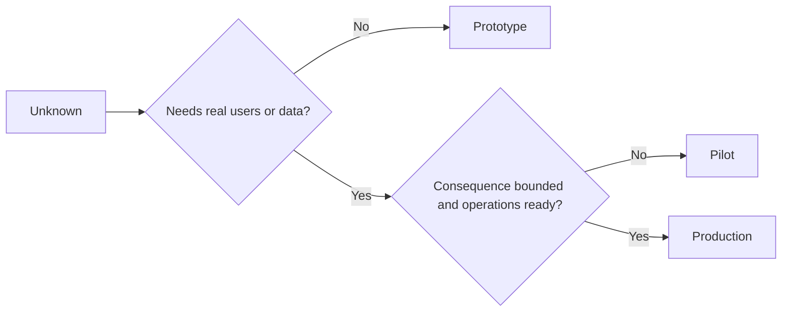

# 审慎选择原型、试点还是生产

> 它们代表着截然不同的认知环境,而不是纯粹的精度差异.

**Type:** Learn + Build
**Languages:** Python (stdlib)
**Prerequisites:** Phase 14 lessons 50 to 52
**Time:** ~70 minutes

## 学习目标

- 根据未知类型,受众范围,数据敏感性,破坏后果和运维成熟度,审慎选择构建阶段.
- 制定各阶段专属的管控措施 (控制) 和退出准则 (退出标准)
- 防止原型系统在无人责任的情况下转化为生产系统.
- 在证据和运维保障充分就绪之前,推迟授予系统真正的生产权.

## 三个截然不同的核心问题

| 阶段 | 核心问题 |
|---|---|
| 原型（Prototype） | 该技术机制到底能不能产生预期的实证结果？ |
| 试点（Pilot） | 在受控真实受众与真实工况下，它能否安全稳定运行？ |
| 生产（Production） | 组织能否按照既定的可靠性与风险承诺，持续对该系统承担长期责任？ |

一个技术上极为完善的原型仍然可以被设计为后期废弃物;一个试点可以使用实际生产数据,但其受众规模和操作权限必须受到严格限制;只有当组织正式接盘并承担长效责任时,生产阶段才真正开始.

## 原型阶段

当需要解答的未知假设无需引入真实用户或真实生产数据时,采用原型阶段――保持原型:

- 随时可废弃;
- 严格隔离;
- 功能边界狭窄 (狭窄);
- 核心验证问题显式明确 (明确说明学习问题);
- 没有假的运维稳定性承诺.

在机制本身尚未证明它值得进入下一阶段之前,不要过早优化整个系统架构.

## 试点阶段

假设必须依赖于真实操作行为,真实数据或真实工作流才能检查,但破坏后果或运维成熟度还不足以支全面发布时,采用试点阶段.

一个合格试点必须具备:

- 确定试点受众;
- 明确的人类负责人;
- 严格限制运行周期和操作权限;
- 审计追溯与快速回滚方案;
- 成果指标与护指标价值
- 明确针对扩容,修改或彻底终止退出准则

## 生产阶段

生产阶段绝对不仅等于将代码完成部署:

- 明确的服务等级目标(SLO);
- 值班排班与故障事件处理责任人;
- 安全与隐私专项审查;
- 成本上限和吞吐容量管控;
- 完整的回滚与容量恢复机制;
- 七小时24小时全天候监控;
- 清晰的退役与下线路径──



## 阶段漂移陷

当原型代码在未建立长效运维责任制的情况下, 获得真实用户"",敏感数据"或核心操作权限时,就会变得极其危险.**阶段漂移（Stage Drift）**△必须在系统配置,权限控制,遥测标标以及架构文档中强制划定原型和试点的硬性边界 单纯挂在界面上测试版警告横幅是远远不够的

系统处的阶段应能够直接在系统运行状态中被观测和验证.

## 动手实现

根据决策下文自动推合适阶段,回归各阶段所需的必要管理措施,并输出`outputs/stage-decisions.json`,我知道.

```bash
python3 code/main.py
python3 -m unittest discover code/tests -v
```

试点示例修改为低破坏后果且具有运维成熟性──思考并解释还需要补充一些认知证据,才能证明它能够正式晋级生产阶段──

## 课后练习

1. 根据认知探索阶段 (而不是单纯的代码部署状态),将你头上的三个现有项目重新归类.
2. 编写一个包含决策终止决策选项的试点退出准则.
3. 增加技术控制措施,从根本上防止原始代码接触生产环境数据.
4. 找出第一个标志着系统真正转变为生产级责任的运维责任.
5. 为受限试点设计一套完整的回滚操作凭证.

## 延伸阅读

- [Barry Boehm, A Spiral Model of Software Development and Enhancement](https://dl.acm.org/doi/10.1145/12944.12948)探讨如何使每代资源投入与已解答的风险程度相匹配.
- [Fagerholm et al., Building Blocks for Continuous Experimentation](https://doi.org/10.1145/2601248.2601276)分析,持续开展工程实验所需的组织流程和技术前提.

## 交付物沉

留下`outputs/stage-decisions.json`记录了为什么选择各阶段的论证理由以及在进入下一阶段之前必须实施的各种管理措施.
