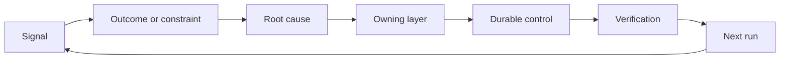

# 构建归属退役机制的反棘轮

> 代码发布结束了当前的构建循环,同时开启了长期的学习循环.

**Type:** Learn + Build
**Languages:** Python (stdlib)
**Prerequisites:** Phase 14 lessons 46 and 53
**Time:** ~75 minutes

## 学习目标

- 将故障事件,评测数据,用户行为和纠错转化为具有责任归属性的行动项.
- 将不同信号精准路由至下文,评测集,安全策略,运行时间或需要的待遇.
- 根据重度和复现频率进行重发风险优先排序.
- 为每一个系统控制机制设定明确退役条件 (退休条件)

## 反本身也是基础设施

一个团队可以收集大量的系统链接追踪 (痕) 评测记录,支持工单和故障日志,但完全没有从中汲取任何认知教训.**晋级通道（Promotion）**证据的持久化系统的变化,

棘轮反轮反轮的关闭环节是:

1. 观测到具体实测信号;
2. 关联到预期产出结果,约束条件或预置假设;
3. 识别对诱因承担归属责任的最底层系统层次;
4. 实施受控的持续改进;
5. 验证该故障复发的概率已切实降低;
6. 定期审查该控制机制是否应继续保留.

## 精准路由至应对责任层次

| 信号类型 | 归属目的地 |
|---|---|
| 误报、功能倒退、错误输出结果 | 评测集（Evaluation）或自动化测试 |
| 上下文缺失、重复劳动、过时事实 | 上下文数据源或检索路由策略 |
| 不安全操作或越权漏洞 | 安全策略（Policy）或权限硬边界 |
| 超时、重试风暴、依赖服务不可用 | 运行时控制（Runtime Control） |
| 新的产品需求或尚未决断的权衡取舍 | 经过规范成型（Shaped）的待办项 |

在能够从根本上解决问题的最底层进行修复时,当自动化测试或硬性权限足以使错误完全无法发生时,绝不要在 Prompt 中再添加一个提示词.



## 责任归属本身就是控制机制的一部分

每个轮流行动项目必须明确:

- 唯一的人类责任人 (唯一的人类责任人)
- 基于破坏后果和复发频率综合评价的优先级;
- 拟修改的目标系统组件(艺术品);
- 证明修改实效的验证方案;
- 复审或自动失效窗口;
- 明确的退役条件

没有人知道的所谓的改进方案,充满其量只是一个排版的小观观观废话.

## 断退役过时的控制机制

对于沉重系统的不断积累策略和控制项,这些规则可能会变得相互矛盾且成本高昂.

- 系统架构或业务工作流发生了根本性的变化;
- 底层的不变量机制已经彻底取代了上层的文字指示;
- 在预设的时间窗口内,被防范故障从未再次出现;
- 控制规则阻碍正常业务推进的频率,已经超过了其防范危害带来的收益.

退役控制项也需要实证支,绝不能仅仅因为看起来年过久就随手删除

## 打通产品构建与编码代理的反关闭环

同一个棘手轮机制可以同时服务于产品业务和智能体研发的两条轨道:

- 产品业务实证驱动预期产出框架"",假设图谱"",最小切片或量度计划的发展;
- 编码代理的运行纠正或驱动自动化测试,上下文加载,操作作用域,自动化脚本或交通信机制的优化;
- 线上真实故障既能促成产品功能边界调整,也能推动代理工作台的加强.

这也是为什么任务框架的理念绝对不是编码前宣告结束阶段,

## 动手实现

本实验对实测信号进行分类,创建附带责任归属的棘轮行动项目,按优先级排序,并输出`outputs/feedback-backlog.json`,我知道.

```bash
python3 code/main.py
python3 -m unittest discover code/tests -v
```

尝试添加一个运行时超时信号,验证它将正确通过运行时控制层,而不是泛化混入通用需求待定列表.

## 课后练习

1. 随着近期故障和一个用户真实投诉,分别转化为具体的棘轮行动项目.
2. 明能够从根本上防止其再次复发的最底层系统层次.
3. 为实验输出的行动项补充实实行自动化验证命令或观测指标.
4. 为一个现有的安全策略规则制定明确退役条件.
5. 系统接受的纠正偏好训练,反向追踪并融入下一个任务框架中.

## 延伸阅读

- [Basili, Caldiera, and Rombach, The Goal Question Metric Approach](https://www.cs.toronto.edu/~sme/CSC444F/handouts/GQM-paper.pdf)探讨如何通过目标导向的测量机制实现组织层面的持续认知沉重性.
- [Fagerholm et al., Building Blocks for Continuous Experimentation](https://doi.org/10.1145/2601248.2601276)分析将实证实与产品的持续研发与技术与组织的联系.
- [Nuseibeh and Easterbrook, Requirements Engineering: A Roadmap](https://www.cs.toronto.edu/~sme/papers/2000/ICSE2000.pdf)解释将需求视为整个系统生命周期动态发展的工程视角.

## 交付物沉

留下`outputs/feedback-backlog.json`是产品判断力与交付 (产品判断和交付) 学习路径的收束产品,也开启下一个预期产出框架的输入起点.
