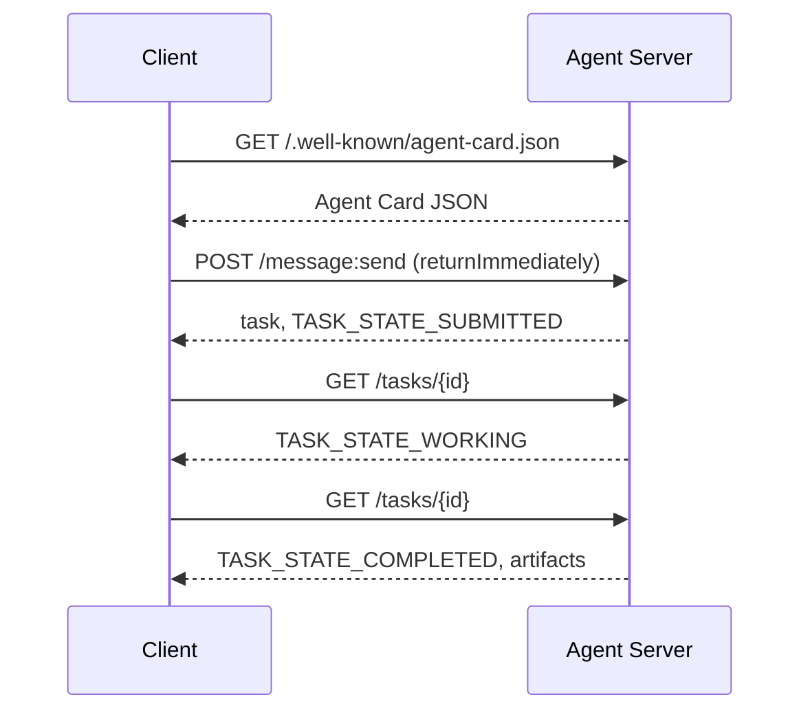

# 智能体间通信协议 (A2A )

> 谷歌于2025年4月发布A2A;到2026年4月,官方规范已发展到1.0.1,并获得包括AWS,微软,销售力量等150多个机构的支持.A2A是MCP的横向互补协议:MCP聚焦横向 (MCP聚焦横向) 代理工具,而A2A聚焦横向点对点 (MCP聚焦横向点对点) 代理.它定义了代理卡 (Agent Card) 用于发现 (携带) 产品文本,结构化数据多模多媒体) 的任务,不透明任务生命周期以及重认证机制.在级别系统中,MCP和A2A的生产日益广泛使用.

**Type:** Learn + Build
**Languages:** Python (stdlib, `http.server`, `json`)
**Prerequisites:** Phase 16 · 04（原语模型）
**Time:** ~75 分钟

## 问题背景

当你的代理需要调用在另一个系统或组织中的代理时,应该如何通信?你肯定可以暴露一个专有的HTTP端点,定义定制JSON方案,并期望对方能够按照你的规则调用.

通过A2A,该跨系统调用提供了通用线路协议 (Wire Protocol). 它定义了标准服务发现,标准任务抽象,标准传输绑定以及标准输出产品,如为智能体定制的HTTP+REST基础架构.

## 核心概念

### 四大核心因素

**Agent Card（智能体名片）。**存储在`/.well-known/agent-card.json`编辑:JSON 文档,用于全面描述代理:名称、技能、`supportedInterfaces`默认输入和输出媒体类型以及识别权要求`securitySchemes`与`securityRequirements`通过读取名片完成动态发现.

```http
GET /.well-known/agent-card.json HTTP/1.1
Host: agent.example.com
```

```json
{
  "name": "code-review-agent",
  "description": "审查 Python 与 TypeScript 代码。",
  "version": "1.0.0",
  "supportedInterfaces": [
    {
      "url": "https://agent.example.com",
      "protocolBinding": "HTTP+JSON",
      "protocolVersion": "1.0"
    }
  ],
  "capabilities": {"streaming": false, "pushNotifications": false},
  "securitySchemes": {
    "bearer": {"httpAuthSecurityScheme": {"scheme": "Bearer"}}
  },
  "securityRequirements": [{"schemes": {"bearer": {"list": []}}}],
  "defaultInputModes": ["text/plain", "application/json"],
  "defaultOutputModes": ["application/json"],
  "skills": [
    {
      "id": "review-python",
      "name": "审查 Python 代码",
      "description": "审查传入的 Python 源码并给出改进建议。",
      "tags": ["code-review", "python"]
    },
    {
      "id": "review-typescript",
      "name": "审查 TypeScript 代码",
      "description": "审查传入的 TypeScript 源码并给出类型与逻辑改进建议。",
      "tags": ["code-review", "typescript"]
    }
  ]
}
```

**Task（任务）。**基本工作委托单元――一个具有生命周期的异步有状态对象:`TASK_STATE_SUBMITTED`其他`TASK_STATE_WORKING`其他`TASK_STATE_COMPLETED`现在,`TASK_STATE_FAILED`现在,`TASK_STATE_CANCELED`客户端发送消息,服务器创建任务,然后客户端通过轮询或流式订阅获取更新.

**Artifact（产物）。**执行完毕产出的结构化结果――支持文本、结构化 JSON、图像、视频、音频等多种形式的媒体――艺术品是严格的类型化:每个部分 携带`text`,我知道.`raw`,我知道.`url`或`data`之一并可指明其`mediaType`,我知道.

**不透明生命周期（Opaque Lifecycle）。**客户只观察状态转换与最终产品;被调用方完全自由选择任何底层模型和框架――

###  MCP 与 A2A 的分工

- **MCP**机器人 工具――机器人 借助 JSON-RPC 读写工具 服务器,核心完全无状态――
- **A2A**代理 代理 应等协作协议,通信双方均具有独立推理能力的完整智能体.

在生产多智能体系统中,两者协同运转:A2A对端在自己侧调用本地配置的MCP工具.

### 发现与调用时序



上述路径遵循HTTP+JSON 绑定规范,并且每个请求均携带`A2A-Version: 1.0`默认情况下请头`SendMessage`由于任务结束, 客户的轮询模式 设置`configuration.returnImmediately`为了立即完成任务对象.

对于流式传输:`POST /message:stream`返回服务器发送事件首先输出`task`随后陆续推送`statusUpdate`与`artifactUpdate`事件),而`/tasks/{id}:subscribe`则用于重新添加到运行中的任务.`final`标志:

### 身份认证与安全 (Author)

支持三种主要安全模式:

- **Bearer Token**标签:OAuth2 或不透明`httpAuthSecurityScheme`或`oauth2SecurityScheme`
- **mTLS**双向TLS认证,组织间强证身份(`mtlsSecurityScheme`
- **API Key**:位于请求头、URL 查询参数或 Cookie 中的密钥(`apiKeySecurityScheme`

认证规则在代理卡中公布:`securitySchemes`命名方案,`securityRequirements`规定调用方必须满足要求.

```figure
sw-agent-card-discovery
```

## 动手实践

`code/main.py`基于A2A 1.0 HTTP+JSON 绑定协议,纯使用Python 标准库`http.server`与`json`实现了极简的A2A服务器与客户端.

- 暴露`/.well-known/agent-card.json`其他
- 接受`POST /message:send`调用;
- 管理任务 状态机转换;
- 在`GET /tasks/{id}`上回归产品.

客户端功能包括:

- 拉取并解析代理卡;
- 发送带有`returnImmediately`消息创建任务;
- 持续询问直至任务完成;
- 读取并验证最终文物──

运行命令:

```bash
python3 code/main.py
```

脚本将在后台线程中启动服务器,然后由客户端调整其发起完整流程,直观展示发现,提交,轮询和获取产品的整个过程.

## 交付物品

本课交付 `outputs/skill-a2a-integrator.md`用于规划完整的A2A集成方案:代理卡内容,任务,校验契约,权限选项,流式和轮询策略.

## 核心专业术语

| 术语 | 规范定义 |
|------|---------|
| A2A | 跨系统异构智能体间互相调用的对等开放协议 |
| Agent Card | 暴露于 `/.well-known/agent-card.json` 的元数据卡片，声明技能、端点与鉴权要求 |
| Task | 具备明确生命周期、完成时生成产物的异步工作单元 |
| Artifact | 任务产出的具名、带类型结果（文本、结构化 JSON、音视频媒体等） |
| 不透明生命周期 (Opaque lifecycle) | 内部解决过程对调用方隐藏，仅对外暴露状态流转与产物 |
| 服务发现 (Discovery) | 通过发起 `GET /.well-known/agent-card.json` 获取名片并了解支持能力 |
| MCP 对比 A2A | MCP 属于垂直的 Agent 与工具交互，A2A 属于水平的 Agent 间对等协作 |

## 延伸阅读

- [A2A 规范主站](https://a2a-protocol.org/latest/specification/) 官方权威规范
- [A2A v1.0.1 源码发布](https://github.com/a2aproject/A2A/tree/v1.0.1) 本课程遵循的代码契约与规范定义
- [Google Developers Blog — A2A 发布说明](https://developers.googleblog.com/en/a2a-a-new-era-of-agent-interoperability/) 官方设计背景
