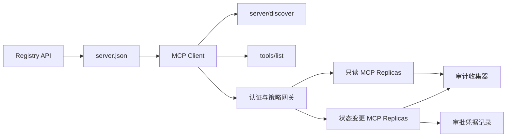

# 综合实战项目13:带登记与管理无状态MCP服务器

> 生产级MCP绝不是单一简单的服务器进程――它是一个整套协议链条:可发布的元数据、实时服务发现、无状态请求包裹、身份认证和授权、细分度策略决策、审计证书以及部署证书――

**Type:** Capstone
**Languages:** Python 与 TypeScript 参考模型；支持任何生产级编程语言
**Prerequisites:** Phase 11, Phase 13, Phase 14, Phase 17 与 Phase 18
**必修 MCP 进阶课：** [Lesson 28: Tool Contracts](../../../13-tools-and-protocols/28-mcp-tool-contracts-and-content/docs/en.md)现在[Lesson 29: 可靠性与流控](../../../13-tools-and-protocols/29-mcp-reliability-cancellation-and-flow-control/docs/en.md)现在[Lesson 30: Registry 供应链](../../../13-tools-and-protocols/30-mcp-registry-supply-chain-and-drift/docs/en.md)及[Lesson 31: 一致性工程](../../../13-tools-and-protocols/31-mcp-conformance-versioning-and-operations/docs/en.md)
**目标协议规范：**股`2026-07-28`
**Time:** ~25 小时

## 学习目标

- 实现合规的无状态MCP 请求与结果包
- 查看现实时间协议与运行时的数据.
- 构建具有确定性排序和缓存感知工具发现体系.
- 对于每一个工具 调用强制执行签发者 发行商 受众 观众 作用域 范围 审批策略
- 部署无会议 亲和性绑定的流媒体HTTP集群──
- 在网络线路,授权,策略,注册和审计边界提供完整的工程证据.

## 必修 MCP 前置路径

在将本项目视为生产准备之前,必须依次完成第13阶段的四节进步课程:

1. [Lesson 28](../../../13-tools-and-protocols/28-mcp-tool-contracts-and-content/docs/en.md)定义本服务器 必须暴露的工具、方案、结构化内容、分页、自动补充、路由及错误分类契约──
2. [Lesson 29](../../../13-tools-and-protocols/29-mcp-reliability-cancellation-and-flow-control/docs/en.md)定义取消竞争态"",截止日期"",等性"",背压"",重试与断线重连行为"",
3. [Lesson 30](../../../13-tools-and-protocols/30-mcp-registry-supply-chain-and-drift/docs/en.md)定义命名空间归属、来源追踪、准入锁定、登记 状态、漂移检测、账本记录与回滚凭证──
4. [Lesson 31](../../../13-tools-and-protocols/31-mcp-conformance-versioning-and-operations/docs/en.md)定义黄金标准与反向转录例"",严格版本时代"",SDK 行为差异校验"",代理网络凭证"",敏感数据脱敏"",健康门禁与发布阻"",

项目负责密集化这些生产阶级元素,绝不能用单一简单的SDK测试来织事物.

## 问题背景

企业内部平台需要一套只读数据工具和少量具有状态变化能力的写操作工具――开发人员必须能够发现该服务器,了解如何连接,检查其实时运行能力,并且只能调用其被明确授权访问的操作――

真正困难从来不是写一个Python函数,而是如何让以下六套真相源保持高度一致:

1. `server.json`声明服务器在何处安装或通过什么网络端点访问;
2. `server/discover`声明现行运行的实时进程实际支持的能力;
3. 每个请求明确说明其采用的协议版本和客户能力声明;
4. 授权系统将调用与合法的发发言人,资源指示器,资源指标以及范围的定制;
5. 策略引擎独立决策是否准备执行该特定操作和输入参数;
6. 审计日志忠实记录跨境的每一次交往,绝不会泄露敏感的载荷或凭据密钥.

任何环节发生漂移,平台就可能显示无法连接的孤儿服务器,错误路由不兼容的客户端,错误用于发送其他资源的代币,或在未经批准的情况下执行高危破坏性操作.

## 两层发现机制 (两层发现)

现实时的MCP服务器 回答完全不同维度的问题:

| 发现层次 | 交互契约 | 回答的核心问题 |
|---|---|---|
| 发布层 (Publication) | `server.json` 与 Registry API | 该 Server 是什么？其代码包或远程网络端点在哪里？如何进行配置？ |
| 运行时 (Runtime) | `server/discover` | 该运行进程当前实际支持哪些协议版本、能力特性、扩展及 Server 身份？ |

官方登记册 采用带版本控制的`server.json`方案――一个远程条目可以声明流式HTTP地址:

```json
{
  "$schema": "https://static.modelcontextprotocol.io/schemas/2025-12-11/server.schema.json",
  "name": "com.example/internal-readonly",
  "title": "Internal Read-Only Tools",
  "description": "Read-only incident and data lookup tools.",
  "version": "1.0.0",
  "remotes": [
    {
      "type": "streamable-http",
      "url": "https://mcp.internal.example.com/readonly"
    }
  ]
}
```

报名方案与MCP协议版本完全独立,不要混为一谈.

具备合规计划 不代表拥有命名空间所有权──对`example.com`完成验证的发行者使用反向 DNS 命名空间 `com.example/*`或其子命名空间.

服务器必须实现`server/discover`客户可以在创业方法前主动调用它:

```json
{
  "resultType": "complete",
  "supportedVersions": ["2026-07-28"],
  "capabilities": {
    "tools": {
      "listChanged": false
    }
  },
  "_meta": {
    "io.modelcontextprotocol/serverInfo": {
      "name": "com.example/internal-readonly",
      "version": "1.0.0"
    }
  },
  "ttlMs": 3600000,
  "cacheScope": "public"
}
```

## 无状态MCP 核心(无状态MCP核心)

股`2026-07-28`完全移除协议会议`initialize`握手与`Mcp-Session-Id`,每一个请求均在`params._meta`中携带协议上下文:

```json
{
  "io.modelcontextprotocol/protocolVersion": "2026-07-28",
  "io.modelcontextprotocol/clientCapabilities": {},
  "io.modelcontextprotocol/clientInfo": {
    "name": "internal-platform-client",
    "version": "1.0.0"
  }
}
```

负载均衡器可以无忧无虑地连续请求分发给不同的健康复制品,因为任何一个复制品都可以完全从报道中自验证并处理请求.

常规成功结果返回 `resultType: "complete"`且服务器应在`_meta.io.modelcontextprotocol/serverInfo`中标明身份──协议版本非法返回不有效的参数 错误码 `-32602`对于合法但不支持的版本,返回`-32022`没有确切的数据`supported`与`requested`,我知道.

### 可缓存的服务发现

`tools/list`必须保证确定性排序,其结果包括:

- `ttlMs`面向客户的新鲜度缓存提示
- `cacheScope`其他:`public`公共共享`private`其他地方
- 严格稳定的工具排序,使相同列表能够极大复用模型端的快速缓存;
- `resultType: "complete"`服务器的身份数据.

针对特定用户权限控制,通常应输出`cacheScope: "private"`绝对不能将用户专属工具的可见性存储在公共共享存储中.

## 流式 HTTP 传输

面向网络的服务器 暴露单一的 POST 端点──每个 JSON-RPC 请求或通知均为独立的 POST──

针对请求,服务器返回单个JSON响应或针对该请求启动的请求作用域 SSE流――长周期的变更通知通过`subscriptions/listen`建立长连接流――

请求必须镜像指定 HTTP 请求头:

- `MCP-Protocol-Version`根据要求的数据;
- `Mcp-Method`:与JSON-RPC 方法名一致;
- `Mcp-Name`调用`tools/call`等方法时镜像工具名;
- `Accept: application/json, text/event-stream`,我知道.

头部与请求不一致时立即返回`-32020`错误码――校验`Origin`保护DNS重绑定,并将请求作用域 SSE流的动断视为请求取消.



```figure
cf-mcp-gate
```

## 认证与策略决策

传输层元数据绝对不等于权限凭证.

1. 动态发现受保护资源元数据;
2. 为资源选择应对授权服务器;
3. 优先使用客户ID元数据文件 (CIMD) 注册客户;
4. 在授权流程中发送资源指标;
5. 验证返回的`iss`是否与记录授权服务器 一致;
6. 根据发行人 隔离存储 凭据客户,绝不跨发行人 复用;
7. 在 MCP Server 侧验证代币的发发发商、受众、过期时间与 Scope;
8. 执行具体工具名称和实际参数的二次策略决策.

### 人工审批是证据记录,而不是魔法范围

状态变更调用需要一个结构化的人工审批凭证 (?? 审批记录),与操作员,工具名,规范化参数哈希值 (?? 测量) 、目标环境,过期时间及单次/多次使用策略深度绑定――单独一条聊天消息绝不能充满审批凭证――

 Python 模型将对排序键的规范化 JSON 计算哈希,并将该 Digest 与代币主体、工具名、服务器URL 和过期时间签名绑定――改哪怕是一个参数段,该审批记录均无法重置――审批记录是独立的证书证书,而不是直接进入代币的范围――

## 动手构建步骤

1. **建模发布元数据**编写并验证`server.json`确保命名空间符合反向的DNS规范.
2. **实现实时服务发现**处理任何业务的RPC 优先实现`server/discover`,我知道.
3. **实现无状态 Envelope**要求必须填写版本与能力元数据,移除所有底层会议状态.
4. **构建工具集**提供仅阅读与状态变更工具,准备封闭的JSON方案与准确的提示注解.
5. **支持缓存感知的工具列表**输出确定性排序工具列表,并配置`ttlMs`与`cacheScope`,我知道.
6. **接入认证与策略网关**校验证,并调用高危工具前强校验防重放的审批凭证.
7. **分离静态 Registry 与运行时校验**对于`server.json`与实时的`server/discover`及时上报漂移――
8. **接入脱敏审计日志**对于敏感参数执行哈希或脱敏落盘.
9. **验证水平扩展**发起并发发请求验证无亲和性依赖.
10. **真实网络验证**通过真实网络捕获请求头和JSON体,验证各种正向和反向异常用例.

## 必须备证据包(证据包)

提交的代码必须附上以下五类工程证据:

| 证据类别 | 最低验证标准 | 来源课程 |
|---|---|---|
| 网络线路 (Wire) | 正反向用例中脱敏的原始 HTTP 头与 JSON-RPC 体，覆盖类型错误、头不匹配、不支持版本等 | [Lesson 31](../../../13-tools-and-protocols/31-mcp-conformance-versioning-and-operations/docs/en.md) |
| 代理网络 (Proxy) | 直连与经过代理转发的报文对比，证明协议错误未被粗暴折叠为 500 且流式传输未被缓冲 | [Lessons 29](../../../13-tools-and-protocols/29-mcp-reliability-cancellation-and-flow-control/docs/en.md) 与 [31](../../../13-tools-and-protocols/31-mcp-conformance-versioning-and-operations/docs/en.md) |
| 准入管理 (Admission) | 已验证的发布者命名空间、不可变 Registry 记录哈希、实时 `server/discover` 观察凭证与准入账本事件 | [Lesson 30](../../../13-tools-and-protocols/30-mcp-registry-supply-chain-and-drift/docs/en.md) |
| 重试与取消 (Retry) | 取消与完成的竞态测试、显式超时、安全只读重试、写操作幂等键、重连刷新机制 | [Lesson 29](../../../13-tools-and-protocols/29-mcp-reliability-cancellation-and-flow-control/docs/en.md) |
| 发布回滚 (Rollback) | 明确的先前版本哈希、描述符锁定、健康检查窗口、路由平滑切换结果与决策证据 | [Lessons 30](../../../13-tools-and-protocols/30-mcp-registry-supply-chain-and-drift/docs/en.md) 与 [31](../../../13-tools-and-protocols/31-mcp-conformance-versioning-and-operations/docs/en.md) |

## 本地参考模型运行

 Python 模型在不开放外部网络套接的情况下,完成命名空间测试,实时发现,确定性列表,请求元数据测试,代码识别权,基于哈希的审批证书和审计流程:

```bash
cd phases/19-capstone-projects/13-mcp-server-with-registry
python3 code/main.py
python3 -m unittest discover -s code/tests -v
```

类型字体项目显示在不借外的MCP SDK的情况下,通过原生工作室 暴露无状态 JSON-RPC 接口并返回非法参数`isError: true`其他:

```bash
cd phases/19-capstone-projects/13-mcp-server-with-registry/code/ts
npm install
npm run typecheck
npm test
npm run demo
```

## 线路协议报文范例

```http
POST /mcp HTTP/1.1
Host: mcp.internal.example.com
Content-Type: application/json
Accept: application/json, text/event-stream
MCP-Protocol-Version: 2026-07-28
Mcp-Method: tools/call
Mcp-Name: postgres.readonly
Authorization: Bearer REDACTED

{
  "jsonrpc": "2.0",
  "id": 42,
  "method": "tools/call",
  "params": {
    "name": "postgres.readonly",
    "arguments": {"sql": "SELECT 1"},
    "_meta": {
      "io.modelcontextprotocol/protocolVersion": "2026-07-28",
      "io.modelcontextprotocol/clientCapabilities": {},
      "io.modelcontextprotocol/clientInfo": {
        "name": "internal-platform-client",
        "version": "1.0.0"
      }
    }
  }
}
```

## 核心专业术语

| 术语 | 行业俗称 | 规范真实定义 |
|---|---|---|
| 无状态 MCP (Stateless MCP) | “到处都没有状态” | 协议层不存在 Session；跨调用状态属于显式传递且由业务服务端持久化管理 |
| `server.json` | “工具清单清单” | Registry 静态元数据，用于定义发布命名、代码打包、配置项与传输端点 |
| `server/discover` | “传统握手” | 强制实现的常规业务 RPC，用于获取实时支持的版本与能力，而非建立会话 |
| 缓存作用域 (Cache scope) | “能不能缓存？” | 标识可缓存结果是否可以被跨上下文公共复用（`public`）或仅限当前上下文（`private`） |
| 策略决策 (Policy decision) | “Token 允许就能调” | 针对调用者主体、工具、操作目标、参数载荷及外部上下文的细粒度二次判定 |
| 审批凭证 (Approval record) | “人工在群里点了同意” | 绑定至具体操作者、确切参数哈希与过期时间的强防篡改凭据证据 |
| 显式句柄 (Explicit handle) | “Session ID” | 业务层具名状态的普通应用标识符，绝非底层传输连接会话 |

## 延伸阅读

- [MCP 2026-07-28 核心变更](https://modelcontextprotocol.io/specification/2026-07-28/changelog)
- [Streamable HTTP 传输规范](https://modelcontextprotocol.io/specification/2026-07-28/basic/transports/streamable-http)
- [MCP 服务发现](https://modelcontextprotocol.io/specification/2026-07-28/server/discover)
- [MCP 鉴权与授权规范](https://modelcontextprotocol.io/specification/2026-07-28/basic/authorization)
- [官方 Registry server.json 要求](https://github.com/modelcontextprotocol/registry/blob/main/docs/reference/server-json/official-registry-requirements.md)
