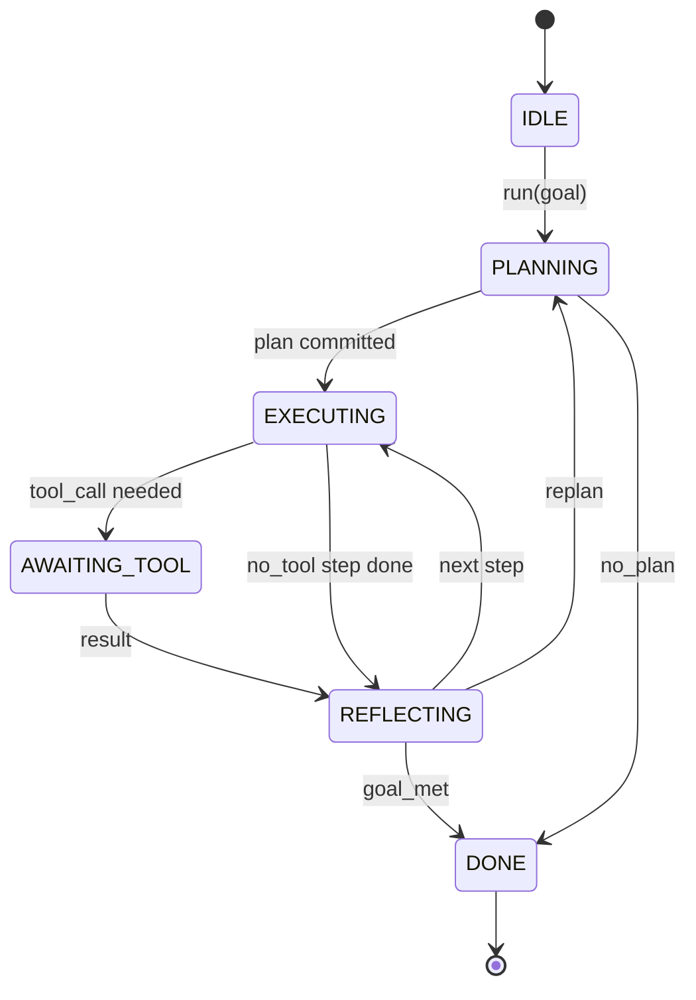

# 代理杆合同

> 导弹就是代理.模型是共处理器.你可以接入任何模型的循环合同.

**Type:** Build
**Languages:** Python
**Prerequisites:** Phase 13 lessons 01-07, Phase 14 lesson 01
**Time:** ~90 minutes

## 学习目标


```figure
cf-loop-contract
```
- 将代理利用循环 规范一个具有明显转变的确定性状态机器.
- 实现十个生命周期曲主题,操作员可以将政策,远程测量和防护线接入其中.
- 定义两个拉点,循环在这些位置把控制权交给调用者,并重新输入上恢复.
- 强制执行每次会议预算 (转换,工具调用,墙钟),同时在超限时不泄漏部分状态.
- 发出包含十种类型的事件类型的类型流,让下游 UI 和追踪器 无需直接检查循环即可订阅.

## 框架

一个无人值守运行四十轮的编码代理 不是聊天环. 它是一个状态机,操作员可以拦截它的节点,也可以审核它的边缘. 一旦你签订合同,

我们将命名六个国家,10个主题,2个拉点,10个事件类型以及一个预算包裹.

## 州

环有六个状态.五个是活跃的.一个是终端的.



`IDLE`是唯一合法的入口点.`DONE`是唯一的合法的出口.`AWAITING_TOOL`只有一个引力点的状态.

这个状态机是确定性的. 给定同一个事件日志, 运行将重新进入同一个状态.

## 子主题

是运营商 接入循环的接口――会触发十个话题――每个话题可以接受任意数量的订阅者――订阅者 按注册序列触发――一个订阅者可以突变的有效载荷――升级来中止当前转,或返回一个哨兵跳过下一步――

```text
before_plan         after_plan
before_tool_call    after_tool_call
before_step         after_step
on_error
on_pause
on_budget_exceeded
on_complete
```

这种形状映射了克劳德代码,Cursor 和OpenCode到2025年中期都趋同采用模式.`rm -rf`子被放在`before_tool_call`◎发送OpenTelemetry跨度的子 放在`after_step`在停顿的会议上恢复的子 放`on_pause`,我知道.

## 拉动点

首先是我在门上看到一个子.`AWAITING_TOOL`没有工具,就无法继续推进.`on_pause`预算耗尽,或者某个子明确要求人体审查.

拉点不是例外. 它是一个回应. 调用者检查带状态,获取带.`resume(payload)`△接会从停止位置继续──这与Python生成器的形状相同──拉点上传由你选择──在TUI中它是键压──通过MCP 时它是`tools/call`通过排队,这是一个工作调查.

## 事件流

循环 会在合同中特定位置将事件添加到输入的流.

- `session.start`调用`run(goal)`时发出一次
- `plan.draft`规划者 返回计划草案 时发出
- `plan.commit`草案提交为主动计划 后发出
- `step.start`每一个执行步骤 开始时发出
- `step.end` 每个执行步骤 结束时发出
- `tool.call` 需要工具的步骤将控制权交给调用者发出时
- `tool.result` 使用工具结果 恢复时发出
- `tool.error` 使用错误 恢复时,或取消电话 发出时
- `budget.warn` 达到预算限制 时发出
- `session.pause`循环因停顿 (预算或) 让出发时间发出
- `session.complete`循环到达`DONE`时发出一次

事件 不复制杆有效载荷──杆是必不可少的──转变、堕胎──事件是观测的──记录、船──把它们视为彼此正交──

## 预算包裹

一个会议 携带三个限制――转数"",工具调用数"",墙钟秒"",每个转会让转加一――每个工具调用 会让工具调用加一――每次状态过渡都会检查墙钟――一旦达到任意的限制,循环会触发`on_budget_exceeded`发出`budget.warn`然后在下一个拉点上转向`IDLE`并附带预算超出原因.

预算不是杀开关. 它是一个收益.

## 本课不做什么

它不会调用模型. 它不会注册真正的工具. 它不会实现运输.

`main.py`中的确定性规划器是替代的. 它返回一个硬码的三步计划,其中两个步骤需要工具结果.重点是循环,而不是计划.

## 如何阅读代码

`HarnessLoop`它具有状态,触发,发出事件.`Budget`按照你的限制.`Event`是上流的打字包.`HookRegistry`是发送机.`_transition`只有一个变化状态的函数,所以状态机的变量都集中在一个地方.

从上到下阅读`main.py`,然后阅读`code/tests/test_loop.py`测试会固定每个转变和每个射命令.

## 继续深入

在生产环境中,构建杆的最困难部分不是状态机器,而是让合同可强制执行.这个合同必须能承受规划器的热加载.`before_tool_call`在本课程中,会覆盖这些失败模式.

下一课将添加工具注册表――再下一课是JSON-RPC运输――再后是发送器――到第24课时,本文件中的循环将针对真实工具 运行真实计划,并执行真实预算――
