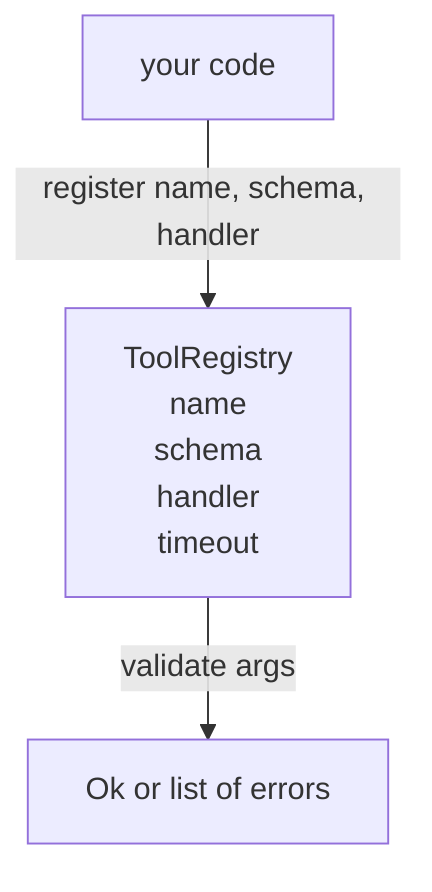

# 带方案验证工具登记

> 代理无法验证的工具,就是代理无法调用的工具.

**Type:** Build
**Languages:** Python
**Prerequisites:** Phase 13 lessons 01-07, Phase 14 lesson 01
**Time:** ~90 minutes

## 学习目标


```figure
cf-registry-validate
```
- 持有有类型的注册表,映射工具名称 →方案 →处理器,让发送商只需查询一次,之后即可信任――
- 实现JSON Schema 2020-12的一个子集,覆盖百分之九十的工具调用实际使用的关键字──
- 返回精确的、形如json指针的错误路径,让模型可以在一次往返内自我修改.
- 在没有明显的覆盖的情况下拒绝重复注册,因为静默覆盖正是生产工具目录漂移的原因.
- 保持验证器 纯净(无I/O、无时间、无全球),这样它可以在重播日志上重新运行.

## 为什么注册需要先于工具

2026年编码代理拥有注册工具,比模型能放进单个文本窗口的还多. 一个不寻常的杆会注册200个工具,并在任意一轮中暴露十到四十个. 杆是这些问题的唯一事实来源:有哪些工具存在?

我们要避免的错误是发布没有计划的处理者,或者发布没有验证的处理者.

## 长什么样的工具记录

```text
ToolRecord
  name        : str          (unique, lowercase alphanumeric and underscore segments separated by dots, e.g., snake_case.segment.case)
  description : str          (one line, shown to the model)
  schema      : dict         (JSON Schema 2020-12 subset)
  handler     : Callable     (async or sync, returns Any)
  idempotent  : bool         (dispatcher uses this for retry decisions)
  timeout_ms  : int          (override per-tool dispatcher default)
```

方案是验证器 唯一会触碰的字段――处理器对它是不透明的――我们故意把二者分开――方案是数据――处理器是代码――把它们混在一起,会诱使你把验证逻辑放入处理器,而这正是我们要阻止的错误――

## 编程: 编程:

完整的2020-12规范是一篇论文. 我们需要八个关键字.

```text
type           string / number / integer / boolean / object / array / null
properties     map of property name -> schema
required       list of property names
enum           list of allowed primitive values
minLength      integer, applies to strings
maxLength      integer, applies to strings
pattern        ECMA-262-compatible regex, applies to strings
items          schema applied to every array element
```

这足以覆盖工具API 实际需要的内容──我们没有添加关键字 ((oneOf, anyOf, allOf, $ref,条件) 在生产方案中有效,但将验证器转化为带周期的树步行器──我们构建的是注册表,不是JSON Schema引擎──

## 错误路径

验证时失败,验证器返回一个错误列表.每个错误都带着一个指向输入的内部json-pointer路径.

```text
{"a": {"b": [1, 2, "x"]}}
                    ^
                    /a/b/2
```

读取错误路径的能力强于读取句子的能力――如果 schema 要求`args.user.email`模型传入一个整数,错误应该是`/user/email`没有带有`expected_type: string`◎模型 会在下一次调用中修改它,不需要一轮自然语言说明──

## 注册与过失

`register(name, schema, handler, **opts)`默认拒绝重复注册.调用方必须传入.`override=True`才能替换. 这是操作层面的卫生习惯. 代码库的两个部分默认注册在同一工具名称上,是生产中花了一周才能找到的错误.

登记 暴露三个读取方法.`get(name)`返回记录或抛出异常.`validate(name, args)`返回一个`Ok`或一组错误.`names()`按注册顺序返回工具名称──

## 验证器是什么,不是什么

它是对方案树的一次回归遍历. 它是纯函数. 它不调用处理器. 它不做强制转换类型.`"42"`它不会通过数码方案.

它不是安全边界――验证 通过后,恶意处理器 仍然可能不当――第23课中的发送器 会添加时间和沙盒层――注册表 添加的是形状――

## 形状



## 如何阅读代码

`code/main.py`定义了`ToolRegistry`,我知道.`ToolRecord`,我知道.`ValidationError`基于验证器的功能`schema["type"]`发送或把带有`enum`的方案 当作未类型的 enum 查看处理) ・每个类型验证器 要么返回空列表,要么返回 `ValidationError`列表――上层步行者 会拼写错误,并向下递归时前置路径段――

`code/tests/test_registry.py`覆盖登记,过渡,验证成功,带路径的验证失败以及该子集中的每个关键字.

## 继续深入

现在,你需要两个扩展:针对本地定义区块的.`$ref`解决方案以及用于严格形状的`additionalProperties: false`△两者都很小.随着工具目录的增长, 已有超过50个工具, 它们都很常见. 我们把它们留在本课外,

下一课(二十二) 会构建JSON-RPC工作室运输,把这个注册表 暴露给模型客户端──再下一课(二十三) 会把二者包在一个带时间和回复的发送器后面──
