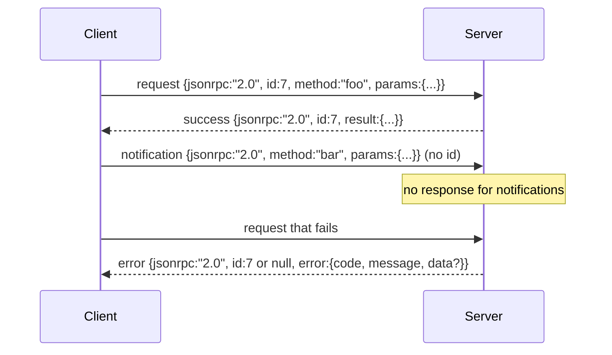

# 基于新线限度工作室的JSON-RPC 2.0

> 模型客户端和工具服务器之间的运输是基于工作室的JSON-RPC.

**Type:** Build
**Languages:** Python
**Prerequisites:** Phase 13 lessons 01-07, Phase 14 lesson 01
**Time:** ~90 minutes

## 学习目标


```figure
cf-jsonrpc-frames
```
- 使用通过 stdin 和 stdout 上的新线限定的JSON框架的JSON-RPC 2.0 通信.
- 映射五个标准错误代码(-32700, -32600, -32601, -32602, -32603),并以正确语义暴露它们──
- 区分请求,答案,通知和批量,不发明新的包裹钥匙
- 每行处理一个解析错误,不污染流的其余部分.
- 使用 io.BytesIO 构建一个会自动终止的演示,让课程无需产生的孩子过程即可运行.

## 为什么JSON-RPC仍然是语言法语

2026年,一个编码代理在单个会议中可能会和12个工具服务器通信.每个服务器都是一个独立的过程或远程终端点. 电线格式自2013年以来一直是相同的. JSON-RPC 2.0 是两页的规格. 它能活跃下来,是因为替代方案.

本课构建工作室变体――新线界限JSON――每个请求是一行――每个答案是一行――运输界限是`\n`,我知道.

## 电线形状

存在四种包装形状――两种由客户端发送――两种由服务器发送――



没有通知`id`如果服务器向通知回复响应,客户端就没有办法将其连接到某个呼叫站点.

如果批量中每个输入都是通知,服务器不发送任何内容.

## 五个错误代码

```text
-32700  Parse error      JSON could not be parsed
-32600  Invalid Request  Envelope shape is wrong
-32601  Method not found
-32602  Invalid params
-32603  Internal error
```

其他所有代码都是应用定义的. 本课只使用这些五个. 如果处理器抛出异常,运输会把它包装为-32603,然后将它包装为-32603.`data.exception`中放入例外类名称──

解析错误 有一条特殊规则.`id`是 `null`由于请求尚未被解析到足以提取身份的程度.

## 新线框和BytesIO演示

运输一次读取一行.`\n`如果某行无法解析,运输会写入一个带.`id: null`现在,我们在这个问题上,

在本课中,我们把一对`io.BytesIO`包装成 stdin 和 stdout──服务器 读取请求直到 EOF,为每一个请求 写入回复,然后返回──客户再读回响应──没有过程生殖──没有时间──运输 行为与真实子进程管 完全相同,因为 Python 的`io`接口提供了相同的`.readline()`和 `.write()`合同

## 方法发送

运输不知道有哪些方法 存在.它把工作交给了带 提供可调用.`handler(method, params)`△处理器 返回结果或抛出异常――三个例外类 暴露特定代码――

```text
MethodNotFound -> -32601
InvalidParams  -> -32602
Anything else  -> -32603 with exception name in data
```

运输永远不会看到工具注册表. 注册表. 位于处理器后面. 这正是我们想要的层次化. 运输说 JSON-RPC.

## 上流的错误 行为

```text
client writes              server reads             server writes
---------------            -----------              -------------
{...valid request...}      parses ok                {...response, id matches...}
{...broken json...         parse fails              {id:null, error: -32700}
{...valid request...}      parses ok                {...response, id matches...}
{...missing method...}     invalid envelope         {id:X, error: -32600}
```

一行破碎的JSON 不会停止循环.`method`运输会持续读取直到EOF──

## 通知和非对称流量

通知是火焰和忘记──带 使用通知表示进展事件、取消信号 和日志行──通知 让长期运行的工具可以流动状态更新,而不必每条都回路 一次──

本课实现一个出境通知助理,`write_notification`服务器在请求中 进行使用它发出进展. 模拟显示了这个模式:一个请求进来,处理器发出两条进展通知,然后写入最终回复.

## 如何阅读代码

`code/main.py`定义了`StdioTransport`,我可以帮你.`parse_request`没有任何帮助.`write_response`,我知道.`write_error`,我知道.`write_notification`),以及发送循环`serve`△错误代码常量 位于模块范围中──

`code/tests/test_transport.py`覆盖五个错误代码,通知,以及处理器调用中途写入通知的不对称流程.

## 继续深入

运输后续课程. 生产运输将添加三个事情.`id`已经是这个,但在网格中你还需要一个外部的追踪ID) ――一个取消频道(类似`$/cancelRequest`随着在飞行中调用的ID的通知,以及内容类型的谈判握手,让同一个插座可以同时说JSON-RPC和流式HTTP.
