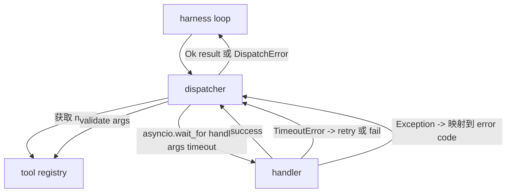
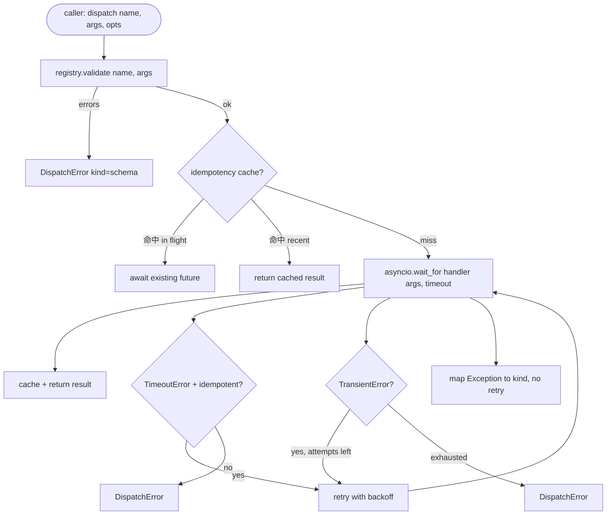

# 函数调用调用器

> 发送器是利用一个方案做出每个承诺的买单地方――时间缺失,退休,排放,错误映射――全部集中在一个接口边界上――

**Type:** Build
**Languages:** Python
**Prerequisites:** Phase 13 lessons 01-07, Phase 14 lesson 01
**Time:** ~90 minutes

## 学习目标
- 用每次通话的时间 包装工具处理器,使其返回输入错误,而不是让循环挂起来.
- 应用带紧张和最大尝试次数的指数式回复尝试.
- 基于无能率的重复试验,这样与缓慢的原始调用 竞争的重复试验 不会运行两次.
- 将处理器的例外和运输错误 映射到使用链循环 已理解的单一错误包.
- 通过同步传输限制,避免四十次工具通话的风扇式消耗事件循环.


```figure
cf-dispatch-retry
```

## 发送机坐的地方

位于使用循环(20课) 和工具登记器(21课) 之间――运输(22课) 向循环 输入――循环 把工具调用给发送器――发送器调用登记器,运行处理器,并返回结果或 JSON-RPC 形状的错误包――



发送机是唯一知道时间,退休和无能的层次的.

## 时间限制

每个工具都有默认的截止时间.`timeout_ms`,当使用者将使用它覆盖默认值.`asyncio.wait_for`时间过时,处理器任务会被取消,发送器回来`DispatchError(kind="timeout")`,我知道.

对于非强大的工具, 默认的时间缺失不是可检查的错误.`db.write`可能已经提交,也可能没有. 退休会重复写入.`idempotent`旗──无力工具 会再试──无力工具 不会──

## 复试,以指数式后退

们的们都在们的们中.

```text
attempt 1  -> delay 0
attempt 2  -> delay 0.1s * (1 + random[0..0.5])
attempt 3  -> delay 0.4s * (1 + random[0..0.5])
```

只有`timeout`和 `transient`错误会再试一次.`schema`错误`not_found`或`internal`错误不会再尝试. 计划错误是确定性的.

如果调用者预算剩余的工具调用为零,发送器会在第一次尝试时快速失败,并返回`kind="budget_exceeded"`,我知道.

## 无能关键扣除

当原来的调用 仍在飞行中 时触发重复尝试,是一个真实的生产错误――第一次调用在四点九秒时挂起(刚好低于时间过期) ―― 复用 在五秒时触发――现在两个请求 竞态访问同一个后端――如果工具是`payments.charge`你已经两次款了.

发送机 接受可选的 `idempotency_key`如果一个通话到达时和一个钥匙正在飞行,发送器会等待那个飞行未来,并返回它的结果.

关键是电话给电话给电话给电话给电话给电话给电话给电话给电话给电话给电话给电话给电话给电话给电话给电话给电话给电话给电话给电话给电话给电话给电话给电话给电话给电话给电话给电话给电话给电话给电话给电话给电话给电话给电话给电话给电话给电话给电话给电话给电话给电话给电话给电话给电话给电话给电话给电话给电话给电话给电话给电话给电话给电话给电话给电话给电话给电话给电话给电话给电话给电话给电话给电`f"{step_id}:{tool_name}:{hash(args)}"`发送器不会发明钥匙,因为只从论点发送钥匙会让两个不同的语义调用看起来相同.

## 错误封面

失败的发送 返回单一形状――

```text
DispatchError
  kind        : "timeout" | "transient" | "schema" | "not_found" | "internal" | "budget_exceeded"
  message     : str
  attempts    : int
  jsonrpc_code: int   （-32601、-32602、-32603 之一）
```

连接圈将`kind`映射到下一个状态――`schema`和 `not_found`进入`on_error`并触发重新计划.`timeout`和 `transient`进入`on_error`可能重新计划,也可能不重新计划,取决于尝试.`budget_exceeded`触发 `on_budget_exceeded`,我知道.

## 风扇外出的货币限制

`gather(*calls)`会同时运行所有程序. 四十个工具通话,意味着四十个开源插座或四十个子工艺管道.

发送机 用通讯器 包装`gather`默认同步限制是八――每个调用在发送之前获得语音符,并在完成时发布.`gather`形状的输出,但实际的规划是有界的.

## 流动一次通话



## 如何读取代码

`code/main.py`定义了`Dispatcher`,我知道.`DispatchError`和 `TransientError`发送器 在构建时接收注册表`dispatch(name, args, ...)`是唯一的入口点.`_run_with_retries`内用`asyncio.wait_for`应用程序`gather_bounded(calls)`以同步限量 运行多个发送量――

`code/tests/test_dispatcher.py`覆盖时间过关 触发、过渡 上的重试、方案错误 上不重试、自由度推断(两个带相同的关键的同时调用 折叠为一次处理器调用),以及同时限制(semaphore 生效) 。

使用测试`asyncio.sleep(0)`基于确定性`Counter`它们在毫秒内完成,不依赖于墙钟时间.

## 走得更远

生产发射器将增加两个扩展. 第一,在每次过渡中进行结构化记录.`dispatch.attempt`和 `dispatch.retry`事件:――第二,电路断裂:在一个窗口内发生 N 次失败后,工具进入冷却期,发送 会立即回来 `kind="circuit_open"`两者都可以在这个发送器上加起来,而不改变合同.

课二十四 会把发送者 粘在计划和执行代理,让你看四个部分一起运转.
