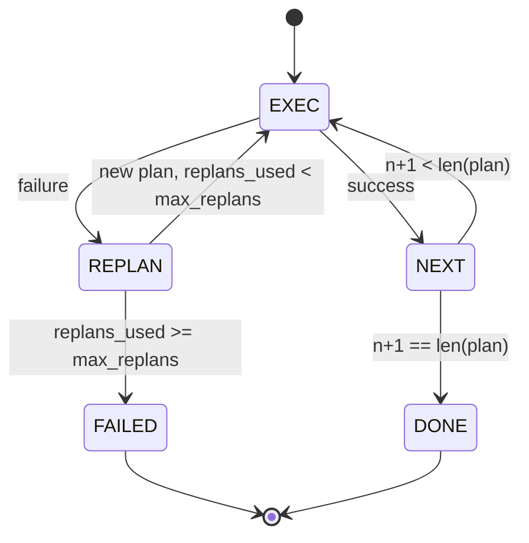

# 计划执行控制流量

> 无法承受失败的计划是脚本.

**Type:** Build
**Languages:** Python
**Prerequisites:** Phase 13 lessons 01-07, Phase 14 lesson 01
**Time:** ~90 minutes

## 学习目标


```figure
cg-plan-replan
```
- 将计划表示为输入步骤的序列,让执行者能够推理进展和结果.
- 顺序执行步骤,并将失败 受控地交回规划者──
- 从当前的线索器开始重复,并在背景中带上之前的错误,让下一个计划更有信息.
- 每次修订都会发出不同的计划,让下游追踪器或UI 能展示计划为什么改变.
- 强制执行两个预算:硬性阶段上限和硬性重建上限.

## 计划和执行,而不是链接思想

链思想代理会发送代币,并让循环 猜测工具调用 在哪里结束――计划和执行代理先发出结构性计划,然后确定性地执行每个步骤――计划是利用可以内视的数据――执行是利用 通过发送器运行这些数据――

两个部分――一个规划者 产生计划――一个执行者 运行计划――真正意义是执行者 遇到失败时发生什么――三个选项:

```text
1. Abort         （返回 failed，暴露 error）
2. Skip          （将 step 标记为 failed，继续剩余部分）
3. Replan        （把 error 交给 planner，从 cursor 获取新 plan）
```

复制是把脚本变成代理的选项.

## 步骤的形状

```text
Step
  id              : int           （在一个 plan revision 内单调递增）
  tool_name       : str
  args            : dict
  expected_outcome: str           （planner 声明的 success condition）
  result          : Any | None
  error           : str | None
```

`expected_outcome`是规划者和步骤一起发射的短句――执行者不会强制检查它――它有两个用途:重新规划者在修订计划中读取它;事件流发射它,让追踪器能展示这个步骤 本来应该做X──

## 规划者 的形状

```python
def planner(goal: str, history: list[Step], last_error: str | None) -> list[Step]:
    ...
```

一个纯粹的功能.`goal`是用户的目标.`history`是已经执行的步骤已填写结果和错误)`last_error`在第一次调用时是没有,在之后的每次调用时是最近的失败消息──计划器 返回从线索器 开始的下一个计划──

计划者不知道执行者. 它不知道重试. 它不知道时间. 它只产生计划.

## 执行者

执行器是一个小型的状态机. 每一步都通过发送器运行. 结果有三种:成功,失败,可重复计划.`FAILED`会议结果.



## 修订时的计划不同

当计划者在失败后回归新计划时,执行者会发出一个包含三个段的单元.`plan.diff`事件

```text
removed: 旧 plan 中存在但新 plan 中不存在的 step ids 列表
added  : 新 plan 中存在但旧 plan 中不存在的 step ids 列表
revised: tool_name 或 args 已改变的 step ids 列表
```

关注不是不同的格式,重点是修改是可见的事件,而不是静默的重写.

## 硬性预算

`max_steps`限制整个会议中总执行步骤,包括重复计划.默认是十二. 一线性的五步计划,如果重复计划两次,并每次增加三个步骤,将达到十六次执行,从而超过预算.

`max_replans`限制第一次计划 之后规划者 被调用次数――默认是五――这是更重要的限制――一个连续五次回归同一个破产的计划的规划者,否则会一直循环,直到步骤预算 抓住它――限制重新规划会让失败更快发生,原因也更清楚――

## 本课中的确定性规划者

本课 不调用模型. 本课提供确定性规划者,根据它.`last_error`选择计划.

```text
last_error is None    -> emit 一个 four-step plan
last_error matches X  -> emit 一个绕过 X 的 three-step plan
last_error matches Y  -> emit 一个优雅放弃的 two-step plan
otherwise             -> return []（表示没有内容可 replan）
```

在每条过渡路上,这个程序执行器的行为:成功,重新规划,一次,两次,重新规划,和阶段预算的疲劳.

## 结果的形状

```text
SessionResult
  status      : "completed" | "failed"
  reason      : str     ("goal_met" | "step_budget" | "replan_budget" | "no_plan")
  history     : list[Step]
  revisions   : list[PlanDiff]
  events      : list[Event]
```

课二十 中的带链循环可以直接读取它.课二十三 中的发送器 执行每个步骤.课二十一 中的注册表验证每个步骤的参数.课二十二 中的运输会通过JSON-RPC将整个流量 暴露给模型客户端.

## 如何读取代码

`code/main.py`定义了`PlanExecuteAgent`,我知道.`Step`,我知道.`PlanDiff`,我知道.`SessionResult`和确定性规划者――执行者是单个`run(goal)`方法,返回`SessionResult`△计划不同 通过比较步骤 id 和 `(tool_name, args)`双数计算.

`code/tests/test_agent.py`覆盖线性成功一次中期计划失败后重新计划返回`failed:replan_budget`计划的排放量,以及计划差异的事件格式.

## 走得更远

连接到真实模型后,你需要两个扩展.第一,部分计划缓存:当一个计划的六个步骤中前三个成功,后失败时,你不想重新运行前三个执行者已经保留历史;计划者只需要读取它.第二,并行分支:当前执行者是严格序列的.`gather_step`而不是`next_step`通过发送器同时运行两个工具调用.

两者都会增加真实的复杂性. 在线执行器被固定后,两者都更容易添加.
