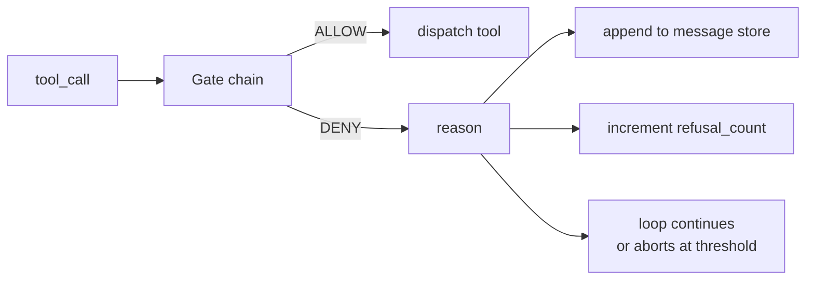
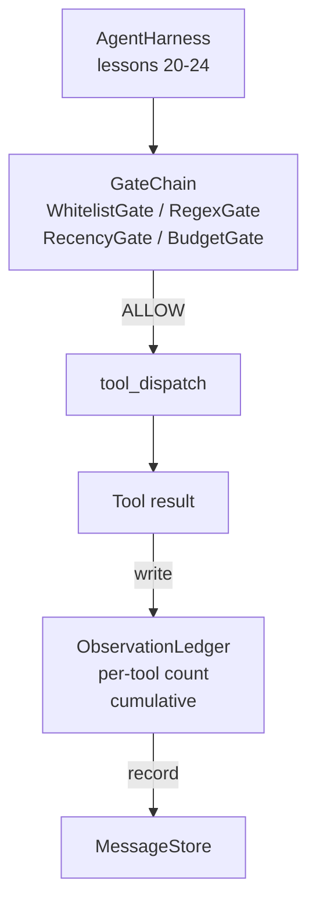

# 标签 第25课:验证门和观察预算

> 没有验证层的代理利用,只是按照外套的愿望. 本课程构建了确定性门链,用来决定是否允许一次工具调用. 触发. 代理可以看到多少输出,以及当代理已经读了太多内容时,循环何时必须停止.

**Type:** Build
**Languages:** Python (stdlib)
**Prerequisites:** Phase 19 · 20-24（Track A1：agent loop、tool registry、message store、prompt builder、model router），Phase 14 · 33（instructions as constraints），Phase 14 · 36（scope contracts），Phase 14 · 38（verification gates）
**Time:** ~90 minutes

## 学习目标

- 建设带有确定性`evaluate(call)`方法的`VerificationGate`协议
- 编组组具有短路语义的链.
- 通过按工具和转换 建索引的`ObservationLedger`追踪每一次观察.
- 当累计观察预算被超出时,拒绝一次工具调用.
- 结构化`GateDecision`记录,供下游可观测性 摄取量

## 问题

当代理利用模型自由调用工具时,在实际使用的第一小时内就会出现三类错误.

第一个类是无限观察――对一个20万行 repo 执行 grep,将50万的代币输出倒进下一轮――模型每千字节只看到一个匹配,其余的文本全被浪费――代币账单很高,而代理在任务上的表现反而变化了――

第二类是旧的最新状态――一个长时间运行的任务会累积50次工具调用――模型将第三轮的第一个读_文件重新读作实时状态――第四十七轮的编辑没有出现,因为快速构建器先序列化了最早的观察――

第三类是特权爬行.`web_search`开始,然后不知怎么就运行了`shell`由于模型编制了一个工具名称,而利用默认宽松.等有人读取痕迹.

验证门是带中负责说不的组件――它不是模型――它不是评判――它是`(call, history, ledger)`确定性函数,返回允许或拒绝,并附带理由――理由会被记录――模型会被告知――循环会继续或停止――

## 概念



门是任何带有`evaluate(call, ctx) -> GateDecision`方法的对象――链是一个有序列表――评估 在第一次拒绝时短路――序列很重要:便宜的结构性门会先于昂贵的代币计数门运行――

本课提供四个门:

- `WhitelistGate`允许的工具名称是显式集合. 集合之外的任何内容都会被拒绝.
- `RegexGate`△工具论据 会与regex 匹配──适合拒绝包含 `rm -rf`电话的使用量仅取决于电话的有效载荷.
- `RecencyGate`模型只能看到最近的N轮观测. 更旧的观测会被遮蔽.
- `BudgetGate`△模型在整个会议中累计读取的代币有上限. 当账本表示已经达到上限时,后续每次工具调用都会被拒绝.

观察账本 负责记账――每次成功的工具呼叫 都会写入一行:工具名称、转换、发行的代币、累积――账本 回答两个问题:模型总共看到了多少,以及它看到了工具 X 的多少――预算门 读取第一个──每工具的预算门是你的练习内容,它会读取第二个──


```figure
cg-gate-chain
```

## 架构



如果它点头,工具会运行,账本会计数,结果将被添加到消息存储器中.如果它拒绝,模型将以系统消息形式获得拒绝,然后循环决定是重试还是停止.

## 你会构建什么

实现一个`main.py`其他测试.

1. `Observation`和 `ToolCall`定义电线形状──
2. `ObservationLedger`记录`(turn, tool, tokens)`列,并回答 `cumulative()`和 `per_tool(name)`,我知道.
3. `GateDecision`携带`(allow, reason, gate_name)`,我知道.
4. `VerificationGate`每个门都实现了.`evaluate(call, ctx)`,我知道.
5. `GateChain`包装一个有序列表. 它将调用每个门,返回第一个拒绝. 如果所有的门都通过,则返回允许.
6. 试验 运行一个很小的合成代理循环――三轮――第三轮触发预算门,循环 会报告一次干净的拒绝,并带有非零的拒绝数――

标志计 有意采用很粗的`len(text) // 4`道管道,而不是代币器.

## 为什么链条 顺序重要

一次否认比一次允许更便宜.`WhitelistGate`运行 O(1) 哈希搜索──`RegexGate`运行 O(模式 * argv) 』`RecencyGate`读取信息商店的一个小片子.`BudgetGate`读取整个账本. 你需要按成本升级排列它们,这样被拒绝的电话就能在执行昂贵的工作前短路.

你还需要按爆炸射线排序. 白名单是最强的主张:这个工具 不在合同中.

## 它与A轨道的其他部分组合如何

之前的课程已经给你了循环,工具注册表,消息存储,即时构建器和模型路由器. 本课程添加模型和工具之间的层次. 第26课程将提供沙箱,当门链回归许可后,发送器将将把工具调用给它. 第27课程将提供评估,将拒绝数量作为质量信号记录下来. 第28课程将门决策 连接到OpenTelemetry范围. 第29课程将这些内容拼接成一个可工作的编码代理.

## 运行方式

```bash
cd phases/19-capstone-projects/25-verification-gates-observation-budget
python3 code/main.py
python3 -m pytest code/tests/ -v
```

测试 覆盖本书、每个独立门、链短路,以及端到端合成循环──
