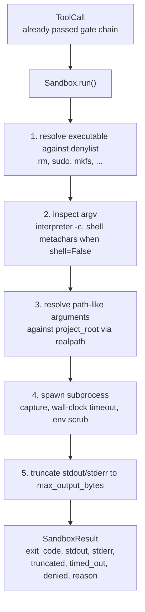
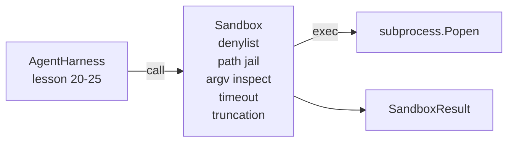

# 石头 第26课:带丹利斯与路径监狱的沙箱跑步者

> 验证门决定一次工具调用是否应该运行. 沙盒决定它运行时会发生什么. 本课程提供了一个子进程运行器,它会拒绝危险的执行,拒绝危险的 argv 形式,将每个文件路径 限制在项目根内,截断超大输出,并在墙钟时间内 杀死逃跑的进程. 它位于模型和操作系统之间的两个层中的第二层.

**Type:** Build
**Languages:** Python (stdlib)
**Prerequisites:** Phase 19 · 25（verification gates and observation budget），Phase 14 · 33（instructions as constraints），Phase 14 · 38（verification gates）
**Time:** ~90 minutes

## 学习目标

- 构建一个包装`subprocess.run`的`Sandbox`课程,带有时间,捕获和裁剪.
- 按名称通过 denylist,按结构通过 argv检查员 拒绝命令.
- 拒绝任何解决到声明的项目根之外的路径参数──
- 在 shell 模式下关闭时拒绝 shell 超级角色.
- 返回结构化`SandboxResult`供下游可观和评估利用

## 问题

能够除的编码代理可以在一个转换内安装后门,外泄密钥,损坏开发人员的笔记本电脑,并产生云账单. 最低的防御成本是不给它.

经纪人痕迹 中反复出现三类失败.

第一个类是危险的执行. 一个在修复路上 问题承受压力模型会尝试.`sudo`,我知道.`chmod -R 777`,我知道.`rm -rf`,我知道.`mkfs`,我知道.`dd`,这些都不属于代理运行.

另一类是argv技巧. 被告不能使用 shell 的模型,会通过解释器 管道化攻击:`python3 -c "import os; os.system('rm -rf /')"`,我知道.`bash -c '...'`,我知道.`node -e '...'`,我知道.`perl -e '...'`沙盒 需要知道,任何带有类似的`-c`旗的解释器运行,实际上只是几步的呼.

第三类是逃走路.`./src/main.py`读了.`../../etc/passwd`沙盒 会通过`os.path.realpath`解析每个路径的论点,并断言其前,从而将它们限制在监狱内.

这个沙盒不是操作系统的安全边界――一个拥有代码执行的坚定攻击者仍然可以逃离――这个沙盒是开发时间的防护车:它使常见失败模式变得明显,并阻止代理因纯粹的拙而造成破坏――

## 概念



沙盒有四个拒绝轴:名称,argv,路径,结构.每个轴都是调用的纯函数,此时还没有子进程.

`SandboxResult`输出代码 使用惯例值:0 表示成功,非零表示失败,另外有三个哨戒代码:拒绝 (-100)、时间_out (-101) 和缩短了(输出代码是真实值,同时设置旗)。下游课程会读取这个结构化结果,而不是解析 stderr。


```figure
cg-path-jail
```

## 架构



丹尼尔是可执行的基名的子.`/bin/rm`,我知道.`/usr/bin/rm`) 都会解析到相同的基名──argv检查员 了解解释器形状:任何 argv[0] 是解释器 且后续任一 arg 以 `-c`或`-e`开头的参数都会被拒绝.当电话时,没有明显的请求.`;`,我知道.`|`,我知道.`&`,我知道.`>`,我知道.`<`子,子,子,子,子,子,子,子,子,子,子,子,子,子,子,子,子,子,子.`$()`) 会导致拒绝.

道监狱是最微妙的部分.`project_root`任何看起来像路径的论点`/`或与现有文件相匹配) 都会通过`os.path.realpath`归结,然后与项目根的真路比较――如果解析后的目标不在根下,则拒绝――Symlink逃离尝试(项目根中指向外部的符号) 将被检查到真路阻止,而不是检查字面路径――

## 你会构建什么

实现是`main.py`现在还有一个测试.

1. `SandboxResult`数据类:出口码、stdout、stderr、truncated、timed_out、denied、reason、duration_ms。
2. `SandboxConfig`数据类:project_root、max_output_bytes、timeout_seconds、denylist、interpreter_block。
3. `Sandbox`类:`run(argv, *, shell=False, cwd=None)`返回`SandboxResult`,我知道.
4. 内部拒绝助手:`_check_executable_denylist`,我知道.`_check_argv_interpreter`,我知道.`_check_shell_metachars`,我知道.`_check_path_jail`,我知道.
5. 输出短缩,带清晰的`truncated`旗和捕获的流中标记线.
6. 底部演示:一系列合法与反抗的电话.

默认使用`subprocess.run`且`shell=False`,我知道.`capture_output=True`△墙钟时间使用 `timeout`论证`TimeoutExpired`时,沙盒会杀死过程组并合成一个沙盒结果.

## 为什么这不是真正的沙盒

本课的沙盒 不使用名字空间,组,次组,gVisor,Firecracker或任何核层次的孤立.

对于生产代理,你需要叠加它:在无特权的Docker容器中运行,在microVM中运行,滴滴功能,将项目根部 挂载为读写,并将划痕 挂载为读写,对内存和CPU设置清洁限制,将环境 理为已知安全的白名单. 第29课程将成为其中的一部分.

## 运行方式

```bash
cd phases/19-capstone-projects/26-sandbox-runner-denylist
python3 code/main.py
python3 -m pytest code/tests/ -v
```

通过测试会创建一个临时目录,放入一个干净文件,然后运行一组电话.`denied=True`和原因的沙盒结果――时间过关会回来`timed_out=True`◎ 截图会设置`truncated=True`△demo 会打印结果的JSON表,并以零退出──

## 它与A轨道的其他部分组合如何

第25课产出门链. 第26课在门允许后运行执行者. 第27课的评估利用将将结结果与每个任务的期望出门代码进行比较. 第28课将围绕每次进行比较.`Sandbox.run`调用发出一个`gen_ai.tool.execution`现在,我们将把一个真正的编码代理连接到这两个层面.
