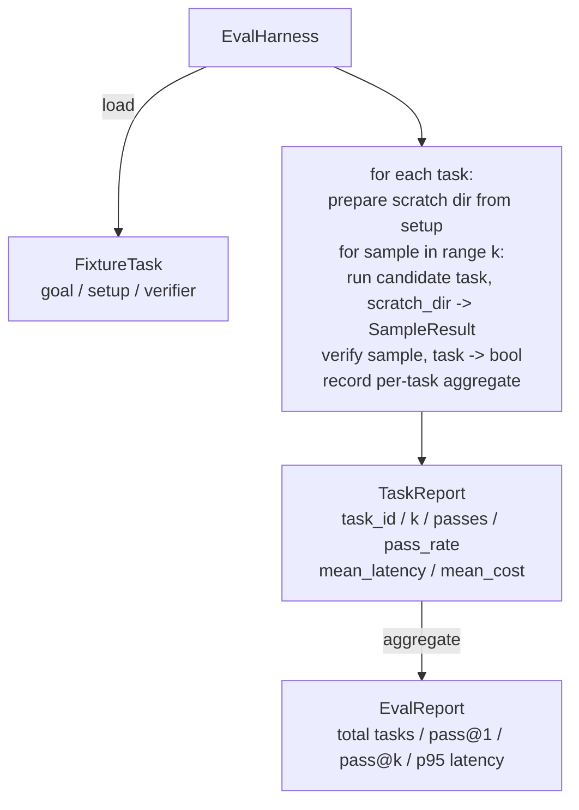

# 石头27课: 带固定任务的平行束

> 一个编码代理的水平取决于你用来衡量其任务套件. 本课程将构建一个评估链:它接收一个固定任务文件,让候选代理个别运行这些任务,通过确定性验证器评定通过或失败,并把结果聚合为pass@1、pass@k、平均延迟和平均成本.

**Type:** Build
**Languages:** Python (stdlib)
**Prerequisites:** Phase 19 · 25 (verification gates), Phase 19 · 26 (sandbox runner), Phase 14 · 30 (eval-driven agent development), Phase 14 · 19 (SWE-bench and GAIA benchmarks)
**Time:** ~90 minutes

## 学习目标

- 将固定任务定义为目标,设置和验证器的三元组.
- 为每一个任务的多次样本运行 打分,并计算通过@1 和通过@k。
- 将延迟和成本聚合为平均与95%的指标.
- 将确定性验证器 (将确定性验证器) 接入可复用函数.
- 输出结构化JSON报告,供回归跟踪脚本 摄取──

## 问题

没有评估,就构建代理基准,会遇到三类失败模式.

第一个类是未经验证的经历. 代理说它修复了错误,人类一眼不同,就把套件标记为绿色,三周后回归测试 暴露出同一个错误. 代理的推理看起来合理,但实际上什么也没有修复.

第二类是未发现的回归. 快速模板的一次变化,让代理在显而易见任务上提高4%,但在静止任务上下降14%.

第3类是逐任务漂移.周一运行100个任务,周五只运行95个任务,因为有人重新命名了5个任务.

运行每一个固定,并使用一个验证器,根据确定性检查返回真或错误.

## 概念

```mermaid
flowchart LR
  F1[fixtures/task_001/<br/>task.json + expected/] --> Harness
  F2[fixtures/task_002/<br/>...] --> Harness
  Harness[Harness<br/>for each task:<br/>setup / run agent k samples /<br/>verify each sample /<br/>record latency, cost]
  Harness --> Report[EvalReport<br/>pass@1 / pass@k<br/>mean ms / p95 ms<br/>mean cost]
```

`FixtureTask`是一个小JSON文件,加上一个可选的文件.`expected/`目录──JSON 声明`id`,我知道.`goal`(给代理的提示)`setup`块(要放入该的文件) 以及`verifier`块──verifier 块指定使用的验证器登记库中的一个函数,并提供其参数──

三种验证器 形态覆盖大多数有用任务.

第一个是`file_equals`应对该文件的预期内容.

第二种是`regex_match`△将指定文件内容与regex 匹配. 这能捕捉函数必须存在并返回X的任务,其中可能有很多可接受的解法.

第三种是`shell_exit_zero`运行一个器命令 (通过第26课的沙箱),只有当命令以零 退出时才让任务通过――这能捕捉测试必须通过任务――

运行每个任务`k`下一篇: 通过`1 - (1 - p)^k`实验通过率;运算也报告原数,方便你发现差异性――延迟是每个样本的墙钟――成本是代理自行报告的任何内容――标志数、美元,或两者);运算会跨样本 求和并呈现逐任务和聚合数字――

## 建筑



候选人是一个可调用的:`Callable[[FixtureTask, str], SampleResult]` 通过 `tempfile.mkdtemp()`创建了零碎目录,并把其路径作为普通字符串传入──harness 不关心候选人 如何工作──候选人 可以是确定性的补丁应用程序(对harness自测试很有用)、真实LLM代理、fuzzer──契约是 SampleResult──

## 你会建造什么

`main.py`提供:

1. `FixtureTask`数据类
2. `SampleResult`数据类:成功_自行报告、延迟_ms、成本_单位、编辑──
3. 带`to_dict()`的`TaskReport`,我知道.`EvalReport`数据类──
4. 将验证器名称映射到函数的`VerifierRegistry`△内置验证器:文件_等式、regex_match、shell_exit_zero。
5. `EvalHarness`通过一个候选人运行一个任务目录. 回复EvalReport.
6. 捆绑在`tasks/`中的五个固定任务:
   - `fizzbuzz`中的一个一个
   - `factorial`中缺少回报
   - 错误信息 中的字体错误
   - 空功能体
   - 链接列表中的离散
7. 一个确定性参考候选人`apply_known_fixes`),使用它演示干净的通过@1 = 1.0。
8.  Demo 打印EvalReport JSON 并以零 退出

固定任务 以`tasks/`中的JSON文件形式捆绑,并配有`tasks/<id>/buggy/`和 `tasks/<id>/expected/`中的源文件──harness 将buggy 复制到零地,把它交给候选人,并根据预期验证──

## 为什么使用pass@k,而不只是pass@1

真实LLM代理是随机的. 通过1为0.6看起来像失败. 通过5为0.95 表明代理 大多数时候能得到正确答案,但在早期样本上选错了.

通过@k 会和通过@1 一起报告,因为通过@k 会掩盖真实失败:如果模型二十次只得到一个正确的答案,你没有一个有用的代理.

## 它与A轨道的其他部分组合如何

课25 产出门链.课26 产出沙箱.`shell_exit_zero`验证器 使用沙盒──课28 会把每次运行运行包进OTel追踪──课29 针对其中一个捆绑的固定装置 运行端到端演示,并断言参考候选人的通过@1 = 1.0──

## 运行方式

```bash
cd phases/19-capstone-projects/27-eval-harness-fixture-tasks
python3 code/main.py
python3 -m pytest code/tests/ -v
```

测试 覆盖验证器函数、pass@k数学、固定装载,以及对捆绑参考候选人的端到端行为──

```figure
pass-at-k
```
