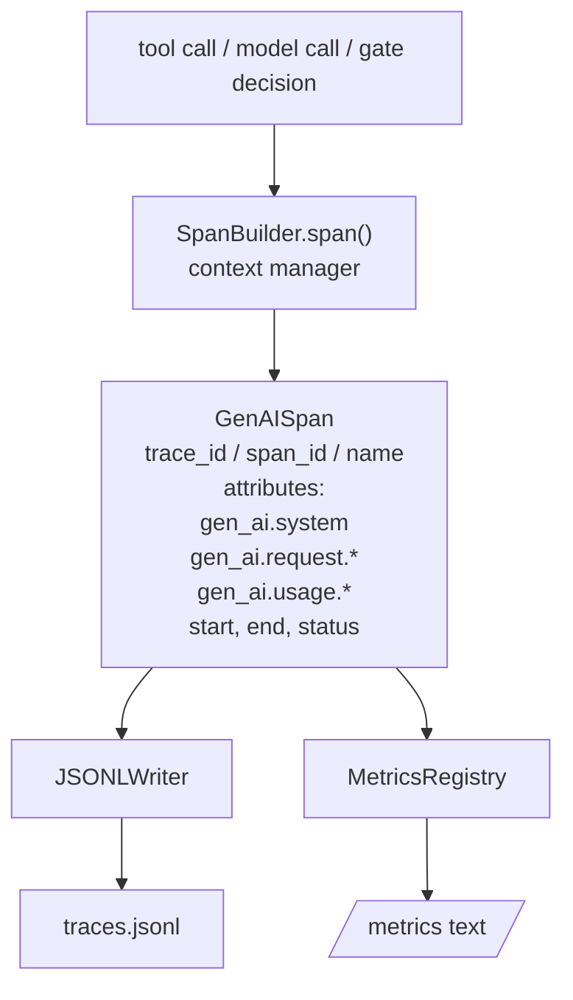
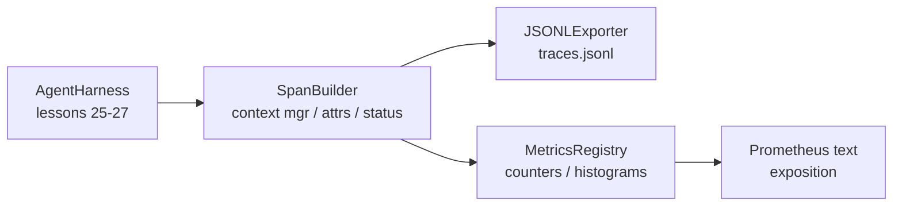

# 石28课:使用OTel GenAI跨度和承诺指标实现可观性

> 没有可观测性的代理利用是一个会花钱的黑盒子. 本课会手写一个跨度构造商,发行符合OpenTelemetry GenAI的语义公约的记录,将它们写入JSON-Lines文件,每行一个跨度,并以Prometheus文本格式 暴露计和历史图片.

**Type:** Build
**Languages:** Python (stdlib)
**Prerequisites:** Phase 19 · 25 (verification gates), Phase 19 · 26 (sandbox), Phase 19 · 27 (eval harness), Phase 13 · 20 (OpenTelemetry GenAI), Phase 14 · 23 (OTel GenAI conventions)
**Time:** ~90 minutes

## 学习目标

- 构建符合OpenTelemetry GenAI语义公约的一个形态的跨度数据类.
- 实现一个JSONL出口商,每行写入一个自包含的跨度.
- 构建带标签和Prometheus文本格式曝光的计数器与历史图片──
- 用跨度文本管理器 包装任意调用,记录时间、状态和例外──
- 验证发射范围可通过`json.loads`轮回,并匹配的规格形状.

## 问题

生产中的编码代理 每一轮都会产出三类文物:一次模型调用一次工具执行,以及一个验证门决策──没有结构化的远程测量,这些都没有用──

第一个类失败模式是缺失痕迹.周二出现问题,但唯一记录是一个500行聊天日志.

第二类失败模式是不可察觉的痕迹──哈恩斯写了跨度,但使用自己的专用字段名称──Grafana、Honeycomb、Jaeger 或本地CLI都读不了──团队堆中已有的任何工具都被浪费了,因为跨度是非标准的──

第三类失败模式是不整合的指标. 你能在追踪中看到一次很慢的工具调用,但无法回答过去一小时的读取文件调用的p95延迟是多少?

开放Telemetry GenAI语义公约正是为此而存在.它们定义了一个小组标准属性,供各类LLM框架的跨度发射者共享.

## 概念



运行中每个操作都会产生一个跨度――跨度 具有痕迹 id(整个代理调用) 跨度 id(这个操作) 名称(例如`gen_ai.chat`,我知道.`gen_ai.tool.execution`)、遵循GENAI公约的属性、开始和结束时间以及状态──

基因AI公约标准化了这些属性关键:`gen_ai.system`(例如哪个提供商)`anthropic`,我知道.`openai`) `gen_ai.request.model`(模型标识)`gen_ai.request.max_tokens`,我知道.`gen_ai.usage.input_tokens`,我知道.`gen_ai.usage.output_tokens`,我知道.`gen_ai.response.model`,我知道.`gen_ai.response.id`,我知道.`gen_ai.operation.name`及工具特定的钥匙`gen_ai.tool.name`和 `gen_ai.tool.call.id`,我知道.

实际的OTel出口商会使用OTLP gRPC;本课程的JSONL出口商是离线等价格,并且在每个工作站上都以零退出.

每次工具调用都会增加一个计数器:`tools_called_total{tool="read_file"}`◎历史图 记录观察到的延迟:`tool_latency_ms{tool="read_file"}`两者都会序列化为Prometheus文本曝光格式,这是基于拉力的指标的事实标准.

## 建筑



跨度建设者是一个小类,带有`span(name, attrs)`方法,返回一个文本管理者――文本管理者 在输入时记录开始时间, 在出口时记录结束时间,如果抛出了例外就添加了这个例外,并把最终的跨度推送给出口者――

计量表是两个字节.`{(name, frozen_labels): int}`◎ 史图ograms 将原始样本保存在列表中,并将其列为Prometheus histogram buckets──

## 你会建造什么

`main.py`提供:

1. `GenAISpan`数据类:trace_id、span_id、parent_span_id、name、attribut、start_unix_nano、end_unix_nano、status、status_message、events。
2. 带`span(name, attrs, parent=None)`环境管理员的`SpanBuilder`课堂
3. 带`export(span)`的`JSONLExporter`课程,附加写入一行.
4. `Counter`和 `Histogram`类,以及`MetricsRegistry`,我知道.
5. 生成文本格式输出 的 `prometheus_exposition(registry)`,我知道.
6. 发出时间并更新的指标`wrap_tool_call(name)`装饰师
7. 演示:合成一次完整代理调用 (合成一次完整代理调用) 工具跨度 外层包 gen_ai.chat跨度),写入 traces.jsonl,打印Prometheus曝光,并以零 退出。

跨度 id 和 痕迹 id 是16字节的六字符串,由 `os.urandom`生成──这符合OTel的W3C追踪环境──出口者永不抛出;IO错误会被浮现,但利用会继续运行──

历史图 有一组固定桶的定义值: 5、10、25、50、100、250、500、1000、2500、5000、10000、+Inf) ⋅ 样本以列表保存;曝光 会按需要计算每个桶的数量──

## 为什么写手写,而不是使用开放式SDK

通过使用Python SDK,你将相同的属性 接入到真实的SDK,就能免费获得OTLP出口者、批量和资源检测――

由于OTel不破坏GenAI属性名称,它们只会添加新的名称,到2030年仍将继续可解析.

## 它与A轨道的其他部分组合如何

课25 产出门链――课26 产出沙盒――课27 产出评估利用――课28 让这三者都可观测――课29 会把端到端的演示的每一步都包入,最后打印了普罗梅蒂乌斯文本――

## 运行方式

```bash
cd phases/19-capstone-projects/28-observability-otel-traces
python3 code/main.py
python3 -m pytest code/tests/ -v
```

现在,我们在课堂上做了一些工作.`traces.jsonl`(最后清理),然后打印三个跨度的样本,再打印计数和历史图的普罗梅蒂斯曝光――测试验证跨度可回路序列化、可波的GenAI属性 存在、计数 正确递增,并且历史图的曝光包含预期的桶数――

```figure
trace-spans
```
