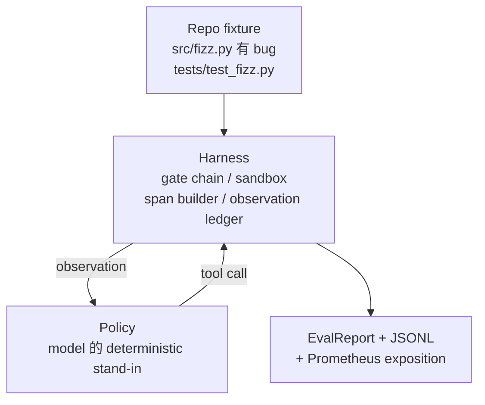
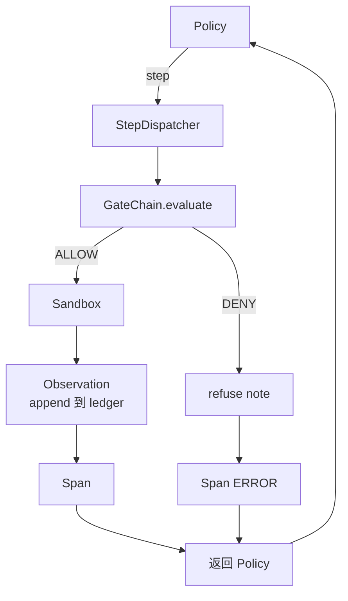

# 卡普斯通课程29:利用上端到端编码代理

> 追踪A的成果──本课程把门链、沙盒、带 和OTel 串连成一个可工作的编码代理,用来修复一个多文件Python项目中真实的(小型固定尺寸)bug──这个代理是确定性政策,不是LLM;这个替换让课程可复现,并说明带才永远是最关键的部分──合同 完全相同:真实模型可以插入政策接──

**Type:** Build
**Languages:** Python (stdlib)
**Prerequisites:** Phase 19 · 25 (verification gates), Phase 19 · 26 (sandbox), Phase 19 · 27 (eval harness), Phase 19 · 28 (observability), Phase 14 · 38 (verification gates), Phase 14 · 41 (workbench for real repos), Phase 14 · 42 (agent workbench capstone)
**Time:** ~90 minutes

## 学习目标

- 将门链,沙盒,带和跨度构造商组合成单个代理环.
- 实现一个使用阅读_文件、运行_测试 和写_文件 修复固定错误的确定性政策──
- 在一次端到端运行中强制执行全局步骤预算和观察代币预算.
- 为完整运行发出完整的OTel GenAI痕迹和Prometheus指标.
- 验证代理在12步内解决装置,并且合法工具上没有门.

## 问题

大多数代理演示都是孤立工作的:单独的沙盒,单独的评价,单独的跨度发射器.

门链 给了许可,但沙盒 因为链 没有预期到的原因拒绝了. 车载 记录通过,但OTel 跨度显示门 拒绝了代理 声称使用过的工具.

本课程是整个轨道的集成测试. 经理必须顺序完成四件事:读取项目,运行测试,从测试失败中识别错误,写入修复,重新运行测试,然后停止. 每个操作都经过门链. 每次工具执行都经过沙盒. 每一步都包裹在跨度中.

## 概念



代理的政策是一个国家机器.

`SURVEY`项目列表. 下一个状态是RUN_TESTS.

`RUN_TESTS`如果测试通过,状态机以成功停止.否则下一个状态是INSPECT.

`INSPECT`据了解,在此次的调查中,

`FIX`现在,我们已经开始了.

`VERIFY`如果测试通过,则停止成功.否则停止失败.

每个国家都应对一次工具调用. 每次工具调用都通过门链.

固定器的错误是`fizz.py`中的单独的决定性政策 通过回复从测试失败消息 中检测出错误,并发出修改后的文件


```figure
cg-harness-weave
```

## 建筑



本课程是自含的. 每个前课的原始都在.`main.py`由于这些名称与25-28课程完全一致,因此概念映射是明确的──

## 你会建造什么

`main.py`提供:

1. 最小束原始,名称与课 25-28 相同:`GateChain`,我知道.`Sandbox`,我知道.`ObservationLedger`,我知道.`SpanBuilder`,我知道.`MetricsRegistry`,我知道.
2. `CodingAgentPolicy`类:包含五个州的状态机.
3. `Repo`准备一个子,其中包含捆绑的buggy装置.
4. `AgentRun`类:驱动政策,通过带发送,并返回 `AgentRunReport`,我知道.
5. 一个捆绑的装置`fixture_repo/`),包含 src/fizz.py、测试/test_fizz.py,以及用于评估利用的预期/树木──
6. 演示:端到端运行政策,打印逐步追踪,断言通过,并打印指标.

结合式设置与27课的任务结构 形状相同:一个buggy文件和一个测试文件――测试失败信息 包含足够的信息,让确定性政策能识别解决――真实LLM会做同样的工作,只是慢慢并拥有更广泛的回忆,但它不会改变利用的期望――

## 为什么政策不是法学士

真正的LLM 需要API关键,网络调用,以及无法验证的股票性.

本课程的政策是LLM代理所做事的严格集.

## 演示会断言什么

端到端演示 在退出时断言五件事,测试套件也会以编程方式重新断言它们.

政策在12个步骤内解决了固定.

观察预算 从未超出――

合法工具 上触发了零次的拒绝.

随着一个步骤的发展,

普罗梅蒂乌斯的演示包含一个`tools_called_total{tool="read_file"}`进入和一个`tool_latency_ms`历史图

## 它与A轨道的其他部分组合如何

本课程是集成――课25 编写了门链――课26 编写了沙盒――课27 编写了评估利用――课28 编写了可观见性――课29 证明它们作为一个系统可以工作――真实代理利用 从这里扩展:把确定性政策 换成模型,把捆绑式固定 换成实例任务,把 JSONL 导体 换成 OTLP――

## 运行方式

```bash
cd phases/19-capstone-projects/29-end-to-end-coding-task-demo
python3 code/main.py
python3 -m pytest code/tests/ -v
```

测试 覆盖政策状态转型,合成工具调用 上的门拒绝,捆绑式设置 上的端到端运行以及阶段预算变量,
