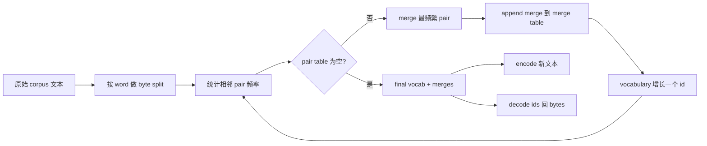
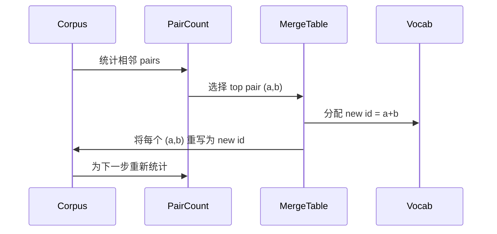

# 从零构建 BPE 标记器

> 字节进,字节出,字节再回到相同字节.

**Type:** Build
**Languages:** Python
**Prerequisites:** Phase 04 lessons, Phase 07 transformer lessons
**Time:** ~90 minutes

## 学习目标
- 通过反复合并 最频繁的相邻符号对,从原始文本体 训练字节对编码词汇──
- 实现确定性融合表,并将其应用到新文本上,生成子词 id 流──
- 将任意的 UTF-8 输入往返转换为 id 并恢复,且不丢失信息.
- 保留并保护特殊代币(`<|endoftext|>`,我知道.`<|pad|>`让它们在训练和解码后保持不变.
- 推理为什么字母级字母是通用代币器的正确下限.


```figure
cap-bpe-merge
```

## 框架

语言模型永远看不到文本. 它看到的是整数. 把字符串映射为整数列表并再映射回来的东西,就是标记器.

通用文本模型中占主导的字母子语 代码家是字节对编码──想法很小──从已知字母中开始──找到最常见的相邻符号对.把它合并成一个新的符号──重复,直到词汇 达到目标大小──编码 新文本会按同样的顺序复用相同的合并列──

我们将构建字节级别的变体――字母是256个原始字节,而不是 Unicode代码点――这个选择让Tokenizer能够处理任何UTF-8输入,而无需回到未知的代码――

## 管道



结合表. 这个共享就是合同. 如果你在结合时改变结合顺序,就会解码出不同的ID.

## 字节字母

前 256 个ID 保留给原始字节 0x00 到 0xFF──这保证每个输入字符串都能在任何合并之前使用词汇表达出来──在字节区块之后,我们为特殊代币保留一小段范围──训练循环永远不会提出这些ID作为合并目标,因为我们将将它们完全排除在预先技术化的流之外──

预测器 会在训练中 看到体积 之前,按白空间和点击界限 进行分离.如果没有这个分离,BPE 合并步骤 会很乐意学习跨越词界限的合并,词汇 会被常见整句短语填满.

## 训练循环

在每一个训练阶段,循环做三件事――它遍历了整个体内的每一个词,统计了当前符号的每一个相邻对的出现频率,并按词本出现频率加权――它选择了最高的数量――它把这个对的每一次出现重写为一个单个新符号,它的ID是词汇中下一个空位――然后它记录合并――



对于一百万字和一万个ID的目标词汇,循环将在几秒内完成,因为符号序列将随着合并而缩短.

## 编码新文本

推断 不调用合并计量器――它按学习到的相同顺序应用合并表――对于一个新词,编码器从字节分开开始――它扫描当前序列,寻找排名 最低的合并 (最早学习到且可应用的那个)――它执行该合并――然后再扫描――当前序列中没有任何合并适用于当前序列时,循环结束――

按排列排列的属性使编码具有确定性,并且与训练一致在相同输入上的行为.

## 特殊代币

特殊代币是字节流永远无法生成的ID. 我们手动保留它们.

- `<|endoftext|>`在预训期间分开文件. 它告诉模型:一个新的文件从这里开始,不要让前一个文件的背景泄露进来.
- `<|pad|>`填充短序列,让批量可以成为矩形子―― 失去面具 会在训练期间隐藏它――

编码器 接受一个旗,用来允许输入中出现特殊的代币――当旗 关闭时,字符串 `<|endoftext|>`和 `<|pad|>`会按拼写它们的字节来标记. 当旗开时,字母字符串会映射到其保留的ID,并且不会参与任何合并.

## 往返保证

编码后再解码 必须精确返回输入字节──解码器会按顺序拼写每个 id 的字节扩展──由于每个 id 要么是原始字节,要么是两个以前已知的 id 的连接,复发式扩展 总会终止于原始字节──解码 随后返回这些字节 拼写出来的 UTF-8 字符串──

本课程的测试套件将包含一个不见的句子,一个包含Unicode的情感符号,以及一个包含字面的句子.`<|endoftext|>`标志的句子 上检查这个属性――

## 这一课不做什么

它不会构建最大型生产的托克尼泽,它将托克尼泽作为黑盒子,并在其上构建滑动窗口数据集.

它不会对比对数. 在Python中,对几千个字的体积做循环会在不到一秒内完成.对于更大的体积来说,显然,最常见的做法是对每一个字的对数进行统计,然后减少.

## 如何读取代码

`main.py`定义四个物体――`BPETokenizer`拥有词汇,并表和特殊标记表.`train`是训练循环.`encode`是推断路径.`decode`是字节连接. 下部的演示会在内置体内. 上训练一个小型的标记器,编码一个长期的句子,将识别码解码回来,并打印两者.`code/tests/test_bpe.py`中试验 确定了回路属性,特殊代币预订和合并订单.

运行演示.然后把演示中目标词汇大小从300改成600,观察长度的编码,如何下降.那条曲线就是BPE压缩曲线.
