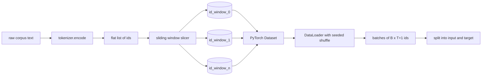
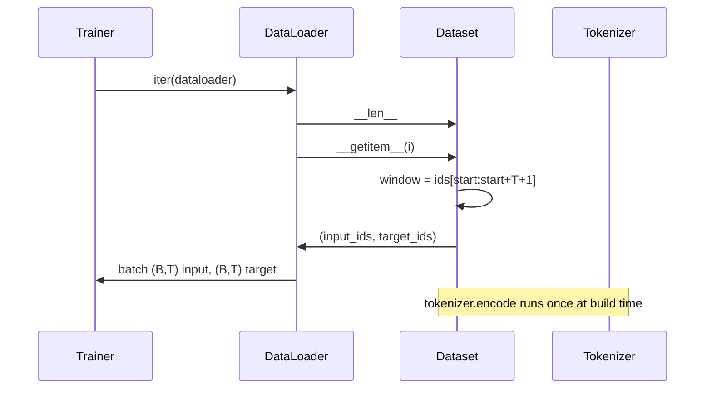

# 使用滑动窗口的标记数据集

> 一次预训运行,一个从代币ID到分数函数. 本课会构建把ID送进的传送带.

**Type:** Build
**Languages:** Python
**Prerequisites:** Phase 04 lessons, Phase 07 transformer lessons, 本 phase 的 Lesson 30
**Time:** ~90 分钟

## 学习目标


```figure
cap-sliding-window
```
- 通过只调用一次的标记器,把原始的体积转换为标记ID流.
- 使用可配置的重叠步骤,把 id 流切成固定长度的窗口.
- 构建一个PyTorch数据集,为下一个代码预测返回输入和目标子.
- 用 DataLoader 包装数据集,并使用按时代 设定种子的确定性混动.
- 推理步骤,冗余和有效数据集尺寸之间的权衡.

## 框架

一次预训运行 每次读取一批代币ID,并更新模型――每个批次的形状由训练合同固定――对于因果语言模型,批次 持有`(B, T)`输入 id 和 `(B, T)`目标 id,其中目标是输入 左移一位;;数据管道的工作,是从可能有数GB原始文本的体内,按需要、确定性 且可复现地产生这个合同──

本课会构建这个管道――上一课的Tokenizer会把文本转换为一个长长的平面ID列表――滑动窗口会把这个列表切成训练示例――自定义数据集 会把示例 暴露于子――数据载体会把它们组成批量,并使用已知种子 进行混动――

## 形状合同

消费形状为`(B, T)`其中的身份证`B`是批量大小,`T`是文本长度.`t`目标是位置`t+1`输入. 这意味着每个训练例子`T+1`个原始 ids──窗口步骤 控制相邻例子 之间有多少重叠──



剪切器永远不会跨越体内的边界. 如果最后一个窗口没有足够的ID,填满.`T+1`个位置,剪刀会丢弃它.`<|pad|>`填充尾部也是有效的选择,但它会让损失面具变得复杂.

## 为什么使用滑窗

预训练体是个长的ID流――如果模型只看到不重叠的窗户,每个训练例子都会教它相同`T`个边界――调整步骤 会移动这些边界,让模型看到更多的预测下一个标记任务――

步骤 为 `T`没有重叠的窗户.`T // 2`产生百分之五十的重叠,并使有效的数据集翻倍.`1`产生最大重叠,并让数据集增长`T`倍――代价是每个时代 需要更多的计算――收益是边界多样性更高――大多数预训运行使用等于文本长度的步骤,因为体积已经远大于模型 在一个时代内能运行完整的规模,所以边界多样性论点更弱――

## 数据集类

鱼数据集有两个必需方法.`__len__`返回例子 数量――`__getitem__`以一对子的形式返回一个例子――我们的数据集 存储编码后的 id 流和步骤――对其进行索引时,会即时计算窗口的起点,因此无论步骤 产生多少个例子,记忆成本只是 id 流的一副本――



变化发生在`__getitem__`内部──数据设置 返回 `(input, target)`在其中`input = window[:-1]`没有任何`target = window[1:]`两者都是 PyTorch长子.

## 确定性混动

使用 `shuffle=True`通过传入一个按时代 设定种子的显式`torch.Generator`运行的每次重启都能得到相同的混动.当你想比较两个只有一个超参数运行时,这个属性很重要.

本课的种子合同很简单.`epoch_seed = base_seed + epoch_index`△基础种子 在构建时传入――时代指数 由教练在每个时代 顶部递增――使用相同的基础种子 重新运行,总会在每个时代看到相同的顺序――

## 批量样本器

对于小数据集做细节调整时,合同也是一样的.`B`下一个`__getitem__`并堆积结果来组装一个批量. 因为每个例子在构建上长度相同,所以不需要填充逻辑.

本课为了简单的起见保留`num_workers=0`在生产运行中,工人会并行化`__getitem__`对于我们的管道来说,这基本上是没有操作,因为工作只是对内存子做切片,但同一个数据集API可以干净地支持工人.

## 计算示例

对于长度为`N`的 id 流 背景长度`T`和步骤`S`举例 数量是`max(0, 1 + (N - (T + 1)) // S)`△本课把这个计算暴露在数据集上的静态方法上,这样教练可以不过代代计算每个时代的总步骤――

## 本课不做什么

它不会从磁盘流传. 库存会完整编码到内存中,并作为单个子保存. 对几百万个ID的库存,这远低于一百MB,而且是本课时合适的形状.

它不处理多个文件. 文件被视为连续的 id 流.`<|endoftext|>`标识 来编码下一个文档边界――模型 会学习围绕边界进行预测――

## 如何阅读代码

`main.py`定义了两个类和一个助手.`SlidingWindowDataset`是PyTorch数据集.`make_dataloader`返回一个配置好的数据加载器,并带有种子发电机.`_encode_corpus_to_ids`是一次性的Tokenizer调用――底部的演示会在进程中构建一个小的Tokenizer,编码内置体,构建数据集和数据加载器,打印一个批量,并断言形状合同――`code/tests/test_dataset.py`中试验 固定窗口数量公式 变量一 属性 确定性混动 和步骤交易

运行演示.然后把背景长度从16改为32次,观察每个时代的例子 数量如何下降.
