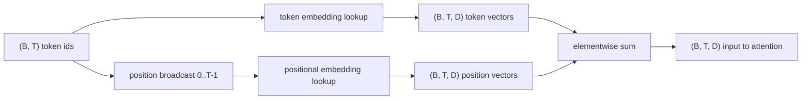
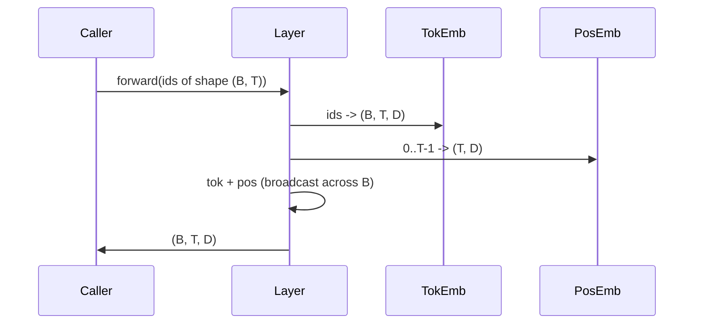

# 标志和位置嵌入

> 图像是整数.模型需要向量. 两个张查找表在二者之间,而位置表的选择会塑造模型.

**Type:** Build
**Languages:** Python
**Prerequisites:** Phase 04 lessons, Phase 07 transformer lessons, 本 phase 的 Lessons 30 和 31
**Time:** ~90 分钟

## 学习目标


```figure
cc-embedding-lookup
```
- 构建一个符号嵌入式查找表,把词汇ID映射到密集向量.
- 构建一个按位置索引的学习位置嵌入式查找表.
- 构建一个按位置索引没有参数的固定鼻状位置嵌入式.
- 把代币和位置嵌入式组合成变压器块的单一输入.
- 与学习和突嵌入式的长度概括和参数数上的差异.

## 框架

模型与代币 id 的第一次接触,是在代币嵌入矩阵中进行行列查找.这个矩阵每一个词汇 id 有一行,每个模型维度 有一列.查找返回一个向量,模型的其余部分将把它视为该 id 的含义.

代币ID本身没有顺序.模型需要第二个信号,告诉它位置一 不同于位置十七. 这个信号的两种主流选择是学习位置嵌入式.`SinusoidalPositionalEmbedding`会在`max_context_length`预计算一张固定表,它的`forward`虽然表格大到可以索引,但当超过训练长度时,模型仍然可能表现出吃力.

本课将构建两者,并将它们与代币嵌入组合组合成下一课注意力区块的单一输入.

## 形状合同

嵌入阶段的输入是形状为`(B, T)`的一批代码ID──输出是形状为 `(B, T, D)`子,其中一个`D`是模型尺寸.每个批量元素都有相同的背景长度.`T`,每个位置都有相同的向量尺寸.`D`,我知道.



组合方式是总和,不是连接.`D`在网络中保持不变,并让模型根据每个特征决定标志的含义或位置在每个层中的占主导地位.

## 嵌入符号矩阵

符号嵌入是一个形状为`(V, D)`参数子,其中`V`是词汇尺寸──PyTorch 以 `nn.Embedding(V, D)`暴露它──init 时条目 从一个小高斯中抽取,对于变压器尺度模型,传统上意味为零,标准偏差约为`0.02`△精确的 init 没那么重要,重要的是它在不同运行之间保持一致.

通过收集行,把`(B, T)`映射为`(B, T, D)`波动――倒退传递 只有将渐进积累到前进传递 中被触及的行程――两行从未出现的批量中在该步骤 收到零渐进――

一个微妙细节――代码嵌入 和模型末端的输出投影 经常共享重量(重量绑定) ――这种情况发生时,每次倒退的传递都会通过输出侧触碰嵌入的每一行――本课在这里把两者暴露为分离模块,但在完整模型中,同一矩阵可以同时扮演两个角色――

## 学习定位嵌入

学习定位嵌入 是第二个`nn.Embedding`形状为`(max_context_length, D)`△查看 由位置 id `0, 1, 2, ..., T-1`作为关键. 进步. 会把这个位置. 矢量播放到批量维度上.

学习表的缺点是,如果模型只训练到位置`T-1`没有任何位置查询.`T`△那一行不存在──使用这种方案的生产仅使用解码器的模型将把最大的文本长度进建筑,并拒绝处理更长的输入──

## 状位置嵌入

坐标式位置嵌入是从位置到向量函数的位置`p`和特征`i`产生:

```python
angle = p / (10000 ** (2 * (i // 2) / D))
emb[p, 2k]     = sin(angle)
emb[p, 2k + 1] = cos(angle)
```

这个函数没有参数――每个位置都具有独特的矢量――波长 会跨特征维度 按几何方式变化,因此较低维度 编码粗粒度位置,较高维度 编码细粒度位置――

由同时选择`sin`和 `cos`得到的性质是,位置`p + k`处的向量是位置`p`处向量的线性函数. 这给了注意层提供了学习相对位置抵消的简单路径.

本课会在构建时计算完整的阴影形表一次,然后向前索引它.

## 组合

按顺序做三件事――读取代币ID――查找代币向量――加上定位向量――返回总量――



总体阶段 中的广播 会沿批量尺寸 复制 `(T, D)`位置子――PyTorch 会自动处理,因为位置子在不压缩后形状为`(1, T, D)`,我知道.

## 对比分析

本课程将在相同的输入上运行两种变体,并打印两种诊断.

第一个是参数数量. 学习的变量会在代币嵌入上增加.`max_context_length * D`个参数――双向变体 增加零个――

第二是相邻位置的嵌入式之间的共数相似性――共性变体有平滑且可预测的衰退,因为函数是连续的――学习变体在初始化时具有近似随机的相似性,因为行是独立抽取的――训练后,学习变体通常会发展出类似的平滑结构,但它必须从数据中发现这种结构――

## 本课不做什么

它不会构建旋转定位编码 (RoPE) 或 AliBi.它们是生产变形器中现代选择.它们都遵循与它嵌入式的相似形状合同.`(B, T, D)`应用依赖位置的转变),但它们应用在注意力投影步骤,而不是输入. 下一课将构建注意力区块,其中一个可选的扩展是将旋转的投影折入那里的查询关键.

它不会训练嵌入.训练需要输出.

## 如何阅读代码

`main.py`定义了三个模块.`TokenEmbedding`包装`nn.Embedding(V, D)`,我知道.`LearnedPositionalEmbedding`包装`nn.Embedding(L, D)`,我知道.`SinusoidalPositionalEmbedding`预计算表,并把它暴露为缓冲.`EmbeddingComposer`把符号嵌入和位置嵌入 绑定在一起――下部的演示会打印形状、参数数和邻居位置相似性诊断――`code/tests/test_embeddings.py`中试验 确定形状,广播行为,参数数和阴道式公式.

运行演示.然后把模型的尺寸.`D`从 64 改为 32,观察阴道波长带的变化如何──
