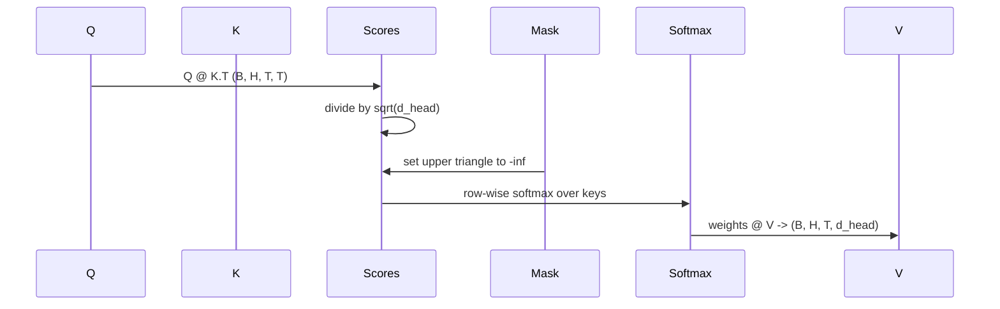

# 多头自律

> 一个线性投影,三种视图,H个并行头,一个面具――这就是模型实际使用的注意力块――

**Type:** Build
**Languages:** Python
**Prerequisites:** Phase 04 lessons, Phase 07 transformer lessons, Lessons 30 through 32 of this phase
**Time:** ~90 minutes

## 学习目标
- 将批量查询/关键/价值投影实现为一个线性层,并分为H个头.
- 使用正确的归结和d类型处理计算量化点-产品关注――
- 应用因果化面具,防止某个位置关注未来位置.
- 检查固定输入下每个头的注意力重量,并推理每个头的关注内容.
- 在玩具任务上训练一个小注意力块,观察损失 随着各头 专门化而下降.


```figure
cap-multihead-attention
```

## 框架

注意是一个函数,它使一个代币的表示能够从同一序列中的其他代币中获取信息.自我注意表示查询,关键和值均来自同一输入.

高效实现模式是使用线性层从`D`投影到`3 * D`切成三个视图,然后重塑成一个头,每个小头.`D // H`△数量数操作执行,因此各个头可以在加速器上并行运行.

本课将构建这个块. 它还将加入因果化面具,使同一段代码可以作为单独解码语言模型 中的注意层使用. 下一课将这个块堆叠成完整的变压器,再下一课将训练它.

## 形状合同

输入是`(B, T, D)`输出是`(B, T, D)`面具是`(T, T)`在区块内部,中间子的形状是`(B, H, T, d_head)`在其中`d_head = D // H`约束条件是`D % H == 0`,我知道.

```mermaid
flowchart LR
    A["(B, T, D) 输入"] --> B[Linear D -> 3D]
    B --> C["拆分为 Q, K, V"]
    C --> D["reshape 为 (B, H, T, d_head)"]
    D --> E["scores = Q @ K.T / sqrt(d_head)"]
    E --> F[应用 causal mask]
    F --> G[对 keys 做 softmax]
    G --> H["context = weights @ V"]
    H --> I["reshape 为 (B, T, D)"]
    I --> J[输出 Linear D -> D]
    J --> K["(B, T, D) 输出"]
```



两个线性层 (QKV投影和输出投影) 是区块中唯一的参数――面具、软max、和重塑都没有参数――

## 车分裂

简单实现将有三个独立的线性层,分别用于Q、K 和V──高效实现只有一个层,输出`3 * D`个特征并分成结果――二是数学上等价,因为三分乘以`(D, D)`权重的矩阵乘法,正好等于一次乘以它们堆积而成的`(3D, D)`权重的矩阵乘法──

高效版本更快,因为加速器只启动一次matmul,而不是三次.

## 头部的形状

拆分后,Q、K、V 都是`(B, T, D)`为了把它变成一个 H 个并行 注意问题,我们重新塑造为`(B, T, H, d_head)`转移为`(B, H, T, d_head)`△头 维度现在位于批量旁边,因此Pytorch 会把每头注意力视为跨`B * H`个独立的例子:批量操作

`d_head`维度保持在最后,因此分数不错`Q @ K.transpose(-2, -1)`结果是,`(B, H, T, T)`对于每个人注意力评分.

## 规模化

积分会在软max前除`sqrt(d_head)`如果没有这种扩展,点产品会随之而来.`d_head`增长而增长,把软max 推到一种几乎所有的质量都集中在一个条目上,其他条目都接近消失的状态.`sqrt(d_head)`可以让分数差异在不同头尺寸下大致保持恒定.

## 原因面具

具体来说,在软max 之前,`(T, T)`积分矩阵对角线以上的每个条目都被替换为负无穷――软最大之后,这些位置的权重将变为零――



我们在构建时把面具注册为缓冲器,因此它和模型位于同一设备上,并且不是渐进图的一部分.`(T, T)`区域

## 输出预测

得到每头的文本向量`(B, H, T, d_head)`后,我们转换回`(B, T, H, d_head)`换个形状`(B, T, D)`没有最后一个应用`(D, D)`线性投影――输出投影 让模型可以混合各个头──没有它,H个头只能通过后层重新组合,块会受到人为限制──

## 注意重量检查

本课在前进通过 上暴露一个`return_weights=True`设置后,区块会在输出旁边返回形状为`(B, H, T, T)`按头注意重量――demo 会在短输入上打印某个头权重的热地图,因此你可以看到因果三角形 结构和每个位置的关注点――

在训练好的模型中,不同头会学到不同模式――有些头会关注紧邻的前一个标志――有些头会关注序列开头――有些头会把注意力几乎均地分散――这个检查是进行可解释性工作的入口――

## 训练演示

`main.py`底部的演示会把注意力块 接到一个很小的LM头,然后重复任务上训练整个模型――输入中的每一行都是随机 id,在整个上下文中复制――目标是右移一个人的输入,所以模型必须学会下一个代币与前一个代币相似――损失是交叉化――使用H=4、D=32、T=12 和大小为64的词汇时,损失会在CPU上 经过三个时期后随机水平约`log(64) ~ 4.16`) 下降到远低于`1.0`,我知道.

演示的目的不是训练一个有用的模型.目的是确认渐进能通过区块的每个部分,并且每个头脑可以在一个明显的问题上学习东西.

## 这一课不做什么

它不会添加进射区块. 真实模型中的变压器层是注意. 后面的两个层MLP,每个部分周围带有剩余连接和层规范. 下一课将添加这些内容.

它不会实现旋转或AliBi位置编码. 其二都在同一块的QKV投影步骤中应用,但它们是独立的教学单元.

它不会实现推断使用KV缓存. 跨向传递缓存键和值是让自动降解式解码变化快速的优化. 它会改变K和V数的形状合约,但不会改变Q. 它属于推断.

## 如何读取代码

`main.py`定义了`MultiHeadSelfAttention`△该类包含两个线性层和一个注册的面具缓冲器──前行通过 会依次执行投影、重型、分数、面具、软max、重量、重型,并再次投影──底部的演示 构建一个小模型,使用代币和位置嵌入以及LM头 包装 注意,在复制任务上训练三个时代,并打印损失曲线 和每头注意热图──`code/tests/test_attention.py`中试定形合约性质,因果性质,软max性质,分头性质和渐进流量.

运行演示.`n_heads`从4 增加到8 保持`d_model=32`为了`d_head=4`),观察热图如何变化.
