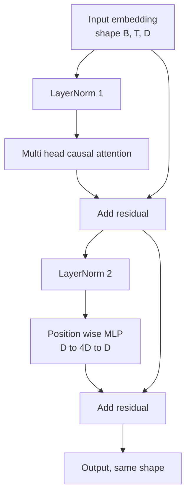
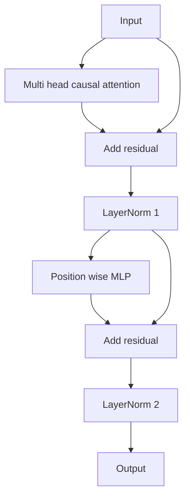

# 从零实现变压器区块

> 一块是每个现代解码器LLM的基本单元――层规则、多头注意力、残余、MLP、残余──前LN变体无需加热也能稳定训练──后LN变体是原始论文发布的版本──本课会并排构建二者,并展示在常见学习率下,哪个能过12层堆──

**Type:** Build
**Languages:** Python
**Prerequisites:** Phase 19 lessons 30 to 33 (tokenizer, embeddings, attention math, batched data loader)
**Time:** ~90 minutes

## 学习目标

- 从四个运动部件构建 PyTorch 中的变压器块:LayerNorm、多头因果注意、残留连接、位置智能MLP──
- 将LayerNorms 放在两种配置中,并解释为什么其中一个没有需要加热也能稳定训练.
- 在多头注意力实现因果化掩饰,使标志 `i`不能看到代币`j > i`,我知道.
- 随着12层堆的两个变体之间的渐进流动,不依赖含糊的说法解读结果.
- 在下一课组装 1.24 亿参数 GPT 时,把这个块作为直接可替换的单元复用.

## 问题

变压器就是重复一个块. 如果这个块一开始就错了,再重复十二次,你得到的模型要么是在第一时代就发散,要么在一路都需要加热.本课将看到的两种失败模式并不罕见.学习者第一次天真地堆积块时会遇到它们.

一旦看清楚,修复就是机械的. 这个块恰好有两个剩余路径和两个正常化位置.

## 概念

每个解码器只有变压器块 都是一个函数,它接收了形状为`(batch, sequence, embedding)`子,并返回相同形状的子.



这是LN前变体――LayerNorm 位于残留分支内部,在子层之前――残留连接 会把未归归化的信号向前传递――

后LN 变体会把 LayerNorm 移到残余添加后



形状完全相同. 训练行为不相同. 在LN后使用,沿着残余路径反向流动的梯度必须穿过LayerNorm. 在12层深度和学习速度.`3e-4`下,这个渐变会缩小得足够快,以至于需要加热时间表.

### 原因多头注意

注意子层将输入投影到查询,关键,值子,每个子都从`(B, T, D)`转型到`(B, H, T, D/H)`在其中`H`是头数量――标点产品关注 会按头 计算 `softmax(Q K^T / sqrt(d_k))`通过软max 应用面具,然后乘以`V`首头会被拼接回单个`(B, T, D)`子,并再次投影――面具是让模型具有因果性的唯一部分――忘记面具就是训练一个会作弊的模型――

### 农业发展部

位置智能 MLP 会把同一个两层网络独立应用到每个代币──隐藏宽度是嵌入宽度的四倍,激活是 GELU,并且在第二个线性 后接下来落──MLP 内部没有代币相互交流──所有代币混合都发生在注意中──

### 剩余的连接可以做两件事

它们让跨深度的渐进路径变成加法形式,从而保持渐进规范的尺度穿过十二层.它们也让每个块学习运行中的表示的加性更新,而不是完全的替代.


```figure
cc-transformer-block
```

## 建立它

`code/main.py`实现了:

- `class LayerNorm`带可学习的规模和转移的偏差,并应用到每个标志向量.
- `class MultiHeadAttention`带`num_heads`,我知道.`head_dim = d_model // num_heads`、融合QKV投影、注册的因果化面具、注意力落和残余落――
- `class FeedForward`包含两个线性层,GELU激活和断.
- `class TransformerBlock`带`pre_ln`旗,用于两种变体之间切换.
- 一个演示,构建6层前LN堆和6层后LN堆,使用相同输入,并打印 (a) 出口形状,(b) 一次倒退通过后嵌入处的渐进规则──

运行它:

```bash
python3 code/main.py
```

输出:两个堆积的形状检查,以及并排的渐进规范――在相同的学习速度下,LN前堆积的嵌入级比LN后堆积大一个数量级,这是LN前的无需加热也能训练的实证信号――

## 堆

- `torch`通过子数学,自动化和`nn.Module`管道
- 不使用`transformers`没有使用预训练的重量.

## 野生生产模式

两种模式将教科书中的块变成可以交付的东西.

**Fused QKV projection.**三个独立线性层会耗耗三次内核发射和三次对称.`3 * d_model`线性层可以在一次发射中完成同样的工作,然后沿最后一个轴分出, 融合路径在每个加速器上都更快,并与GPT-2、LLaMA和Mistral的参考实现一致.

**Registered causal mask buffer.**面具只依赖最大的下文长度.`register_buffer`分发一次,每次前进通过切出活跃窗口,并跳过每次调用分配.

**Dropout in two places, not three.**落后应位于注意软max 之后 (注意力落后),以及MLP的第二个线性落后 (后) 后 (残余落后) 后 (后) 后 (后) 后 (后) 后 (后) 后 (后) 后 (后) 后 (后) 后 (后) 后 (后) 后 (后) 后 (后) 后 (后) 后 (后) 后 (后) 后 (后) 后 (后) 后 (后) 后 (后) 后 (后) 后 (后) 后 (后) 后 (后) 后 (后) 后 (后) 后 (后) 后 (后) 后 (后) 后 (后) 后 (后) 后 (后) 后 (后) 后 (后) 后 (后) 后 (后) 后 (后) 后 (后) 后 (后) 后 (后) 后 (后) 后 (后) 后) 后 (后) 后 (后) 后) 后 (后) 后) 后 (后) 后 (后) 后) 后 (后) 后) 后 (后) 后 (后) 后) 后 (后) 后) 后 (后) 后 (后) 后) 后 (后) 后) 后 (后) 后) 后 (后) 后) 后 (后) 后 (后) 后)

## 用它

- 本课中的块可以不经修改直接插入第35课的GPT组装.
- 变体是每个现代开放权重LLM 使用形式──后LN 变体是2017年原始注意 论文使用形式──了解二者就足以阅读你会遇到的任何解码器架构──
- 把GELU 换成SLU,你就得到了LLaMA 系列激活.

## 运动

1. 给块中每个线条 添加`bias=False`现代开放权重LLM 发布时线性层 不带偏见――测量在12层、768dim 模型中能节省多少参数――
2. 用手写RMSNorm 替换`nn.LayerNorm`,并验证输出形状 不变──
3. 添加一个旗,返回第一个头的注意重量,作为 `(B, T, T)`紧缩量――绘制上三角,确认软max 后它为零――
4. 建立一个健康检查,把`(2, 16, 384)`子在`H=6`下送进两个变体,并断言在权重初始化相同且下降设为零时,前进输出不一样`not torch.allclose`

## 关键词

| Term | What people say | What it actually means |
|------|-----------------|------------------------|
| Pre-LN | "Pre norm" | LayerNorm 位于 residual branch 内部，在每个 sublayer 之前；residual 携带未归一化的 signal |
| Post-LN | "Post norm" | LayerNorm 位于 residual add 之后；这是 2017 年论文发布的形式，并且需要 warmup |
| Causal mask | "Triangle mask" | Attention logits 的上三角被设为负无穷，因此当 j 大于 i 时，Token i 不能读取 Token j |
| Fused QKV | "Combined projection" | 一个宽度为 3D 的 linear，而不是三个宽度为 D 的 linears；一个 kernel，一次 matmul |
| Residual stream | "Skip connection" | 自上而下流过每个 block 的未归一化 tensor；也是每个 block 添加到的对象 |

## 进一步阅读

- 阶段7课02 ((自理注意从零开始),了解这个区块的底层注意力数学――
- 阶段7课05(完整变压器),了解同一骨架的编码解码器版本
- 阶段10课04 ((预训练小GPT),了解这个块 要接入的训练过程──
- 阶段19课35 (本曲目),将把12个这样的块堆积成一个GPT模型.
