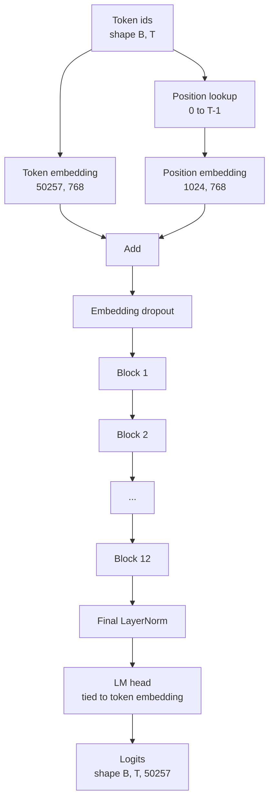
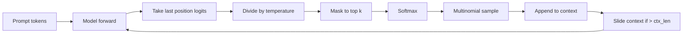

# 模型组装

> 十二个块 堆叠,一个代币嵌入,一个学习得到的位置嵌入,一个最终的层规范,以及一个权重绑定的语言模型头――这是完整的1.240亿参数GPT模型――本课将这些组件组装成一个可运行的类,统计参数确认模型匹配参考的124M形状,并使用多个个体样化、温度和顶-k 生成文本――

**Type:** Build
**Languages:** Python
**Prerequisites:** Phase 19 lessons 30 到 34
**Time:** ~90 分钟

## 学习目标

- 将课34 中的变压器块 组装成完整的GPT模型:Token Embedding、Position Embedding、N 个块、最终 LayerNorm、语言模型头──
- 复现 1.24 亿参数配置:语音50257 文本1024 嵌入 768 十二个头,12层
- 对于语言模型负责人, 权重绑定到代币嵌入,并解释为什么这在这个规模下可节省约3800万参数.
- 使用多个个体样本,温度缩小和顶部的切割 从即时 生成文本,并使用滑动窗口 保持文本长度.
- 对照 124M 目标测量参数数和前进通过 成本。

## 问题

变压器块 单独存在时什么也没有做. 你需要把代币ID转换为向量,混入位置信息,让它们穿过堆,再投射回词汇逻辑. 错过了四步中的任何一步,模型要么无法前进,要么位置信息漂移,要么无法说话.

模型的形状也很重要.参考GPT-2小在上面的精确配置下是1.24亿参数.这些数字并不神秘. 词汇50257乘以嵌入768是代币表. 位置1024乘以768是位置表. 每个块约700万参数,总数8400万. 最终头通过重量绑定重量重量重量重量重量重量重量重量重量重量重量重量重量重量重量重量重量重量重量重量重量重量重量重量重量重量重量重量重量重量重量重量重量重量重量重量重量重量重量重量重量重量重量重量重量重量重量重量重量重量重量重量重量重量重量重量重量重量重量重量重量重量重量重量重量重量重量重量重量重量重量重量重量重量重量重量重量重量重量重量重量重量重量重量重量重量重量重量重量重量重量重量重量重量重量重量重量重量重量重量重量重量重量重量重量重量重量重量重量重量重量重量重量重量重量重量重量重量重量重量重量重量重量重量重量重量重量重量重量重量重量重量重量重量重量重量重量重量重量重量重量重量重量重量重量重量重量重量重量重量重量重量重量重量重量重量重量重量重量重量重量重量重量重量重量重量重量重量重量重量重量重量重量重量重量重量重量重量重量重量重量重量重量重量重量重量重量重量重量重量重量重量重量重量重量重量重量重量重量重量重量重量重量重量重量重量重量重量重量重量重量重量重

## 概念



标志 id 变成标志向量――位置 id 变成位置向量――两者相加后送入堆――最终 LayerNorm 是块外部的组件,并且在每个现代变体中都保留下来――LM头 复用标志嵌入矩阵,这就是重量绑定的含义――

### 按重量

标志嵌入的形状是`(vocab, d_model)`◊语言模型头 需要从 `d_model`投影回`vocab`△它们相互转换.△将两者绑定,意思是字面上使用相同参数数,用两次. 在词汇50257 和 d_model 768 下,这个矩阵有3800万参数.

### 位置嵌入是学习得到的,不是突形

位置嵌入式位置表是一个形状为`(1024, 768)`模型在每次前进时查找位置0到T-1,并把查找结果加到代币嵌入上――这是最简单的位置方案(RoPE、ALiBi、T5相对偏差是替代方案),也是124M 参考模型使用方案――

### 产量:温度,顶级,多项

代代是自动降低的. 每一步,模型都会在每个位置返回完整的词汇上的逻辑. 你只能在最后一个位置,除了温度,可选地把顶部的 k 逻辑之外的所有逻辑掩盖成负无限,软最大的 得到概率,然后从得到的分布中样本一个代币.



三旋,对应三种不同的行为――温度 接近零会退化成贪――温度 为一时匹配模型的自然分布――顶-k 为一就是贪――顶-k 为四十会过长尾――组合方式很重要; 下一课关于训练内容将生成用定性评估信号――


```figure
cc-gpt-assembly
```

## 建立它

`code/main.py`实现:

- `class GPTConfig`数据类,带有124M默认值:`vocab_size=50257`,我知道.`context_length=1024`,我知道.`d_model=768`,我知道.`num_heads=12`,我知道.`num_layers=12`,我知道.`mlp_expansion=4`,我知道.`dropout=0.1`,我知道.`use_bias=True`,我知道.`weight_tying=True`,我知道.
- `class GPTModel`包含代币嵌入,位置嵌入,嵌入放弃,十二个`TransformerBlock`、最终的LayerNorm,以及在旗打开时绑定到代币嵌入的 `lm_head`,我知道.
- `count_parameters`帮助者,返回唯一参数数量,所以统计时会正确处理重量绑定.
- `generate`执行温度,顶-k,多数和滑窗文本.
- 一个演示,构建模型,打印参数数并与参考 124M 对照,然后从固定提示 生成一个短序列,展示管道端到端可运行.

运行它:

```bash
python3 code/main.py
```

输出:参数数与124M 参考值对照、随时随时生成的代币ID,以及在绑定时打开的LM头和代币嵌入共享存储的确认信息──

为了让演示保持快速,脚本还会端到端运行一个小配置.`d_model=64`,我知道.`num_layers=2`),并直线 打印生成的代币序列──124M配置会被构建,但只执行参数计和一次向前传递──

## 堆

- `torch`通过数数学,自动化和模块管道.
- `code/main.py`在本地重新实现34课中相同的块模式.

## 野生生产模式

三种模式决定一个模型只能运行,还是能真正交付.

**把 residual projections 初始化得小一些。**注意的输出投影和MLP的第二个线性城市直接进入残留区间.如果使用与其他线性相似的标准偏差初始化它们,残留流会随着深度的增长,并把最终的层规则推进过热区间.对这两个投影,将按`1 / sqrt(2 * num_layers)`缩放;剩余流量就能在十二层中保持合理范围.

**缓存 position id tensor，不要重复计算。** `torch.arange(T)`总是每次发行时分配新内存.`__init__`中按最大的背景 分配一次,每次调用时切片前T 个条目,跳过分配器往返──

**在 parameter 层面 tie weights，而不只是 copy。**设置`lm_head.weight = token_embedding.weight`需要更新一个参数,自动化图形也需要一次积累──如果你复制,头 会从嵌入 漂走,权重绑定就没有任何收益──

## 用它

- 本课的模型类与下课的模型形状相同.
- 将学习得到的位置 嵌入 替换为 RoPE,就能得到 LLaMA 家庭,而无需改变区块或头.
- 将GELU 换成SiLU,并将LayerNorm 换成RMSNorm,就能得到LLaMA家族的余变.
- 生成函数可用于任何逻辑 来源,不仅限于这个模型.你可以在37课中从预训练的GPT-2文件中拉取逻辑,并复用同一个生成循环.

## 运动

1. 解除LM头与代币嵌入的绑定并重新统计参数――验证差值为50257乘以768 =3800万――
2. 将学习得到的位置嵌入 替换为构建时计算的阴影形表.
3. 为一代 添加`greedy=True`标志,跳过样本并选择 argmax──确认序列在多次运行中是确定性的──
4. 添加`repetition_penalty`旋,在软max 之前,将提示或已生成的历史中任意的代币的逻辑除以一个常数.
5. 在`top_k`旁边添加`top_p`通过两行检查确认保留代币的概率 之和超过`top_p`,我知道.

## 关键词

| Term | What people say | What it actually means |
|------|-----------------|------------------------|
| Weight tying | “Tied embeddings” | LM head 和 Token Embedding 共享同一个 parameter tensor；节省 vocab times d_model 参数，并匹配 GPT-2 参考模型 |
| Position embedding | “Learned positions” | 一个单独的 table，形状为 (context length, d_model)，加到 token vectors 上；端到端学习得到 |
| Sliding window context | “Context cap” | 当 prompt 加生成 tokens 超过 context length 时，丢弃最旧的 tokens，让 active window 能放下 |
| Top-k sampling | “K truncation” | 保留值最高的 K 个 logits，把其余 logits mask 成 negative infinity，并在剩余项上 softmax |
| Temperature | “Sampling temperature” | 在 softmax 前用 T 除以 logits；T 小于 1 会变尖锐，T 等于 1 保持自然 distribution，T 大于 1 会变平坦 |

## 进一步阅读

- 阶段19课时34节,了解本模型堆叠的区块.
- 阶段19课时36:了解如何使用交叉缩损失
- 阶段19课37:了解如何把预训练的GPT-2重量加载到这个精确的架构中──
- 阶段7课07(GPT因果语言建模),了解下一个代币预测的数学──
- 阶段10课04(预训练小GPT),了解同一架构上的原始训练过程──
