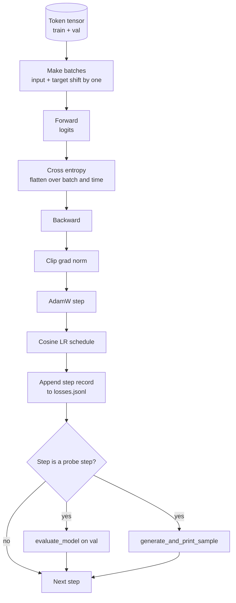

# 培训循环和评估

> 没有测量循环就在说谎. 本课构建驱动GPT模型的训练循环:带重量衰减分离的亚当W、加热加大宇宙学习率时间表`calc_loss_batch`帮助者 保持数据上`evaluate_model`通过每一个步骤一次`generate_and_print_sample`定性探测器以及可在后面绘制的JSONL损失记录.

**Type:** Build
**Languages:** Python
**Prerequisites:** Phase 19 lessons 30 到 35
**Time:** ~90 分钟

## 学习目标

- 构建一个训练循环,为下一个代币预测使用正确的输入和目标配线来计算跨进化损失.
- 配置AdamW,使体重衰减应用于体重杆,而不是应用于LayerNorm或偏差杆.
- 实现带有线性变暖和宇宙衰变的学习率时间表,并读取随时间变化.
- 使用 `evaluate_model`在进行分化上评估,使评估损失可跨运行比较.
- 每个步骤`generate_and_print_sample`生成一个定性样本,以便在损失曲线中显示之前捕捉分歧.
- 将每步的损失 持久化到JSONL,以便重新加载,绘图,并将训练日志作为可交付的交付.

## 问题

一个只打印损失而没有什么做的训练脚本会在三方面失败――它不能告诉你损失是不是因为正确的原因在下降(模型可能只是在训练集中过度,而从来没有真正学习)――它不能告诉你分歧是不是开始的(损失可能起一步后恢复,也可能起一步后崩)――它不能告诉你模型学到了什么(损失是一个尺度;生成的样本是一段文字)――除非做测量,否则这三个失败都会被隐藏起来.

本课中的循环 用三种方法测量――每一步在训练批上的损失――每一步在训练批上的损失――每一步从固定提示生成一个延续――训练日志落在JSONL中,因此文物就是这个循环的证词――

## 概念



两个不那么明显的部分是损失和亚当W衰变的分离.

### 损失配线

模型在每个位置预测下一个代币. 如果输入批量是代币.`[t0, t1, t2, t3]`目标批量必须是`[t1, t2, t3, t4]`△ 横向体在平面形状上`(batch * seq, vocab)`上计算,并对照平面目标`(batch * seq,)`忘记转变,就把模型训练成预测自己;它会收到零损失,却学会没有任何有用的东西.

### 亚当W衰变分化

重量衰减会调整重量杆,但不会调整正常化尺度或偏差――把衰减放在LayerNorm尺度上,会慢慢把尺度推向零,并破坏正常化――把衰减放在偏差上在数学上无害,但浪费周期――标准分分是:矩阵形状杆 (矩阵形状杆) 线性重量、嵌入表) 使用衰减,任何看起来像尺度或转移的参数不使用――

### 热量加上位时间表

热化会在几百步内将学习速度从零拉普到目标值,让优化状态有时间填充. 在剩余步骤中,化率将降低到零,使最终阶段变得较小的步骤尺寸的细节调节重量.

### 进行评估

`evaluate_model`从验证分分 运行固定数量的批量,累积损失,除以批量数,然后返回.没有分数.没有落地. 在同一种子和相同的分下,这个数字可跨运行.

### 质量样本作为早期信号

一个训练损失 下降很好,但生成的样本都是同一个标志的模型是坏的. 一个损失曲线看起来平坦,但生成的样本 逐渐变成连贯单词的模型正在学习.


```figure
cap-training-loop
```

## 建立它

`code/main.py`实现:

- `make_batches(token_ids, batch_size, context_length)`将一个长代币子切片 成输入和目标对子.
- `calc_loss_batch(model, inputs, targets)`执行向前,平坦,并返回尺度交叉化.
- `evaluate_model(model, val_loader, max_batches)`在没有毕业生下, 代数量固定验证批量,并返回平均损失.
- `generate_and_print_sample(model, prompt, max_new_tokens)`, 在固定提示上运行课35的生成函数并打印结果.
- `build_param_groups(model, weight_decay)`生成两组 AdamW参数列表
- `cosine_with_warmup(step, warmup_steps, total_steps, max_lr, min_lr)`返回给定步的 LR──
- `train(...)`运行循环,持久化`outputs/losses.jsonl`并每`eval_every`打印评估损失和样本
- 一个演示,在合成数据上训练小模型少量步骤,写入JSONL日志,并在探测点印出评估损失和样本.

运行它:

```bash
python3 code/main.py
```

输出:每步损失 行、每测试步骤的评估损失、每测试步骤的生成样本,以及最终的`outputs/losses.jsonl`你可以用它.`json.loads`按行加载它.

## 堆

- `torch`通过自动化,优化和模块.
- `main.py`在本地重新实现第35课`GPTModel`和支持模块.

## 野生生产模式

书籍循环将变成一个可以整夜运行的东西.

**Gradient norm clipping 不可协商。**一个坏批次 (异常数据,LR 峰值,数值边界情况) 将产生巨大的渐进,抹掉数小时的训练成果.`backward`之后,`step`之前调用`torch.nn.utils.clip_grad_norm_(params, max_norm=1.0)`可让优化器保持在安全范围内. 剪值是一个自由参数.

**可恢复的 JSONL logging，而不是 pickled state。**将每步损失记录作为`{"step": int, "train_loss": float, "lr": float}`行写入JSONL是耐用的:任何崩都会留下可读的文物,你可以抓住,可以使用三十行Python图画,也可以通过阅读最后一步恢复训练.

**Eval batches 来自固定 slice。**验证代币在脚本启动时被切成批次,而不是动态生成――可复现性依赖于评估批次在每次运行中完全相同;否则比较两次运行的评估损失,测到的批次混动可能和模型本身一样多――

## 用它

- 本课中的循环与实数据训练中的124M模型的骨架相同.`datasets`风格的载体,循环就能不变地运行.
- 士号日志是将训练运行转化为证据的交付. 下一课将使用这样的日志来比较新训练检查点和预训练检查点.
- 定性样本探测是可替代的底检查.

## 运动

1. 添加`weight_decay_groups()`单位测试,确认尺度和偏差参数 落入没有衰变组,而线性 和嵌入重量 落入衰变组――
2. 用一个小文本文件中的字节 替换合成随机代币,让演示在可读内容上训练――验证生成样本 使用文件中存在的字符――
3. 为 cosine时间表 添加一个 `min_lr`价值为`max_lr`没有任何问题.
4. 除了JSONL日志外,每 `eval_every`保存一个检查点.`resume_from`旗来重新加载模型状态和优化器状态――
5. 在损失旁边记录每步输出 (每秒) 符号),并确认它保持在稳定区间.

## 关键词

| Term | What people say | What it actually means |
|------|-----------------|------------------------|
| Loss alignment | “Shift by one” | Input tokens 位于 positions 0..T-1，target tokens 位于 positions 1..T；cross entropy 在 flattened shapes 上计算 |
| Decay split | “Two groups” | AdamW 接收带 weight decay 的 matrix shaped tensors，以及不带 decay 的 scale 或 bias tensors |
| Warmup | “Ramp” | learning rate 在固定步数内从零爬升到目标值，让 Optimizer state 可以填充 |
| Eval batches | “Held out batches” | validation token tensor 的一个固定 slice，在 script 启动时 slice 一次，并在每个 probe 中相同使用 |
| Qualitative probe | “Sample print” | 每 K steps 从固定 prompt 打印一次短 generation，用于捕捉单靠 loss 会隐藏的 failure modes |

## 进一步阅读

- 阶段19课 35,了解该循环 驱动的模型――
- 阶段19课37:了解如何将预训练的重量加载到同一个模型中.
- 阶段10课04 ((预训练小GPT),了解真实数据上的过程──
- 阶段10课10 (评估),了解跨体损失
