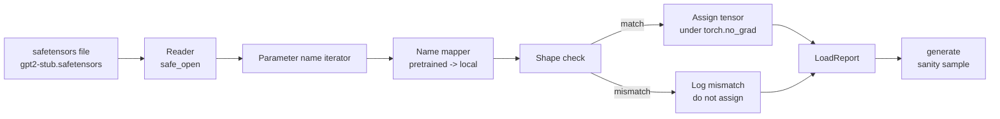

# 加载预训练的重量

> 从零训练一个124万参数模型是预算决策;加载一个公开检查点是日常操作. 本课将安全感器文件中预训练的GPT-2风格重量加载到第35课的同一个架构中,逐步解读参数名称映射,并通过智能生成一个延续来证明加载成功.

**Type:** Build
**Languages:** Python
**Prerequisites:** Phase 19 lessons 30 to 36
**Time:** ~90 minutes

## 学习目标

- 使用 `safetensors`读取安全传感器文件并检查传感器名称和形状
- 将每个预训练参数名称映射到课35 GPT模型内部的一个参数.
- 处理发表的GPT-2重量与本轨道模型之间不同两套命名约定:`wte/wpe/h.N.attn.c_attn/c_proj`和 `mlp.c_fc/c_proj`应本地命名的`tok_embed/pos_embed/blocks.N.attn.qkv/out_proj`和 `mlp.fc1/fc2`,我知道.
- 在任何重量分配发生之前,检测并拒绝形状不匹配,并给出清晰错误.
- 使用加载权重 生成一个短续,并确认代币来自加载分布,而不是随机初始分布.

## 问题

发布的权重不是为你的建筑打包的.它们带有原始实现使用名称.`(2304, 768)`的`transformer.h.0.attn.c_attn.weight`你的模型 期望的形状 为`(2304, 768)`的`blocks.0.attn.qkv.weight`(这是同一个矩阵,只是布局规则不同),或者你的模型使用.`nn.Linear`它们将被转换为存储矩阵. 同一个参数将以三种不同的身份出现.

盲写载体将把正确的子放到错误位置,得到一个生成胡言乱语的模型──形状 不同时拒绝复制但不记录任何日志的载体,将让你猜测哪个子 没有落位──本课的载体是显而易见的:每次分配都会记录日志,每一个形状都会检查,并且`LoadReport`总体来说,我们会看到什么发生了.

## 概念



名称地图器只是一个从字符串到字符串的函数――形状检查是一个如果――任务发生在`torch.no_grad()`内部,因此自动降低不会跟踪加载过程――报告会保存每个名称的结果――

### 基因二级命名公约

发表的GPT-2重量 使用如下名称:

| Pretrained name | Shape | Meaning |
|-----------------|-------|---------|
| `wte.weight` | (50257, 768) | Token Embedding |
| `wpe.weight` | (1024, 768) | Position Embedding |
| `h.N.ln_1.weight` | (768,) | block N 的 LayerNorm 1 scale |
| `h.N.ln_1.bias` | (768,) | block N 的 LayerNorm 1 shift |
| `h.N.attn.c_attn.weight` | (768, 2304) | 融合 QKV linear weight |
| `h.N.attn.c_attn.bias` | (2304,) | 融合 QKV linear bias |
| `h.N.attn.c_proj.weight` | (768, 768) | Attention output projection |
| `h.N.attn.c_proj.bias` | (768,) | Attention output projection bias |
| `h.N.ln_2.weight` | (768,) | LayerNorm 2 scale |
| `h.N.ln_2.bias` | (768,) | LayerNorm 2 shift |
| `h.N.mlp.c_fc.weight` | (768, 3072) | MLP fc1 weight |
| `h.N.mlp.c_fc.bias` | (3072,) | MLP fc1 bias |
| `h.N.mlp.c_proj.weight` | (3072, 768) | MLP fc2 weight |
| `h.N.mlp.c_proj.bias` | (768,) | MLP fc2 bias |
| `ln_f.weight` | (768,) | Final LayerNorm scale |
| `ln_f.bias` | (768,) | Final LayerNorm shift |

需要提前处理的两个意外点.`c_attn`,我知道.`c_proj`,我知道.`c_fc`对于这些线形的矩阵存储方式,`nn.Linear.weight`期望方式是转置的. 载体会在任务中转置时. LM头完全不在文件中. 模型依赖与`wte`重量,因此一旦 `wte`落位,头就通过名 设置好.

### 地方命名大会

本轨道的模型 使用描述性名称:

| Local name | Meaning |
|------------|---------|
| `tok_embed.weight` | Token Embedding |
| `pos_embed.weight` | Position Embedding |
| `blocks.N.ln1.scale` | block N 的 LayerNorm 1 scale |
| `blocks.N.ln1.shift` | LayerNorm 1 shift |
| `blocks.N.attn.qkv.weight` | 融合 QKV |
| `blocks.N.attn.qkv.bias` | 融合 QKV bias |
| `blocks.N.attn.out_proj.weight` | Attention output projection |
| `blocks.N.attn.out_proj.bias` | Output projection bias |
| `blocks.N.ln2.scale` | LayerNorm 2 scale |
| `blocks.N.ln2.shift` | LayerNorm 2 shift |
| `blocks.N.mlp.fc1.weight` | MLP fc1 |
| `blocks.N.mlp.fc1.bias` | MLP fc1 bias |
| `blocks.N.mlp.fc2.weight` | MLP fc2 |
| `blocks.N.mlp.fc2.bias` | MLP fc2 bias |
| `final_ln.scale` | Final LayerNorm scale |
| `final_ln.shift` | Final LayerNorm shift |

绘图是一个固定函数. 本课把它作为一个命令交付,载荷器会代这个命令.

### 子固定

真实GPT-2重量大约0.5GB──Demo 不会下载它们;它会在第一次运行时生成一个小型安全感器装置,采用完全相同的GPT-2命名公约,并使用适合12块模型、d_model 192而不是768的形状──这个装置具有正确的结构,能触发载荷器中每条代码路径──把装置换成真实文件 后,载荷器 无需修改即可工作──


```figure
cc-weight-remap
```

## 建立它

`code/main.py`实现:

- 一个课 35`GPTModel`让本课自含.
- `make_pretrained_to_local(num_layers)`展开每层条目
- `load_safetensors(model, path)`代名称,映射名称,检查形状,转换卷式重量,并`torch.no_grad()`下次任务. 回来.`LoadReport`,我知道.
- `make_stub_safetensors(path, cfg)`通过精确预训练的命名公约生成一个固定文件.
- 一个演示:第一次运行时创建`outputs/gpt2-stub.safetensors`创建一个新型模型,捕获随机的 init 生成一个延续,加载片,再捕获另一个延续,打印二者,并验证两者不同(加载确实改变了模型) ⋅

运行:

```bash
python3 code/main.py
```

输出:固定路径、个别名称的负载日志、`LoadReport`总结,加载前的延续,加载后的延续,以及故意注入装置中的单个坏子,引发形状不匹配,用于覆盖故障路径.

## 堆

- `safetensors`基于磁盘格式和流媒体阅读器.
- `torch`用模型和任务数学.
- 不使用`transformers`没有使用`huggingface_hub`没有网络通话.

## 野生生产模式

对于你没有创建的重量,

**始终在任何 assignment 前验证 file。**打开文件,列出每个子名称及其d型和形状,运行完整地图和形状检查,只有在成功后才开始分配──半加载模型是静默失败机器──

**每次 assignment 都记录 source name 和 destination name。**当某些东西看起来不对, 记录会告诉你哪个子落到哪里; 替代方案是读六.`LoadReport`数据类 会跟踪`loaded`,我知道.`missing`,我知道.`unexpected`和 `shape_mismatch`列表,最后打印总结.

**LM head 是 weight tying alias，不是单独 copy。**载载`tok_embed`后设置`model.lm_head.weight = model.tok_embed.weight`是规范模式――把嵌入矩阵 复制到新的`lm_head.weight`参数会破坏绑定,并让参数数数量翻倍.

## 用它

- 装载器 适用于任何使用预训练命名公约的安全传感器文件──真实GPT-2文件(小/中/大/xl)无需代码变更 即可工作;只有模型配置 不同──
- 一旦更新名字地图,同样的模式可扩展到LLaMA、Mistral、Qwen权重──形状检查和报告保持不变──
- 如果后载的智能生成是快速门:如果后载样本看起来像前载样本,说明加载没有改变模型,也意味着映射 静默漏掉每个子.

## 运动

1. 为加载器 添加`dtype`在任务中,每个子都将被抛到目标d类型`bfloat16`,我知道.`float16`,我知道.`float32` 确认`float32`模型可以降低到`bfloat16`没有可能产生.
2. 添加`expected_layers`拒绝加载`h.N`指数与模型`num_layers`不匹配的检查点.
3. 把载体接入课 35代函数并生成两个并排样本:一个来自随机的 init,一个来自载体.
4. 添加出口路径:使用预训练命名公约 将当前模型状态 写入一个新的安全传感器文件──圆路旅行载荷器 并确认报告 中形状不匹配 为零──
5. 扩展`NAME_MAP`以处理LLaMA命名公约(无偏见、RMSNorm、融合的qkv布局),并生成的 stub LLaMA 装置上重新运行载体──

## 关键词

| Term | What people say | What it actually means |
|------|-----------------|------------------------|
| Name map | "Key remapping" | 从 pretrained tensor names 到 local parameter names 的 function；通常是一个 literal dict，每个 layer index 一个 entry，并在 loop 中展开 |
| Shape mismatch | "Bad shape" | Pretrained tensor 存在于 mapped name 下，但其 dimensions 与 local parameter 不一致；loader 会拒绝 assignment 并记录这对 name |
| Transpose-on-load | "Conv1d layout" | Published GPT-2 将 Attention 和 MLP projections 存储为 nn.Linear 期望形式的转置；loader 会在 assignment 时转置 |
| Weight tying alias | "Shared LM head" | 设置 model.lm_head.weight = model.tok_embed.weight，让 head 和 Embedding 共享 storage；正因为如此，head 不在 file 中 |
| Load report | "Coverage summary" | 一个小型 dataclass，跟踪 loaded、missing、unexpected 和 shape_mismatch lists；打印它可以判断加载是否成功 |

## 进一步阅读

- 接收重量的建筑――
- 阶段19课时36:生成同形的检查点的训练循环
- 阶段10课11:记忆 紧张时如何处理负载重量
- 第十阶段课程13:建立完整的LLM管道:负载与推断周边的完整生命周期
