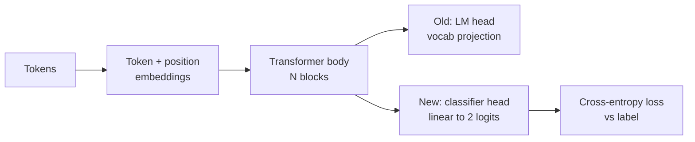
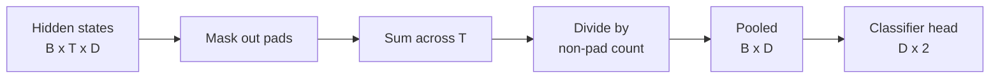
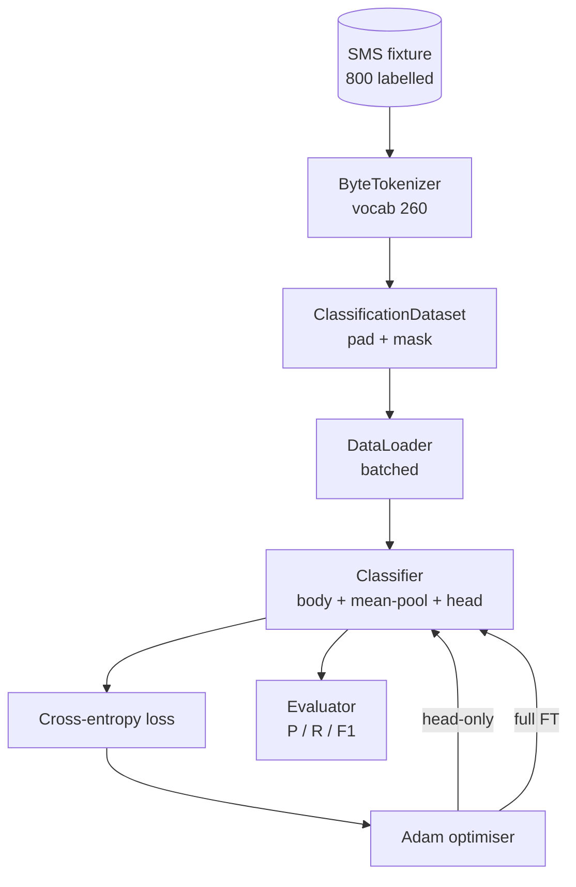

# 石课38:通过头交换进行分类器精细调节

> 轨道B的第一个顶石──训练语言模型是一层自觉注意区块,末端是标志预测头──当你想做垃圾邮件与肉时,头是错误的,但身体基本是对的──本课会拆掉头,把一个两类线性层 接到集成表示上,并使用两种方式训练分类器:最后层只有和完整的细调──同等使用保持分离上的精度、回忆和F1──你会学到每种策略带来什么、代价是什么──

**Type:** Build
**Languages:** Python (torch, numpy)
**Prerequisites:** Phase 19 lessons 30-37 (NLP LLM track: tokenizer, embedding table, attention block, transformer body, pre-training loop, checkpointing, generation, perplexity)
**Time:** ~90 minutes

## 学习目标

- 在不重新初始化体的情况下,把语言模型头换为分类头.
- 实现两种训练模式:结体头头头头头头头头头头头头头头头头头头头头头头头头头头头头头头头头头头头头头头头头头头头头头头头头头头头头头头头头头头头头头头头头头头头头头头头头头头头头头头头头头头头头头头头头头头头头头头头头头头头头头头头头头头头头头头头头头头头头头头头头头头头头头头头头头头头
- 构建标记者意识的数据管道,负责填充,面具填充,并对注意力输出做聚合.
- 从原始的逻辑计算精度,回忆,F1 和混矩阵.
- 推理参数数量,训练时间和主机间的交易.

## 问题

你已经在通用体内上预训练了一个小变压器――输出头会把最后一个隐藏状态 投影到1000代币词汇――现在你有800条标记为垃圾邮件或的短信,希望构建一个二进制分类器――这里有三种选择――

错误选择是基于800个例子从零训练一个新的分类器.训练模型的身体已经编码了有用的结构:词的身份,位置,简单的共产.

两个正确选择是头交换 后结身体,以及头交换 后让身体可训练――只对头的训练 快速,记忆 几乎免费,在这么少的数据上也不太容易过度过度过度过度过度过度过度过度过度过度过度过度过度过度过度过度过度过度过度过度过度过度过度调节 更慢,在小数据上可能过度过度过度过度过度过度过度过度,但当下游域 偏离预训练体积时可以达到更高的准确性――

本课会同时构建二者,让你能在同一场上比较.

## 概念



模型是一个函数:`f_theta(tokens) -> hidden_states`△头是一个功能:`g_phi(hidden) -> logits`换头意味着保留`theta`并替换`g_phi`身体的参数是昂贵的部分.

有两组可训练的参数 很重要:

- `theta`每个注意区中都有数万个重量.
- `phi`标题:`hidden_dim * num_classes`体重加一个偏见.

在头部训练中,你是针对的`phi`计算梯度,并让 `theta`向为零.PyTorch 允许你通过在身体参数上设置.`requires_grad=False`为了做到这一点, 优化,然后只能看到头,身体,保持冷.

在完整的细调中,你允许梯度回流穿过整个堆.身体的重量会漂移以适应的分类目标.风险在小数据上发生灾难性遗忘:身体的预训被过量噪音冲掉.

## 汇集问题

类型 需要每个序列一个向量,而不是每个代币一个向量.

- **Mean pool**按注意力面具加权,对序列上面的隐藏状态取平均.
- **CLS pool**之前设置了一个特殊的代币,并只使用其输出.
- **Last-token pool**通过使用最后一个非标.

本课使用显式注意力面具权重的平均聚合――它最简单,在不同序列长度上给出稳定信号,也不需要预训练 CLS标志――



## 数据

八百条短信,400条垃圾邮件和400条腿,都会在`code/main.py`中确定性 生成──生成器 使用固定种子,选择模板并替换插槽填充器,输出长度在5至25个代币之间的消息──真实数据集 会有这个连接 没有噪音──连接的重点是可复制性──

根据 80/20 分裂:640 列车,160 测试―― 分裂 使用 层次化,因此测试集 保持 50/50 均衡―― 一个平衡已知的 已知 持久集 能让精确 和回忆 被当作可信数字 解读――

## 标准

中类1是正分类讯讯讯讯讯讯讯讯讯讯讯讯讯讯讯讯讯讯讯讯讯讯讯讯讯讯讯讯讯讯讯讯讯讯讯讯讯讯讯讯讯讯讯讯讯讯讯讯讯讯讯讯讯讯讯讯讯讯讯讯讯讯讯讯讯讯讯讯讯讯讯讯讯讯讯讯讯讯讯讯讯讯讯讯讯讯讯讯讯讯讯讯讯讯讯讯讯讯讯讯讯讯讯讯讯讯讯讯讯讯讯讯讯讯讯讯讯讯讯讯讯讯讯讯讯讯讯讯讯讯讯讯讯讯讯讯讯讯讯讯讯讯讯讯讯讯讯讯讯讯讯讯讯讯讯讯讯讯讯

- `TP`预测为垃圾邮件,实际上是垃圾邮件.
- `FP`预测为垃圾邮件,实际上是.
- `FN`实际上是垃圾邮件.
- `TN`预测为,实际是.

标题三项:

- `precision = TP / (TP + FP)`,在被标记为垃圾邮件中,实际上垃圾邮件的比例是多少?
- `recall = TP / (TP + FN)`在实际垃圾邮件中,模型标记的比例是多少?
- `F1 = 2 * P * R / (P + R)`△二者的和平均量

混矩阵会把四个计数打印为2x2格里.


```figure
cap-classifier-head-swap
```

## 建筑



身体是个刻意很小的变压器:口音260、隐藏64、4头、2块、最大序列32──它足够小,可以在CPU上90秒内把两种模式都训练到融合──本课中它不是预训练的;相反,`pretrain_quick`帮助人会在同一节目中学习五个时期的LM训练,让身体有一个非凡的起点.

## 你会建造什么

实现是一个`main.py`加一个测试模块`code/tests/test_main.py`

1. `ByteTokenizer`转换到ID,并保留一个字段ID.
2. `Block`带多头注意和输送前方层的变压器块――预规――
3. `LMBody`: 标签 + 位置 嵌入 加上一叠块──返回隐藏状态──
4. `MeanPool`按按平均值做
5. `Classifier`身体在不同政权中都是相同的例子.
6. `freeze_body`和 `unfreeze_body`换体参数 上的`requires_grad`,我知道.
7. `train_classifier`接收模型和一个为当前可训练的参数组配置的优化器.
8. `evaluate`运行测试设置并返回`Metrics(precision, recall, f1, confusion)`,我知道.
9. `run_demo`首先简短预训练机构,然后训练并评估头脑,再训练并评估完整,打印两个报告,并以零退出――

## 为什么比较是重要的

只有头的模式通常训练更快,并以更平滑的方式不适应. 在这个装置上,只有头的训练 二十个时代后,你通常会看到精度接近0.9、回忆接近0.85──完全精细调大约慢三倍,最终结果会在几个点内浮动,取决于随机种子──

本课不选赢家――它教你读懂数字和成本――对800个例子和小身体来说,头脑只有是正确的选择――对80,000个例子和更大的身体来说,完整的细节调整 值得投入――你从本课带走的合同是API:同一个`train_classifier`处理两种情况,一起来,只是一次电话.

## 实现目标

- 添加第三种模式,只需解最后一个块――这有时被称为部分细调――它比全额FT 成本更低,比头脑只学得更多――
- 增加学习率调度器──对头 用共数调度,并对身体 使用更小的常率,是常见的生产设置──
- 用学习注意力池 换成平均聚合:一个带有一个学习查询的小注意力层――在较长的序列上它通常优于平均聚合池――

执行给你.测试. 定制合同.
