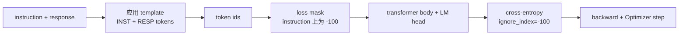
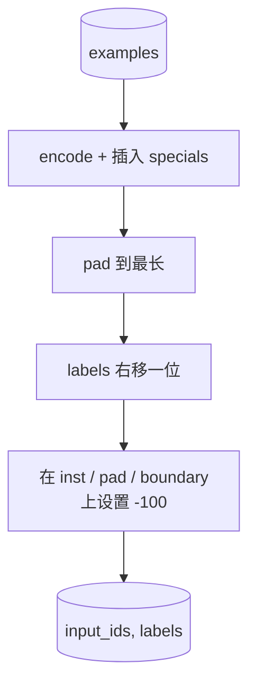
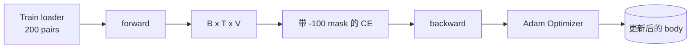

# 课程 39:通过监督的细调 进行指令调整

> 预训练的基模型可以延续一序列,但无法遵循一条指令. 监督的细节调整是修改这一点的最小变化:向模型入通过指令和期望反应 配对组成的样本,并训练主体来预测响应代币. 关键在于你只希望输出计算反应,而不是指令. 本课程将构建一个阿尔帕卡风格的SFT循环,其中包含自定义的集结函数,使用`ignore_index=-100`屏蔽指令令,在200个指令响应对上训练,并使用精确匹配在持久的分分分上评估.

**Type:** Build
**Languages:** Python (torch, numpy)
**Prerequisites:** Phase 19 lessons 30-37 (NLP LLM track: tokenizer, embedding table, attention block, transformer body, pre-training loop, checkpointing, generation, perplexity)
**Time:** ~90 minutes

## 学习目标

- 将配对的指示响应数据格式化为带有明显边界代币的单个因果序列.
- 构建一个集结函数,屏蔽指令令,使交叉缩只计算响应令牌.
- 在SFT目标下训练一个小变压器体,并观察评估测量的变化.
- 实现贪和温度样本生成,并遵守响应开始界限.
- 计算出出了完全匹配的结果.

## 问题

运用下一个代币预测 训练的基础模型 不知道是什么指令.`"What is the capital of France?"`它会继续这个问题,或者编写一个新的句子.

每个训练样例都会变成一个包含三个区域的单一序列:

```text
<INST> What is the capital of France? <RESP> The capital of France is Paris.
```

边界代币是训练时保留的特殊代币.`<RESP>`之后一切都是答案,而答案只是被评分的一部分.

但是这里有一个陷──如果你把整个序列给普通的交叉缩损失,你也在训练模型预测指令令标.指令是已定的────────────────────────────────────────────────────────────────────────────────────────────────────────────────────────────────────────────────────────────────────────────────────────────────────────────────────────────────────────────────────────────────────────────────────────────────────────────────────────────────────────────────────────────────────────────────────────────────────────────────────────────────────────────────────────────────────────────────────────────────────────────────────────────────────────────────────────────────────────────────────────────────────────────────────────────────────────────────────────────────────────────────────────────────────────────────────────────────────────────────────────────────────────────────────────────────────────────────────────────────────────────────────────────────────────────────────────────────────────────────────────────────────────────────────────────────────────────

## 概念



`ignore_index`是 `torch.nn.functional.cross_entropy`任何目标位置等于`ignore_index`城市贡献零损失 和零 梯度──PyTorch 中的惯例是`-100`△每种情况下构建两个子:`input_ids`现在,我们要做什么?`labels`(`input_ids`副本,其中的指导职位被覆盖为`-100`

模型在前进传递期间看到整个序列;注意力可以参加指示――丢失只计算响应标志――这正是你想要的:指示的条件,预测响应――

## 数据

`main.py`中确定性产生了200个命令响应对.它们覆盖了6种任务类型:

- 实际的单次射击(X 的首都)
- 算术
- 清单提取
- 一句总结
- 编码(打印,排序)
- 定义

每个任务都有一个模板的指示和一个决定性反应――这是刻意保持简单的设计――精确匹配很脆弱,而本课使用一个固定,其中正确答案是一个特定字符串――真实的SFT数据集需要模糊的指标;原理完全相同――

分为160列车,40.测试.测试集 覆盖全部六种任务类型,因此可以报告每类别的精确匹配.

## 标记和接

代币器是字节级别,并带有三个保留特点:

- `INST_ID = 256`标记指令区域的开始
- `RESP_ID = 257`标记指示与响应之间的界限
- `PAD_ID = 258`:用于变长批量装

序列是`[INST] inst_bytes [RESP] resp_bytes [PAD]*`△结函数:

1. 标志 每个例子.
2. 将分批中每一个样本的到该分批内最长序列的长度.
3. 构建`labels`移动一个人的右移`input_ids`(因果性LM目标),并且:
   - 将指令区域 替换为`-100`,我知道.
   - 将填充区域 替换为`-100`,我知道.
   - 将`RESP_ID`边界位置 本身替换为 `-100`(你不训练模型预测边界标记;它预测后续内容)



转变是标准的因果技巧:`input_ids`的位置`i`预测位置`i+1`为了`labels[i] = input_ids[i+1]`面具在转移后应用,落在正确位置上.

## 培训



循环是标准的 PyTorch SFT循环──亚当,学习率约3e-4到1e-3,在这个装置上训练十到二十个时代,不使用时间表──模型足够小(隐藏96、2块、最大长度64),可以在两分钟内在CPU上训练到收──

每五个时代,循环会在一个持久的集合上运行一个很小的评估通过并打印精确匹配. 从时代一个的0.0到时代十五左右的0.85,这是本课的关键收获:你可以同时看到模型学习格式和答案.

## 世代

时,模型获得指令前`[INST] inst_bytes [RESP]`没有生成代币,直到:

- 序列达到`max_len`或
- 模型触发一个特殊的停止法:连续两个句子结束字节(`.`,我知道.`!`,我知道.`?`

本课提供贪的解码,并附带一个可选的温度样本.

## 精确匹配的评估

预测的响应字符串会被正常化 (以下文字,条纹白空间,崩双空间),并与同样的正常化的参考响应比较.

真实SFT管道会使用代币级 F1 ((教训 41) 和法官模型 补充精确匹配――精确匹配仍然有用,因为它没有差异;如果它显示0.7,就表示恰好70%的测试说明 字符产生黄金反应――


```figure
cc-sft-loss-mask
```

## 你会建造什么

实现由一个`main.py`加测试 组成

1. `InstructionTokenizer`带保留的特殊的字节级编码器──编码指令前或完整的对──
2. `make_dataset`通过固定种子生成覆盖六种任务类型的200对.
3. `SFTDataset`为了每一个例子回来`(input_ids, labels)`现在,我已经做好了.
4. `sft_collate`动态装,构建批量压,在指令和装位置上设置`-100`,我知道.
5. `TinyGPT`变压器体 加绑定或不绑定的LM头
6. `train_sft`,带每时代的评估子.
7. `generate`,贪或抽样,并带 stop heuristic──
8. `exact_match`标准化字符串比较,返回`[0, 1]`内部浮动.
9. `run_demo`构建数据,训练二十个时代,评估,按类别分类打印,并成功时以零退出.

## 为什么面具很重要

没有面具,Loss会把指令令作为目标.模型会学习预测指示.这是一个不同的目标,并将从两方面产生更差的模型.首先,模型容量被浪费用于重构用户总会提供的输入.

## 实现目标

- 增加学习速度升温,然后使用骨质衰退――SFT对 LR比预训更敏感――
- 添加每代币损失记录,并绘制训练过程中的损失曲线──注意早期时代 由模板代币(`<RESP>`◎常见前) 主导,后期时代 由真实答案代币 主导。
- 将评估扩展到BLEU-1或 chrF――精确匹配将低估那些产生同义改写但答案相同的模型――
- 添加带有多轮格式化的聊天模板,并包含后续的设置上训练.

实现会给你格式合约"",面具和循环"",从基础模型到指令追随者的目标变化,就是一个集函数"",
