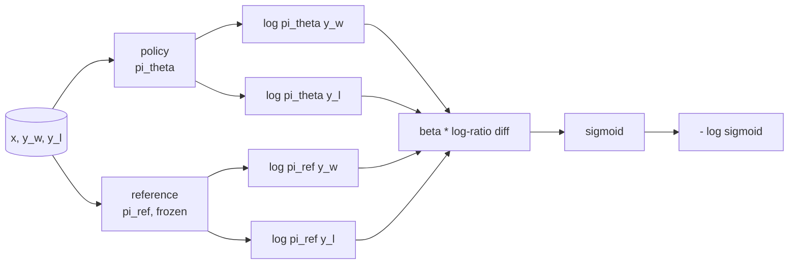
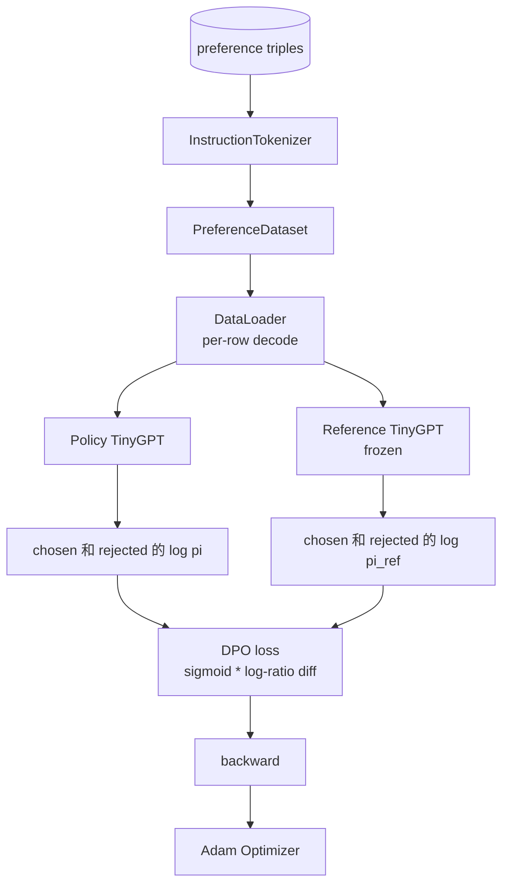

# 石 课程40:从零开始实现直接偏好优化

> 奖励模型 和 PPO 是经典的 RLHF 堆──DPO 将这个堆 压缩成一个监督损失,直接使用偏好对合策略──本课会从奖励差异身份推导DPO损失,提供可工作的参考模型 加政策模型,计算每代币日志概率,并在一个由选择和拒绝完成组成的偏好固定上训练小变压器──测试固定损失数学和渐进方向,让你知道与文件实现 一致.

**Type:** Build
**Languages:** Python (torch, numpy)
**Prerequisites:** Phase 19 lessons 30-37 (NLP LLM track: tokenizer, embedding table, attention block, transformer body, pre-training loop, checkpointing, generation, perplexity)
**Time:** ~90 minutes

## 学习目标

- 将DPO损失推导为上部sigmoid的规模日志比分差异,并将其连接到隐含的回报.
- 构建参考模型+政策模型对,其中参考可以结的政策.
- 在两个模型下计算序列级日志概率,并掩盖提示令牌.
- 在`(prompt, chosen, rejected)`没有人知道,我没有看到.
- 使用测试 固定损失数学、渐变符和参考不变的行为──

## 问题

你有一个SFT模型――它会遵循指示,但输出不稳定;有些完成 清晰,有些冗长或错误――你还有一个小的偏好对数据集:对于同一个提示,人类将选择一个完成标志,另一个标志被拒绝――

经典RLHF 答案是两阶段的管道――先用偏好 训练奖励模型――再用PPO 根据奖励 优化政策――这可行,但成本很高:PPO 期间内存中有两个模型,需要KL控制来让政策 接近参考,并且当奖励模型 脆弱时会出现奖励黑客――

通过监督损失替代这两个阶段的奖励模式 从未显然存在的政策 直接在偏好对上训练,并带有指向SFT参考的显然KL罚款 在布拉德利-特里偏好模型下具有相同的最佳解决方案,但代码少得多.

## 概念

从布拉德利-特里模型开始.`x`和两个完成`y_w`选择与`y_l`没有人能接受.`y_w`概率是

```text
P(y_w > y_l | x) = sigmoid( r(x, y_w) - r(x, y_l) )
```

其中`r`是某种隐藏的奖励函数.`r`训练政策`pi`通过 KL 最大化`r`其他:

```text
max_pi   E_{x, y~pi} [ r(x, y) ] - beta * KL(pi || pi_ref)
```

根据这一目标,`pi*`可以使用`r`写成封闭形式:

```text
pi*(y | x) = (1/Z(x)) * pi_ref(y | x) * exp( r(x, y) / beta )
```

对于`r`重新整理:

```text
r(x, y) = beta * ( log pi*(y | x) - log pi_ref(y | x) ) + beta * log Z(x)
```

`log Z(x)`项对`y_w`和 `y_l`相同的(它取决于`x`没有什么.`y`),因此在计算偏好差异中,

```text
r(x, y_w) - r(x, y_l) = beta * ( log pi_theta(y_w|x) - log pi_ref(y_w|x)
                                - log pi_theta(y_l|x) + log pi_ref(y_l|x) )
```

代入布拉德利-特里标识,并对偏好对象取负记录概率:

```text
L_DPO(theta) = - E_{(x, y_w, y_l)} [
  log sigmoid( beta * ( log pi_theta(y_w|x) - log pi_ref(y_w|x)
                       - log pi_theta(y_l|x) + log pi_ref(y_l|x) ) )
]
```

这就是损失. 它是每个例子一个标志上的标志,该标志由四个日志概率计算得到.没有单独的奖励模型.没有PPO. 损失中没有KL术语.



## 渐变的标志

任何训练都会有有用的健康检查.`log pi_theta(y_w | x)`求分数:

```text
d L_DPO / d log pi_theta(y_w | x) = - beta * (1 - sigmoid(z))
```

其中`z`是西格莫德的论点.`z`由于负面,这意味着:提高选择完成的日志概率将降低损失.`log pi_theta(y_l | x)`渐进为正:提高拒绝日志概率 会增加损失――训练会把选 往上推,把拒绝 往下推――引用是结的;它不会移动――

## 数据

这课提供了12个偏好三倍.`(prompt, chosen, rejected)`△选择完成 短且精确──拒绝 冗长、偏题或错误──这些对 覆盖与第39课相似任务族(资本、算术、列表),因此从SFT基础开始的政策将有一个合理的起点──

产品中的DPO会使用数万对对对; 这里的重点是 Loss 数据和循环 能够在微小的数据集上端到端运行,并且选择对拒绝的日志检查差距会明显增加.

## 参考不变

实现DPO必须仔细处理参考模型――参考是固定不动的SFT模型――必须满足三个性质:

- 参考参数永远不会接收梯度.
- 参考日志的概率在时代之间永远不会改变.
- 开始从与参考相等的权重`theta`是参考加上学习更新;将政策初始化为参考的副本是明确的开始.

通过以下方式实现强制这些性质:

- 前进通行 期间用 `torch.no_grad()`包裹一个参考.
- 对每个参考参数设置`requires_grad=False`,我知道.
- 在参考 构建后,通过`policy.load_state_dict(reference.state_dict())`构建政策.


```figure
cap-dpo-preference
```

## 建筑



模型与课程 39 中使用的TinyGPT 相同(仅用于解码器、因果、字节标记器) 〔引用 和政策共享架构;训练期间的政策权重从引用 发生漂移,而引用 保持固定──

## 你会建造什么

实现由一个`main.py`加测试 组成

1. `InstructionTokenizer`带`INST`和 `RESP`特殊的字节标志器──形状与课程39 相同──
2. `TinyGPT`简单的变体: 形状与课程39相似,因此即使你跳过39,本课也保持自主.
3. `make_preferences`返回十二个`(prompt, chosen, rejected)`两倍
4. `sequence_log_prob`:给定模型、快速预写 和完成,返回完成 上下一个代码日志概率的总和(不包含快速位置贡献) 』
5. `dpo_loss`接收四个记录概率和`beta`返回每例损失数以及用于记录的隐含奖励德尔塔.
6. `train_dpo`根据"时代循环"的政策和参考 下计算选择与拒绝的日志测试,应用 Loss,并执行亚当步骤.
7. `evaluate_margins`:在任意时刻返回政策 下的平均选择拒绝日志概率差距.
8. `run_demo`预训练:从一个小型加热预训练 构建参考和政策,复制权重,训练三十步,按一步打印损失和利,并成功时以零退出――

## 为什么DPO工作

在布拉德利-特利偏好模型下,DPO在数学上等于RLHF,只差于奖励的参数化――隐含奖励`r(x, y) = beta * (log pi(y|x) - log pi_ref(y|x))`根据偏好,最多差一个关于`x`函数,而它会在差值中抵消――闭式形式政策 让你跳过显式奖励模型――KL限制是结构性施加的:`pi`相对`pi_ref`任何偏离都会使日志比率变大,而标志性会和,从而在政策中走得太远时湿度.

## 实现目标

- 给日志概率总数 添加长度规范化:除以完成长度. 长度偏差是一种已知的DPO失败模式,模型会优先选择更短的完成,因为它们的日志概率在绝对值上更大.
- 添加 Loss 的IPO变体:用 `(z - 1)^2`替代sigmoid + log──比较它在固定上的融合──
- 添加一个标签滑滑参数,在硬选择的拒绝标签和统一的0.5 之间插值.
- 用更小,更便宜的模型替换参考

实现会给你损失,参考不变和训练循环.数学是本课的核心.
