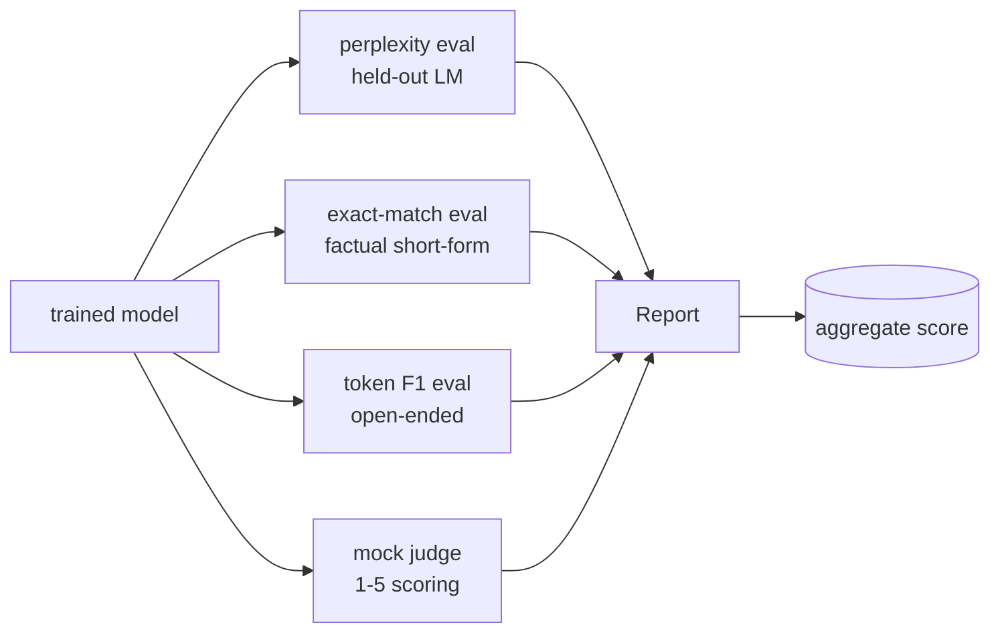
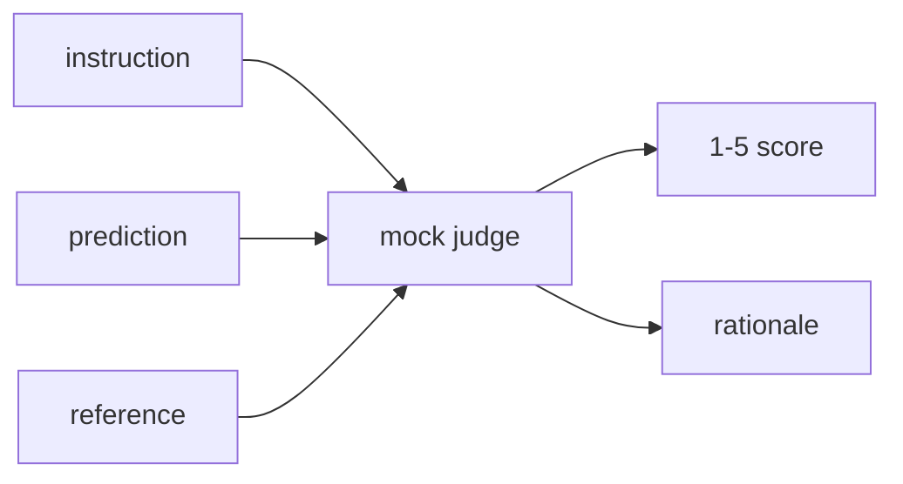
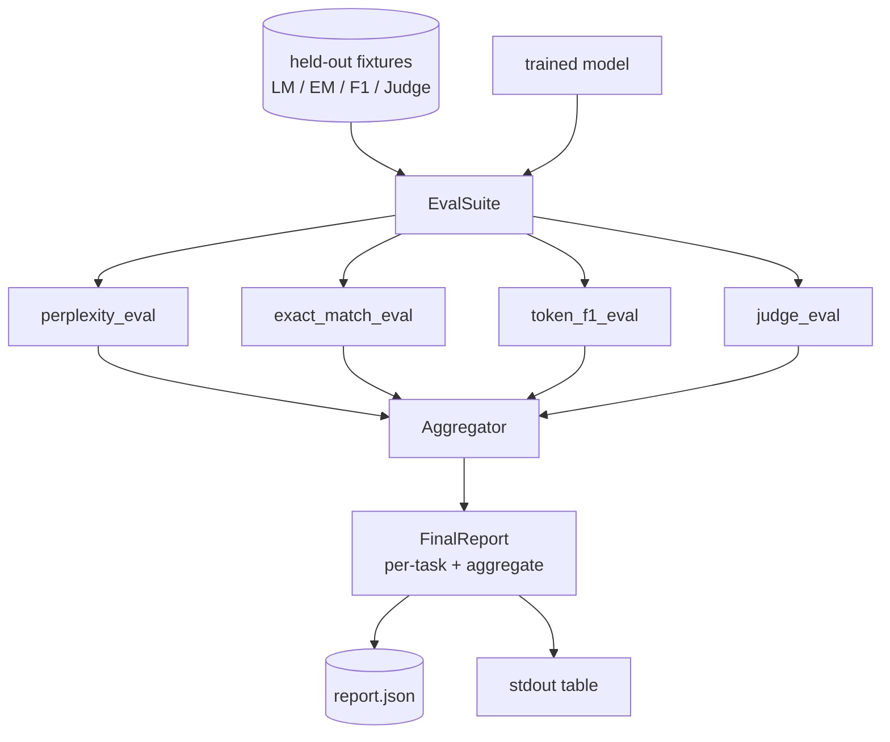

# 完整评估管道

> 培训是你可以使用损失曲线 监控的部分. 评估是你必须设计的部分. 本课程将构建一个统一的评估管道:它接受了任意训练好的语言模型,运行了四种不同的评估,将结果聚合到任务分拆报告,并提供一个本地模仿的法官,让整个循环 无需网络也能运行.

**Type:** Build
**Languages:** Python (torch, numpy)
**Prerequisites:** Phase 19 lessons 30-37 (NLP LLM track: tokenizer, embedding table, attention block, transformer body, pre-training loop, checkpointing, generation, perplexity)
**Time:** ~90 minutes

## 学习目标

- 在微型变压器上使用罩标记计算 持续的困难.
- 在短事实中提示上运行精确匹配评估.
- 通过规范化计算预测与参考字符串之间的代币级 F1──
- 构建一个本地模拟的法官,用1-5分制造给模型输出
- 将四种评估 汇集成一个单一的任务分类报告.

## 问题

单一指标永远无法描述一个语言模型――对语言分布的适应程度的困惑性说明模型,但不说明它是否能回答问题――确切匹配的说明模型是不是产生黄金字符串,但会惩罚正确的改写――F1符号会宽容的表达,但可能会被错误内容中的词汇重叠欺骗――LLM作为法官能捕捉定性维度,但成本高且随机性――

你真正想要的管道同时拥有这四种能力. 每个评估都覆盖其他评估漏掉的一个维度. 每个评估都运行在这个测量设计的不同数据中.

现在,我们要在一个文件中完成这个管道建设.

## 概念



每个评价都是一次.`(model, dataset) -> EvalResult`函数――结果包含了测量的每个例子细节的测量值,以及用于集成的名称――管道 通过配置将它们组合起来,配置指定要运行哪些评估以及如何加权――

## 困惑,正确计算

困惑是`exp(mean negative log-likelihood per token)`实现的两个陷:

- 必须基于真实代币位置而不是批量 *序列.
- 预测下一个代币,所以位置 `i`的记录 预测位置 `i+1`失败仍然会训练,但测量会变得毫无意义.

该评估会按批量计算非位 上的`-log p(token)`总和与代币数量,最后再相除──这比平均每批复杂性更数值安全后者会低估短序列的权重),并且符合教科书的定义──

## 完全匹配,与规范化

预测和参考:

- 转为小字母.
- 首先,我们要去除白色空间.
- 将内部连续的白色空间折叠成单个空间.
- 如果两侧仅因为分符不同,则丢掉末尾终止分符.`.`,我知道.`!`,我知道.`?`

规范化 让确切匹配 在实践中有用处.`"Paris"`是对的;说 `"Paris."`也是对的;说`"  paris  "`对于这个标准,仍然需要规范化.

## 标志 F1,正确的方向

符号F1是基于包的符号计算精度和召回的和的意思──步骤:

1. 规范预测和参考与精确匹配 相同规则)
2. 将每个字符串分为代币列表 (白色空间代币化)
3. 统计多组交叉点――
4. 精度 = `intersection_count / len(pred_tokens)`❖ 召回`intersection_count / len(ref_tokens)`△F1 = 协调平均量

如果预测和参考都为空,F1为1(空格匹配) ・如果只有一个侧为空,F1为0――这个模式匹配SQuAD评估参考,并能在表达上产生稳定数字――

## 地方假法师作为法官

真正评判是API后面的边界模型. 本课中的评判必须离线运行.`{1, 2, 3, 4, 5}`评分规则是明确的:

- 如果正常预测等于正常参考,则为5──
- 如果预测与参考符号之间的F1至少为0.8,则为4──
- 如果F1标志位于`[0.5, 0.8)`则为3
- 如果F1标志位于`[0.2, 0.5)`则为2
- 其他情况为1──

这不是真实的判断,但它有正确的界面.



## 总结

总体是标准化评估分数的权重平均值.`[0, 1]`中的数字:

- 困惑:正常化 为 `1 / (1 + log(perplexity))` 复杂性 为 1 映射到 1,无限性 映射到 0 ⋅
- 完全匹配:已经在`[0, 1]`在中.
- 标志 F1:已经在`[0, 1]`在中.
- 评委:除以5

权重可配置──默认组合是0.2的困惑、0.3的精确匹配、0.3的代币F1、0.2判断──权重的选择是一个产品决策;本课暴露这个按,方便你实验──


```figure
cg-eval-quadrant
```

## 建筑



`EvalSuite`每个独立评价都是一项免费的功能,接收`(model, tokenizer, dataset, config)`并回来了`EvalResult`,我知道.`Aggregator`收集结果并生成最终报告――demo 会打印表格,并写入一个JSON副本,供下游CI摄入――

## 你会建造什么

实现一个`main.py`其他测试.

1. `TinyGPT`课程 38-40 中使用的同一个单独的解码器架构,内置在本课中以便独立运行.
2. `InstructionTokenizer`带 INST / RESP / PAD 特殊的字节标记器.
3. 四个装置:LM体,EM组,F1组和法官组,每组二十个例子,定性组,
4. `perplexity_eval`:返回包含乱值和每代币损失的历史图`EvalResult`,我知道.
5. `exact_match_eval`返回平均EM和每例记录──
6. `token_f1_eval`:返回平均标志 F1 和每例记录──
7. `mock_judge`和 `judge_eval`根据该组的平均分数,
8. `Aggregator.normalise`标准化规则:
9. `Aggregator.aggregate`:重量平均和组装后的报告
10. `run_demo`短暂训练一个小模型,运行全部四种评估,打印报告表并写入JSON,成功时以零 退出──

## 阅读报告

报告有三层――最高层是总分数――下面是四个每期数字――再下面是用于诊断的每个例子分类――失败的CI运行通常需要总分,但追踪回归的审查者需要每一个例子分类,以查看模型的输入 答错了――

通过使用稳定键,让CI仪表板可以跨版本绘制趋势线.

## 实现目标

- 添加校准评估:模型的软最大概率是否匹配其准确性?根据预测的信心 分桶,并报告每个桶的实验准确性.
- 添加强度评估:给每一个例子标记扰乱 (typo、パラフレーズ、分散),并报告每类扰乱的度量下降──
- 用HTTP呼叫后面的真实模型 替换假判断者――函数签名 不变――
- 添加每任务重量学习:不使用固定重量,而是根据模型上的目标偏好顺序 拟合重量。

本实现给你四种类型的评估集体和报告――真实评估管道会在此上叠加更多维度;模式保持不变:每个评估一个函数,一个集体,一个报告――
