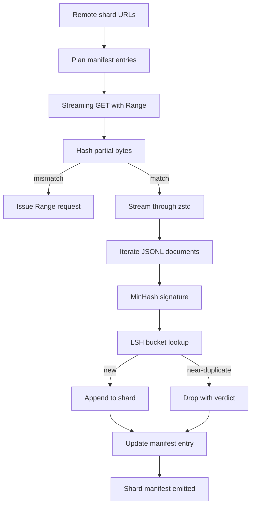

# 大型体体下载器

> 训练语言模型 早在第一次前进通过之前就开始了. 库存必须落到磁盘上,完成解压缩,复制,并且可地址; 在网络中4% 处断掉之前,再写故事就已经要设计好. 本课程构建一个流媒体下载器:它拉取压缩的片段,使用Zstandard 边下边解压缩,通过 MinHash 加本地敏感的哈希为近似复制生成指纹,并写片表,让管道的其余部分可以信任.

**Type:** Build
**Languages:** Python
**Prerequisites:** Phase 19 lessons 30-37
**Time:** ~90 minutes

## 学习目标

- 使用 `urllib`流程远程碎片并用`zstandard`解压,避免将整个文件缓冲到内存中.
- 针对验证的字节抵消发起HTTP`Range`要求恢复部分下载.
- 为了每个文件, 构建MinHash签名,并使用LSH 分桶,让近似副本发生碰撞.
- 输出包含内容哈希,字节大小,文件数量和裁决的分片表.

## 问题

在200GB的训练中,网络在41%中断了,`urllib`例外退出――第二次它在百分比78处断掉――到百分比99你已经重写了循环三次――你从第一分钟起就必须设计应对的两个失败点是部分下载简历和重复文件删除――两者都有成熟方案;两者也经常被跳过,因为管道一开始只是一个长出问题单行.`requests.get`呼叫

恢复是一个HTTP问题.服务器必须支持.`Range`根据磁盘记录, 必须根据验证的对冲, 验证的对冲必须在过程死亡后保留下来. 如果对冲和文件差一个字节, 恢复下载就会写入垃圾中, 机体会以一种方式只在代码化时才会被泄露的方式损坏.

排版是一个签名问题. 精确的hash 排版会丢失近似的重复:同一篇维基百科文章 带有三个不同的板脚本 出现,同一代码文件 带有不同的许可标题,同一篇博客文章的每个链接都带有跟踪参数.

## 概念



### 流媒体`urllib`

标准图书馆`urllib.request.urlopen`返回文件像对象.将包在`zstandard.ZstdDecompressor().stream_reader`中,bytes 就会从网络流经解压缩器,再进入文档代代码器,完全不需要在内存中材料压缩片段或解压缩片段──唯一的内存成本是线路缓冲器──当前文档的MinHash签名以及LSH指数──

### 简历`Range`

写两个文件: 片本身和`.partial.json`检查点`verified_bytes`,我知道.`expected_size`,我知道.`sha256_prefix`(基于前`verified_bytes`字节计算) 和源URL──启动时,下载器 读取检查点,基于磁盘字节 重新计算 `sha256_prefix`只有在重新计算的哈希匹配时才恢复. 如果哈希错误,部分会被丢弃,下载从字节零重新开始.

### 和LSH

据简介,这个集合是其文本的片,`k`个最小的哈希值,每个来自一个独立的哈希函数.两个Jaccard相似性为.`s`文件的任何单个组成部分上一致概率为`s`,我知道.

随后,LSH将`k`个组件 分为`b`每个乐队都有`r`列中`k = b * r`△至少在一条频段内发生两份文件碰撞的概率是`1 - (1 - s^r)^b`它们会给你带来.`(b, r)`调优的`s`值附近形成尖门──典型的体积减产门是`s = 0.8`通过"L.S.H".的研究文献.`k = 128`,我知道.`b = 32`,我知道.`r = 4`达到这个点.

### 作为合同的碎片表

下载器 唯一持久的输出是 manifest──manifest 按 shard 保存 URL、减压字节数、文档数、除掉后的独特文档数,以及最终的 shard 文件的 sha256──下游代码化 读取 manifest,而不是目录列表──如果某个 shard 缺失或其 sha256 错误,manifest 会告诉下一阶段拒绝启动──manifest 是 已下载的数据和 已下载的数据之间的决定性边界──


```figure
cap-corpus-downloader
```

## 建立它

`code/main.py`实现:

- `ShardPlanner`- 读取分片URL列表并生成计划的公开报名.
- `StreamingDownloader`- 打开带可选`Range`的`urllib`流,写入临时文件,在每个部分更新`.partial.json`检查点,并继续 时验证 sha256前.
- `ZstdDocIterator`- 将像文件流 包在`zstandard.ZstdDecompressor`中,并逐行 yield 一份文件──
- `MinHasher`- 使用固定种子家庭为串生长`k`- 组件签名――
- `LSHIndex`根据签名的频段 分桶并报告碰撞.
- `Dedup`- 组合哈希和索引,将每个文件标记为`keep`或`near_duplicate`并附与相匹配的碎片ID.
- `ManifestWriter`- 收集每股统计数据并写入`manifest.json`,我知道.

文件底部的演示会在磁盘上构建一个小型合成体,使用`zstandard`压缩它,通过`file://`查看下载,执行复制,并打印表文档.

运行它:

```bash
python3 code/main.py
```

字体以零 退出并印表概要――

## 生产模式

现在,我们可以把这个模式扩展到真实体.

**Checkpoint before write.** `.partial.json`必须在字节中添加到碎片之前完成`fsync`否则电源损失 会颠倒顺序:在磁盘上,检查点中没有它们,下一次恢复 认为验证的字节比实际更少,翻译的后音字节 会损坏文件──先检查点,再写──这与写前日志是同样的纪律──

**Sharded LSH index.**在200GB 尺寸下,覆盖整个库的单个LSH指数 放不进 RAM.根据第一个带哈希分区LSH指数,将分区存在于磁盘上,并且只查询新签名会落入的分区.成本是每个文档的额外磁盘阅读;收益是LSH指数 不再是硬件内存上限.

**Tombstone, not delete.**丢弃的复制品将被判处`near_duplicate`和它们碰撞的文件的片段ID 记录在表中. 删除它们会丢失与保持者之间的链接.

**Per-shard sha256 in the manifest, plus a manifest sha256.**显示本身也会获得内容哈希. 下游阶段 会在信任每分片的输入 之前验证显示哈希.没有这个机制,显示就是沉默的攻击表面:能编辑单个文件的攻击者可以破坏整个管道.

## 用它

生产模式:

- **Resume on every CI run.**运行器是暂时的. 下载器必须假设每次运行都是新盘,并从缓存或远程恢复.`--cache-dir`是一流的旗.
- **Dedup before tokenization.**代币化是非常昂贵的. 在同一文件上运行两次,为了相同的损失曲线支付两倍成本.
- **Manifest as merge gate.**训练从置提交 读取表格 sha256。新数据集版本 需要新的表格提交──代码与数据之间的链接是 git,而不是口口相传──

## 运送它

`outputs/skill-corpus-downloader.md`在真实项目中会描述哪些URL 提供下载器,检查点目录 如何布局,使用什么带宽和`(k, b, r)`作为一个"变化控制"的机器,

## 运动

1. 添加`--shingle-width`旗并测量缩判决 在宽度3、5、9 下如何变化──为选择的默认值辩护──
2. 通过嗅探魔术字节,在 zstd 旁边添加gzip 支持──下载器 不应要求调用者指定代码──
3. 添加`--resume-only`模式:如果找不到检查点,则拒绝开始新下载.
4. 将LSH指数移到架子或微型文件,并测量吞吐量与内存变量的差异.
5. 在启动时添加表格 sha256 检查.如果磁盘上面的表格与`manifest.lock`中的表达式哈希 不一致,下载器应关闭.

## 关键词

| Term | What people say | What it actually means |
|------|-----------------|------------------------|
| Shard | “一个 file” | corpus 的一个自包含 slice，拥有自己的 sha256，并作为 resume 和 dedup 的单位 |
| MinHash signature | “Fingerprint” | 一个 set 的 `k`-component sketch，其中每个 component 是该 set 上一个 independent hash 的最小值 |
| LSH band | “Bucket” | 一组 `r` 个 signature components，用作 collision detection 的单个 bucket key |
| Verified bytes | “Resume offset” | disk 上 sha256 prefix 与 checkpoint 匹配的 bytes；唯一安全的 resume offset |
| Manifest | “The index” | downloader 产出的单一 durable record，包含 content hashes |

## 进一步阅读

- [RFC 7233](https://datatracker.ietf.org/doc/html/rfc7233)- HTTP 范围请求,即恢复协议
- [Zstandard format specification](https://datatracker.ietf.org/doc/html/rfc8478)- 让流式解压缩安全的框架格式
- [MinHash](https://en.wikipedia.org/wiki/MinHash)- 本课使用的签名家庭
- [Locality-sensitive hashing](https://en.wikipedia.org/wiki/Locality-sensitive_hashing)- 减值门 背后的带状方案
- 19 · 43阶段 - 下载器 供给的 HDF5标记体
- 第19阶段 · 44 - 在体内上训练的阴影时间表
- 19 阶段 · 45 - 消耗该时间表的AMP循环
