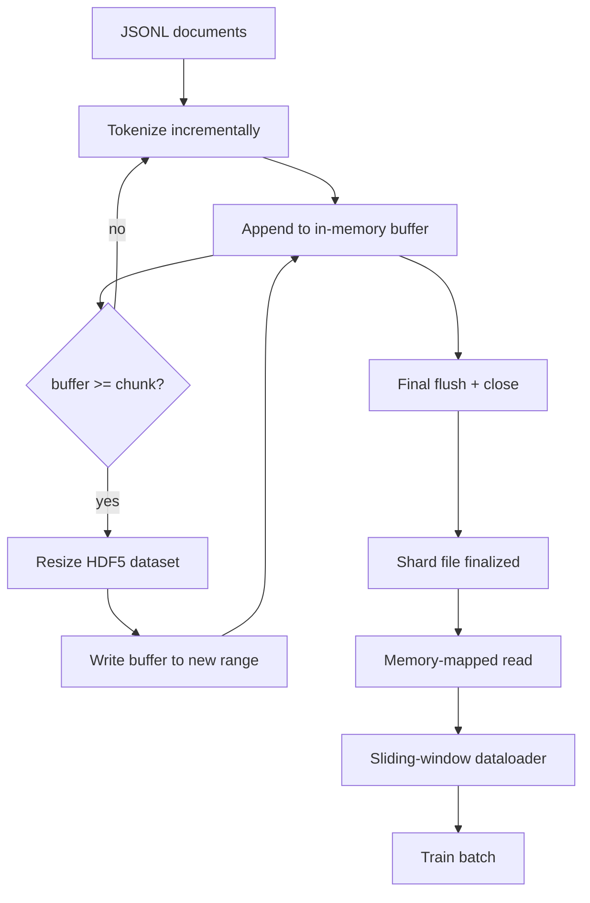

# HDF5标记化语料库

> 下载好的语料必须落在一个训练师可以以行速流式读取的布局里.磁盘上的JSONL 不住16个数据加载工作者.带可调整大小,分块整数数据集的HDF5 可以.本课程将构建流式代码化到可调整大小的HDF5数据集,跨多文件的碎片写,训练时的内存映射阅读,以及一个滑动窗口数据加载器,使用正确的包装生长的固定长度序列.

**Type:** Build
**Languages:** Python
**Prerequisites:** Phase 19 lessons 30-37
**Time:** ~90 分钟

## 学习目标

- 将文档流式写入一个带确定性分断的可调整大小HDF5整数数据集.
- 将分片写入多个HDF5文件,让失败边界可控,并使并行成为可能.
- 通过HDF5 通过页面缓存 支的分块布局 读回代币,使数据加载器只在批量时间 复制到批量缓冲器──
- 实现一个滑窗数据加载器,使用显式包装 规则发出固定长度训练序列──

## 问题

现代语言模型培训运行 会在数十名工人上以每秒数万个样本的速度读取代码.磁盘上的JSONL 在第一次冷缓存页面错误时就会崩:JSON解析器 很慢,文档边界无法寻址,而寻找到"样本 4,217,884" 需要扫描文件.即使压缩效果很好,Parquet也不适合这里,因为教练不想要列;它想要一个带 O1) 随机访问的平代码流.

由于它提供一个可调整大小的数据集,它的部分在读取时对页面缓存友好──培训员 请问`tokens[3,200,000 : 3,200,8192]`通过HDF5将请求的超级标签从页面缓存复制到新分配的NumPy阵列. 费用是每个工作者一个开放的文件处理器,以及一个小部分的页面缓存脚印.

构建问题在于让写入端诚实可靠. 可测量数据集 易被误用:一次写一个文档,HDF5 文件会被碎片化到不可用. 一次大小写入所有文档,进程死亡会丢掉整个片段.

## 概念



### 正确使用可测量的 HDF5

标记数据集 使用 `maxshape=(None,)`和固定的`chunks=(chunk_size,)`创建──写入时,将代币 缓存在长度为 `chunk_size`按时填满时,数据集精确地按`chunk_size`扩展,并把缓冲缓冲 写入新范围. 在碎片结束时,剩余的缓冲缓冲会写入最后一个部分范围. 除了最后一次写入外,每次写入都是连接的,并与部分相对齐的.`token_count`截断最后一次写入.

### 碎片的写字

单个HDF5文件是单点故障──管道 会并行写入片段:阶段19课42中每个输入片段产生一个HDF5输出片段──`shards.json`记录文件路径,代币计数,文件计数以及代币的 Sha256──trainer 读取`shards.json`计算全球抵消并验证语料库.

### 记忆图阅读

训练时,每个工人会`swmr=True`打开自己负责的 HDF5 文件,并请求`tokens[start:stop]`△一旦块变热,HDF5的块布局就会让它成为页面缓存支持的阅读. 工作者永远不会实现整个文件:片段将被复制到数据加载器的批量缓冲器,然后数据加载器在批量时间将其复制到固定记忆训练子.

### 滑窗数据加载器

数据加载器是唯一知道训练序列长度的阶段. 它在全球代币流中随时选择一个开始指数,读取`window_size + 1`个代币,然后回来`(input, target) = (tokens[:-1], tokens[1:])`〔不强制遵守文档边界:一个窗口可以跨越两个文档,中间有明显的.`boundary_token_id`让模型学会使用分区器――这是标准包装规则;它也是初学者容易忘记的规则,最后得到的语料库将变成8%的训练边界代币和92%的自然文本――


```figure
cc-hdf5-corpus
```

## 建立它

`code/main.py`实现:

- `Tokenizer`对于演示,足够好.`encode(text) -> list[int]`和 `vocab_size`,我知道.
- `HDF5ShardWriter`- 打开一个可调整的整数数据集,将代币缓冲到块大小,按固定大小步骤大小并写入,在关闭时把`token_count`和 `sha256`记录为HDF5属性──
- `ShardedTokenizationPipeline`- 通过输入文件,将它们路由到作者,并输出`shards.json`索引
- `MmapTokenStore`- 打开碎片文件 进行内存映射阅读,计算全球偏移,暴露单个`get_slice(start, stop)`子
- `SlidingWindowDataloader`- 从全球流中选择随机窗户,并产生`(input_ids, target_ids)`许多数组.

文件底部的演示会构建一个很小的内存库,将两个片段代码,通过内存地图打开它们,运行数据加载器10批量,并打印每个批量的形状和检查数量.

运行:

```bash
python3 code/main.py
```

脚本以 0 退出并印出批量检查金额.

## 生产模式

课程将扩展到实际训练运行.

**Chunk size 等于典型读取大小。**训练师 每个样本 读取`window_size + 1`个代币――把 HDF5 部分设置为`window_size`读取就会页面缓存排列了. 部分不匹配会让吞吐减半,因为每个样本都会触碰两个块.

**Token count 放在 attributes 中，而不是 dataset 中。**数据集尾部部分可能没有完全填满,因为部分大小不一定整除文档边界――把真实`token_count`作为 HDF5属性 存在数据集 上,并让读者在该值处截断.否则读者 会越过真实末尾读到零填补的代币,模型也会学会预测零.

**带 parallel verification 的 sharded sha256。**每个片子都有自己的代币字节 sha256――训练员可以在训练开始前并行验证所有片子――错误的 sha256 会让运行 提前失败,而不是十六小时后的第三个时代才失败――

**两侧都使用 `swmr=True`，writer 使用 `libver="latest"`。**要求写作 以`libver="latest"`打开,先创建每个数据集,然后设置`file.swmr_mode = True`后面的作者必须在每次调整尺寸后调用`dataset.flush()`如此使用`swmr=True`打开的读者工作者才能看到一致的数据.`libver="latest"`系统的结构变化后重新启动 SWMR,是"文件锁定"

## 用它

生产模式:

- **每个 source shard 一个 HDF5。**输出一个 HDF5──1:1 映射 让恢复 和部分故障恢复 变得简单──
- **Boundary token id。**边界代币是代币器语文的一部分,也是数据加载器注入的唯一代币.如果模型应该忽略它,训练损失会掩盖边界代币;否则模型会学会把它作为序列分离器.
- **`shards.json` 是 source of truth。**添加新片段 意思是写入 HDF5、计算它的 Sha256,并添加一个入口──培训员 在启动时读取该文件一次,之后永远不碰目录列表──

## 运送它

在真实项目中,`outputs/skill-hdf5-tokenized-corpus.md`描述哪个标记器输入管道,哪个块大小,相匹配的训练师的窗户,`shards.json`在版本控制中放置在哪里,以及数据加载器工作者如何跨文件 分片――本课交付引擎――

## 运动

1. 给HDF5编辑添加`--compression gzip`标志,并在演示体上测量吞吐成本――为所选默认做出辩护――
2. 给滑窗数据加载器 添加确定性种子,并验证相同的种子的两次运行会产生相同的批量――
3. 添加`--validate`读取每个碎片,重新计算其代币的 sha256,并与`shards.json`对于比较,CI 应该在训练开始之前运行它.
4. 对于部分尺寸等于窗口尺寸,半窗口尺寸,两倍窗口尺寸,
5. 添加`--max-document-tokens`为了对读取时的决定做出辩护

## 关键词

| Term | What people say | What it actually means |
|------|-----------------|------------------------|
| Resizable dataset | "Append-only" | 一个带 `maxshape=(None,)` 的 HDF5 dataset，通过按 chunk 大小 stride 调用 `resize` 增长 |
| Chunked layout | "How HDF5 stores it" | 固定大小的 on-disk pages，kernel 可 memory-map，dataloader 可连续读取 |
| `swmr` mode | "Read-while-write" | Single-Writer-Multiple-Reader mode，使 dataloader workers 能安全共享文件 |
| Shard index | "shards.json" | 包含 offsets 和 content hashes 的所有 token shards 的 durable index |
| Sliding window | "Training sample" | global token stream 的固定长度 slice，trainer 会把它与 shift-by-one target 配对 |

## 进一步阅读

- [HDF5 chunking documentation](https://docs.hdfgroup.org/hdf5/v1_14/)- 本课使用的分块化,可扩展的数据集布局
- [h5py user guide](https://docs.h5py.org/en/stable/)- HDF5 的Python绑定
- [NumPy memory mapping](https://numpy.org/doc/stable/reference/generated/numpy.memmap.html)- 通过h5py 暴露的读侧原始
- 阶段19 · 42 - 输出由本课代币化的下载器
- 19 阶段 · 44 - 消费这个数据加载器的代码时间表
- 19 阶段 · 45 包裹训练阶段的AMP循环
