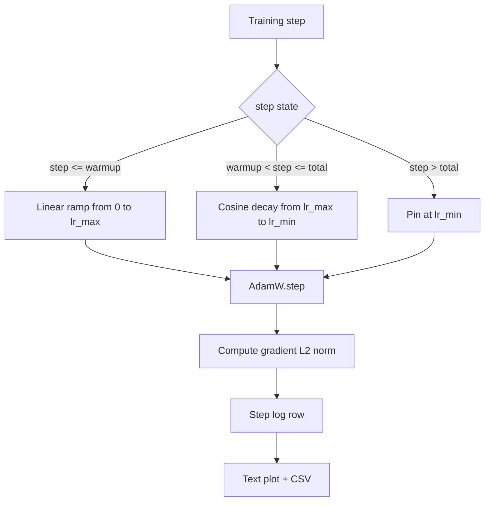

# 带线性变暖的宇宙 LR

> 学习率计划仅次于损失函数的第二个重要决策.带随机衰退和线性变暖的亚当W是语言模型培训的现代默认选择,因为它使模型在脆弱的前千次更新中看到较小的有效步骤尺寸,逐步升至配置的峰值,然后平滑衰退回接近零. 本课程将构建这个计划,绘制了训练步骤的上曲线,在计划旁记录梯度规范,并证明该计划遵守变暖的峰值和衰退的边界.

**Type:** Build
**Languages:** Python
**Prerequisites:** Phase 19 lessons 30-37
**Time:** ~90 分钟

## 学习目标

- 实现一个亚当W优化器,并接入带线性加热的共性学习率时间表.
- 在任意步骤中 精确计算时间表的值,避免跨运行出现浮点漂移──
- 让训练健康状态可观察.
- 将时间表 染色为人眼可读的文本图片,以及任何工具都可消费的CSV.

## 问题

前一千次训练更新 最──模型的重量 仍然接近初始化──优化器的运行第二时刻估计 尚未稳定──渐进标准 又大又声── 如果学习率在这些更新中处于峰值,模型要么直接分歧,要么陷入永远逃不出的损失平原──两个众所周知的修复方法是梯度剪辑,也就是19阶段的课程45 的主题,以及从小开始并逐步升级学习时间表――────────

热度时间表有三个区域. 从零到零.`warmup_steps`学习率从零线性缩小到配置的峰值`lr_max`从`warmup_steps`到了`total_steps`学习率 遵循曲线的上半段,从`lr_max`衰减到`lr_min`在`total_steps`之后,学习率 固定在`lr_min`没有什么可言的,一个过度过度的错误配置训练师不会静静退出时间表.

构建问题在时间表中 很容易被一个人掉. 会议在训练运行中 六小时后表现为学习率在模型开始过度匹配时高出或低出1%,除非对时间表的边界做尽可能的测试,否则这是不可见的.

## 概念



### 热化公式

对于`warmup_steps > 0`时位于`[0, warmup_steps]`的`step`学习率是`lr_max * step / warmup_steps`退化`warmup_steps = 0`没有加热的情况: 时间表在零步骤中直接从`lr_max`开始,并立即进入阴阳衰变.`warmup_steps = 0`检查时间表仍然可以产生可用的曲线.

### 子公式

对于`(warmup_steps, total_steps]`中中 `step`学习率是`lr_min + 0.5 * (lr_max - lr_min) * (1 + cos(pi * progress))`在其中`progress = (step - warmup_steps) / max(1, total_steps - warmup_steps)`在`step = warmup_steps`求值为`cos(0) = 1`得到了`lr_max`与热点的最终点 精确匹配.`step = total_steps`求值为`cos(pi) = -1`得到了`lr_min`与衰变的终点 精确匹配

两个终点上层的连续性不是偶然的.`step`单个函数,而不是三段不同的函数 拼接在一起――拼接的时间表 在第一次改变`lr_max`时就会失去一个边界.

### 楼层后的全部步骤

对于`step > total_steps`学习率保持在`lr_min`合同是显而易见的:时间表 不报错,也不抽象;它固定在地板上,并让教练记录警告.`total_steps`而不是修改循环.

### 将分级标准与率的记录

时间表是训练健康状态的一半――渐进的标准是另一半――训练循环 每一步 记录两者――不同训练运行会先出现梯度标准的峰,然后损失才会变化;调好的加热会让标准随着线性上升的速度;过于激进的峰会表现为加热后的标准 仍然保持高位――磁盘上的数据集是`step, lr, grad_l2_norm, loss`△CSV是唯一的持久记录.


```figure
cap-cosine-warmup
```

## 建立它

`code/main.py`实现:

- `CosineWithWarmup`- 一个无国有函数,以配置时间表为基础的形式`lr(step) -> float`,我知道.
- `TrainState`- 们的模型`AdamW`优化和时间表 封装成单个步骤函数――
- `TrainState.step`- 运行一次前进过渡一次后退过渡,记录梯度 L2 标准,并把`lr(step)`应用到优化器.
- `plot_schedule_ascii`- 将时间表 染为人眼可读的文本图片.
- `write_schedule_csv`- 为每一步,输出一行学习率.

文件底部的演示会构建一个很小的`nn.Linear`模型,在固定输入批量上训练20步,并打印每步的学习速度、渐进规范 和损失──日程也会被染为文本图,用于视觉智力检查──

运行:

```bash
python3 code/main.py
```

脚本以 0 退出,并打印每步训练日志和时间表图片.

## 生产模式

,,,,,,,,,,,,,,,,,,,,,,,,,,,,,,,,,,,,,,,,,,,,,,,,,,,,,,,,,,,,,,,,,,,,,,,,,,,,,,,,,,,,,,,,,,,,,,,,,,,,,,,,,,,,,,,,,,,,,,,,,,,,,,,,,,,,,,,,,,,,,,,,,,,,,,,,,,,,,,,,,,,,,,,,,,,,,,,,,,,,,,,,,,,,,,,,,,,,,,,,,,,,,,,,,,,,,,,,,,,,,,,,,,,,,,,,,,,,,,,,,,,,,,,,,,,,,,

**Schedule 放在 config 中，而不是 code 中。**培训员从提交到 git 的 YAML 或 JSON 配置 读取 `warmup_steps`,我知道.`total_steps`,我知道.`lr_max`,我知道.`lr_min`◎时间表是可复现的,因为配置是内容的;时间表是可审计的,因为配置是 PR 差异的一部分.

**Step counter 是 monotonic，并与 epochs 解耦。**当数据集被分碎或数据加载器重启时,一些框架会混步骤和时代.`global_step`继续运行 会在正确的时间表位置继续,因为步骤计数是持久的轴.

**Schedule plot 放在 run directory 中。**每次训练都会跑到`outputs/lr_schedule.png`没有必要重新运行任何东西就能检查智力时间表.

**Log row schema 固定。** `step, lr, grad_l2_norm, loss`按下列,将使所有现有仪表板失效.

## 用它

生产模式:

- **先 sweep peak，再 sweep 其他任何东西。** `lr_max`首先是小型上扫它;最佳`lr_max`与模型大小的规模化很弱,所以小模型扫描是强的先驱.
- **Warmup 是 total steps 的 fraction，不是绝对 count。**一个200万步跑如果只有2000步升温,几乎就达到峰值;一个20000步跑使用相同数量则会升温10%──把升温配置为分数 ((典型:1-3%)),让时间表随着训练时间缩小──
- **`lr_min` 非零是有意的。**一个为`lr_max`让优化器在长尾中继续学习.`lr_min = 0`时间表将得到一个图上很好的训练曲线,以及一个实际上尚未完成的训练模型.

## 运送它

在真实项目中,`outputs/skill-cosine-warmup.md`描述哪个配置 承载时间表 全球计数 从哪个训练步骤 读取,以及什么样子`lr_max`扫描 产出部署的价值.

## 运动

1. 添加时间表的反方根变体,并在200步玩具训练运行上对比――哪条曲线产生更低的最终损失?
2. 添加`--restart`旗,在`total_steps / 2`增加第二次加热. 为了加热重新启动. 在玩具运行上升或伤害.
3. 添加一个单位测试验证时间表是连续的:对于`[0, total_steps]`中间的每个步骤,差值`|lr(step+1) - lr(step)|`受`lr_max / warmup_steps`约束.
4. 将时间表 接入 `torch.optim.lr_scheduler.LambdaLR`如何使用简单的步骤函数;包装 改变了什么?
5. 添加`--plot-png`通过旗`matplotlib`写出真实剧情――为本课的文本剧情 和 PNG 哪个更适合合作为CI运行的默认做出辩护――

## 关键词

| Term | What people say | What it actually means |
|------|-----------------|------------------------|
| Warmup | "Slow start" | 在前 `warmup_steps` 次 updates 中，从 zero 到 `lr_max` 的 linear ramp |
| Cosine decay | "Smooth drop" | 在剩余 steps 中，从 `lr_max` 到 `lr_min` 的上半段 cosine curve |
| Floor | "After training" | schedule 在超过 `total_steps` 后固定的 `lr_min` 值 |
| Gradient norm | "L2 of grads" | 拼接后的 gradient vector 的 Euclidean norm，每 step 记录 |
| Global step | "Schedule axis" | 一个能跨 restart 保留的 monotonic step counter，用于驱动 schedule |

## 进一步阅读

- [Loshchilov and Hutter, SGDR: Stochastic Gradient Descent with Warm Restarts (arXiv 1608.03983)](https://arxiv.org/abs/1608.03983)- 科西斯时间表的参考文件
- [Loshchilov and Hutter, Decoupled Weight Decay Regularization (arXiv 1711.05101)](https://arxiv.org/abs/1711.05101)- AdamW 的参考文件
- [PyTorch torch.optim.lr_scheduler](https://docs.pytorch.org/docs/stable/optim.html#how-to-adjust-learning-rate)- 阶段函数 如何与框架规划组合
- 第19阶段 · 42 - 产出此时间表 所消费语料的下载器
- 19 · 43阶段 - 与此时间表共同发展的数据载体
- 阶段19 · 45 - 梯度剪辑和AMP,也就是循环的下一层
