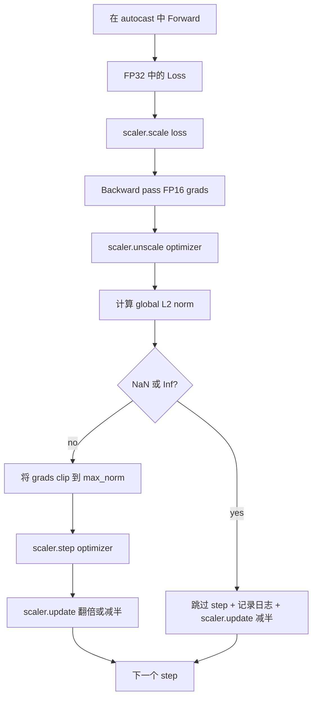

# 渐进式剪切和混合精度

> 上一课中的优化和时间表 假设梯度是正常的――它们通常不正常――一个糟糕的批量就能让梯度标准升三个数级――混合精度训练会通过在损失侧引入FP16溢出 放大这个问题――本课构建生产训练 缺少一不可缺的两条安全带:将梯度剪切到配置好的全球L2标准,以及使用自动播放和 GradScaler的混合精度循环,它可以检测NAN 和 Inf,干净地跳过步骤,并记录扩展因素 以便事后分析――

**Type:** Build
**Languages:** Python
**Prerequisites:** Phase 19 lessons 30-37
**Time:** ~90 minutes

## 学习目标

- 计算所有参数梯度的全球L2标准,并超越配置值时原地剪辑.
- 用自动加 GradScaler 包装训练步骤,让FP16前进和后退通过能承受溢出.
- 检测 损失或中级的 NaN 和 Inf,跳过优化步骤,并记录这一跳跃.
- 每一步都报告 GradScaler 的扩展因素,让连续大量跳过

## 问题

昨天还能干净运行的训练运行,在步骤 8,217 时损失曲线突然垂直上升.罪祸首是一个批次,其梯度标准达到 4,200,是此前峰值的二十倍.没有剪辑.时,优化器会执行一次步骤,把模型前一小时学到的东西全部重置.使用标准 1.0 的全球 L2 片段后,同一个批次只贡献单位标准更新;损失保持在趋势线上;运行活跃下来.

通过混合精度训练通过FP16计算前进传递和大部分后进传递,将吞吐升高2-3倍.代价是FP16的指数范围非常窄.一个在FP16中溢出的典型梯度将变成inf,然后在后层传播到NaN,导致下一次优化步骤将每个重量设为NaN.

构建问题在于正确连线. 首先剪辑 再不扩展, 值就会作用在扩展梯度上; 首先不扩展 再剪辑, 格radScaler 上的操作顺序就很重要. 正确顺序是:`scaler.scale(loss).backward()`然后`scaler.unscale_(optimizer)`然后`clip_grad_norm_`然后`scaler.step(optimizer)`最后`scaler.update()`任何其他顺序都会产生一个沉默损坏的循环.

## 概念



### 全球L2标准

全球L2规范是后面梯度向量的尤克利德规范,而不是参数规范.`torch.nn.utils.clip_grad_norm_(parameters, max_norm)`△该函数返回了剪辑前的标准,因此本课可以同时记录自然值和剪辑值,这对于诊断我们每一步都在剪辑是必要的

### 机器和GradScaler

`torch.amp.autocast(device_type)`是一个环境管理者,会选择性地使用FP16运行符合条件的操作 (大多数的操作都符合条件).`torch.amp.GradScaler(device_type)`是一个助手,会在后退前尺度损失,并在优化步骤前逆尺度梯度――二者是设计的;只使用其中一个是配置错误,测试应该捕获这种问题――

这一课使用CPU自动播放,因为这是CI中能运行的内容;同样的模式可以通过.`device_type="cpu"`改为`device_type="cuda"`原样迁移到CUDA──CPU 上的 GradScaler 是一个 stub(CPU 自动播放默认已经运行在BF16 运行,不需要损失扩展),但本课包含这些调用站点,让电缆与GPU循环完全一致──

### 检测NAN和inf

检测发生在两个位置. 首先,失去本身会在后面前用.`torch.isfinite`检查;如果没有损失不会产生有用的梯度,会进入优化器前被跳过.`scaler.unscale_(optimizer)`之后,本课会用`has_non_finite_grad(...)`扫描未经测量的梯度,并把任何inf或nan视为跳过.

### 扩展因素诊断

规模因素是 GradScaler 的内部状态.`scaler.get_scale()`并且将其与学习率和梯度标准相结合.`2^17`或`2^18`附近和──行为异常运行会显示高值和低值之间的振荡因素,这说明模型的梯度有时在范围内,有时不在──不记录日志,这个诊断信号是不可见的──


```figure
grad-clip-monitor
```

## 建立它

`code/main.py`实现:

- `clip_global_l2_norm`- 对`torch.nn.utils.clip_grad_norm_`包,返回前剪辑和后剪辑标准.
- `has_non_finite_grad`- 扫描 渐进 中 NaN 和 Inf 的辅助员──
- `AmpTrainState`- 包裹一个模型`AdamW`优化器,一个GradScaler以及一个自动播放设备.`step(inputs, targets)`运行完整的剪裁,扩展和跳转NaN管道.
- `StepLog`和 `SkipLog`- 结构化的每步记录
- 一个演示,会训练一个小的`nn.Linear`模型 20 个步骤,在步骤 5 向 渐进 注入 Inf 以触发跳转路径,并打印得到的日志.

运行:

```bash
python3 code/main.py
```

脚本以0 退出,并打印每步日志,每行标记为`STEP`或`SKIP`其中至少有一行是`SKIP`,我知道.

## 生产模式

轮可以升级为生产培训阶段.

**Skip counter 应该是 alert，而不是一行 log。**每次训练运行 跳过少量步骤是健康的. 每个时代出现百次跳过是硬警报:模型进入了FP16无法承载的区域,而循环正在静默失败. 本课跟踪1000步滚动跳过率;在生产中,如果率超过5%,就应该页面.

**Clip threshold 放在 config 中。** `max_norm = 1.0`是现代语言模型培训的默认值.先在小模型上扫描;更大的门 让模型能够从真正困难的批量中恢复;更小的门 会约束最坏情况,但代价是损失曲线更杂.

**Norm log 和 schedule 一起进入 CSV。** CSV列是`step, lr, grad_l2_pre_clip, grad_l2_post_clip, loss, skipped, skip_reason, scaler_scale`△ 评论者 打开文件后,可以在同一行看到时间表, √ 级别的故事, 规模因素, 以及跳过结果, √ 含原因.

**`scaler.update()` 每个 step 都运行，即使 skip 也一样。**在干净步骤上,scaler 读取它的无线计数,递增,并可能把因素翻倍. 在跳过步骤上,scaler 把因素减半并重置计数.`update()`由于没有改变的错误而产生了扩展因素.

## 用它

生产模式:

- **Autocast device 匹配 optimizer device。** GPU 训练 使用`torch.amp.autocast(device_type="cuda")`计算机使用`torch.amp.autocast(device_type="cpu")`△混用设备会产生静默类型错误,表面上是损失曲线看起来正常,但模型没有学习──
- **Backward 前检查 Loss。** `torch.isfinite(loss).all()`节省的过程是完全的训练步骤.
- **`zero_grad` 中使用 `set_to_none=True`。**将 设为 渐进`None`而不是零,让优化器跳过未影响参数组的计算.

## 运送它

`outputs/skill-clip-amp.md`在真实项目中会描述训练步骤 使用哪个剪辑门和自动播放设备、按步骤CSV 在版本控制中位置,以及生产跳转率警报门是什么──本课交付引擎──

## 运动

1. 用真实的损失尖 替换合成 输入 输入 输入 输入某个批次的目标 乘以 1e8),并验证跳转路 会触发。
2. 添加一个`--bf16`模式将自动播放 切到BF16而不是FP16──BF16的指数范围比FP16更宽,通常很少需要损失扩展;验证同一个演示 上跳速率降至零──
3. 添加一个单元测试,验证在没有剪辑发生时,渐进式剪辑包装会正确返回前剪辑和后剪辑规范.
4. 添加滚动窗口跳转率 计算,以及一个CLI标志:如果速度 连续 100 个步骤 超过配置值,就让运行 失败.
5. 将循环接到正规的CSV(`step, lr, grad_l2_pre_clip, grad_l2_post_clip, loss, skipped, skip_reason, scaler_scale`)写入,并通过每行后冲动 确认文件能在Ctrl-C 后保留下来.

## 关键词

| Term | What people say | What it actually means |
|------|-----------------|------------------------|
| Global L2 norm | "Clip target" | 所有可训练 parameter 的拼接 gradient vector 的 Euclidean norm |
| autocast | "Mixed precision" | 在 `with` block 内，对符合条件的 operation 选择性执行 FP16（或 BF16） |
| GradScaler | "Loss scaler" | 在 backward 前乘以 Loss，并在 optimizer step 前 inverse-scale Gradient 的 helper |
| Skip | "Bad step" | 因为 Gradient 或 Loss 是 non-finite 而拒绝执行的 optimizer step；scaler 会将 factor 减半 |
| Scaling factor | "Scaler state" | GradScaler 当前的 multiplier；干净区间后翻倍，每次 skip 时减半 |

## 进一步阅读

- [Micikevicius et al., Mixed Precision Training (arXiv 1710.03740)](https://arxiv.org/abs/1710.03740)- 首次的损失规模提议
- [Pascanu, Mikolov, Bengio, On the difficulty of training recurrent neural networks (arXiv 1211.5063)](https://arxiv.org/abs/1211.5063)- 渐进式剪辑 参考论文
- [PyTorch torch.amp.GradScaler](https://docs.pytorch.org/docs/stable/amp.html)- 本课包裹的扩展器API
- [PyTorch torch.nn.utils.clip_grad_norm_](https://docs.pytorch.org/docs/stable/generated/torch.nn.utils.clip_grad_norm_.html)- 本课使用的剪辑原始
- 19 阶段 · 42 - 为循环提供体积的下载器
- 19 · 43阶段 - 循环消耗的数据加载器
- 19 · 44阶段 - 与本循环组合的时间表
