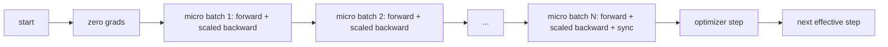
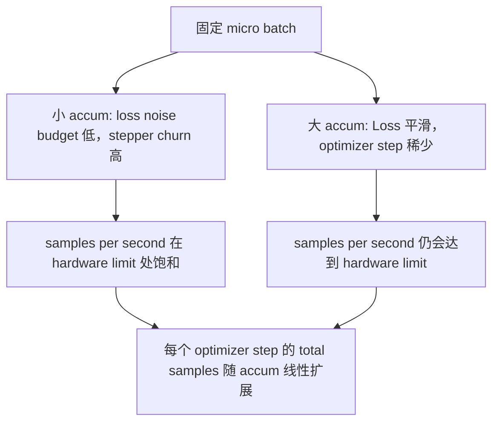

# 渐进积累

> 用一个微型批量,训练出你负担不起的有效批量――规模损失,暂缓优化步骤,让渐进的积累――

**Type:** Build
**Languages:** Python
**Prerequisites:** Phase 19 lessons 42 to 45
**Time:** ~90 minutes

## 学习目标

- 推导有效批量恒等式:`effective_batch = micro_batch * accum_steps`,我知道.
- 实现每微批量损失规模化,让积累的渐变量 匹配一次完整的全批次倒退.
- 在最后一个微批次之前跳过优化同步
- 读取产量与有效批量曲线相比,并解释降低回报――

## 问题

你想使用有效的批量512 训练,因为损失曲线更平滑,优化步骤在这个规模上更合理――桌上的加速器在耗尽内存前只能容纳32个例子――加倍批量不可行――把模型减半也不可行――领域2017年开始采用并沿用到目前为止的技巧是:运行16次倒退,让格拉迪ент在参数缓冲中积累,并且只能在计数中实现目标时执行优化步骤――

风险在于,损失 不再是大批次时的相同数值. 将16个小批次的交叉进化直接相加,将是一个全批次损失的16倍. 没有扩展, 渐进方向是正确的,但幅度是错误的,优化步骤会大16倍.

## 概念



合同短暂:

- 每个微批量的损失在`backward()`之前除了`accum_steps`鱼默认将渐进加到`param.grad`现在,我们已经开始了.
- 每个有效的批量一次触发,在最后一个微批量的后退后――中途步骤会扭曲后续整个运行所依赖的每个参数――
- 优化器的状态 (momentum buffer、Adam moments) 每个有效的步骤一次进步,而不是每一个微批次进步一次――否则指数动平均会看到错误频率,并消耗掉时间表――
- 在单个设备上,这只是会计. 在多级集群上,同一个模式将不会是最后的微批包在.`no_sync`在文本中,跳过渐进式全部减少;最后一个微批会一次性减少 完整的积累式渐进式,而不是支付N 次网络成本──

### 代码中的等效证明

```python
loss = criterion(model(x_full), y_full)
loss.backward()
opt.step()
```

等价格

```python
for x, y in chunks(x_full, y_full, n):
    scaled = criterion(model(x), y) / n
    scaled.backward()
opt.step()
```

除了浮点总和顺序的差异──循环结束时积累的梯度缓冲与一次全批后退会产生的度相似──课程代码在`equivalence_check`中用小于1e-4的最大abs差距断言这一点.

### 价格上去哪里

每个微批都需要一次向前一次向后.`outputs/accum-curve.json`中央输出曲线显示了固定微批次下面有效批次增长时会发生什么:



没有免费的午餐.`accum_steps`翻倍,会让每个优化步骤的墙时间翻倍――变化是渐进估计的变化:在相同的墙预算下,你执行优化步骤更少,但每次都在更多的样本上平均――文献把大批和小批视为不同的优化问题;本课关注的是机制,而不是统计――


```figure
cc-grad-accumulation
```

## 建立它

`code/main.py`它做了三件事.

### 步骤1:等效检查

`equivalence_check()`用相同的种子构建相同的网络的两个副本.一个在一次前进传递中看到16个样本批量.另一个看到四个4个样本部分,并把损失除以四.函数在优化器步骤前比较梯度缓冲,后比较参数.`max_abs_diff < 1e-4`,我知道.

### 步骤2:最后步骤的同步模式

`train_one_optimizer_step`通过微批次,除了最后一个微批次,每个都会进入`no_sync_context(model)`在单个过程中,这个背景是没有开放的;在DPD中,这里会跳过渐进的全部减少.`sync_counter`记录我们离开无_sync范围的次数;对于N 个微批次,数量是每个有效步骤一次,而不是N 次。

### 步骤3:输出曲线

`sweep_effective_batches`使用固定微批和一组积累步骤 运行同一个模型──每个设置都会记录:

- `samples_per_sec`看到的总样本除了墙时间
- `median_step_ms`每个有效步骤的50个百分比
- `sync_calls`受到触发的集体点
- `avg_loss`:扫的优化步骤平均值

输出落在`outputs/accum-curve.json`并可从笔记本中复用.

运行:

```bash
python3 code/main.py
```

脚本先打印等效差,再打印扫描表,最后打印JSON路径──出口代码零──

## 用它

在生产培训中,渐进积累 藏在一个子后面.`accumulation_steps = effective_batch // (micro_batch * world_size)`△这里不允许使用的框架会包裹同一循环,但步骤是相同的: 规模损失,跳过非最终微软上的同步,积累,步骤 一次.

实践中有三个模式:

- 微批量被选为能满设备内存.
- 从学习率表中选择──大有效批次需要扩展学习率和升温;这是自2017年以来一直讨论的线性扩展规则──
- 积累数量是两者之间的桥梁,也是你唯一能在运行时间自由调节而不重写数据加载器的按.

## 运送它

`outputs/skill-gradient-accumulation.md`抓住这个食谱,让同伴可以把它放进新的储备库.`accum_steps`规模损失,在非最终微软上跳过优化器同步,每个有效批量只步骤优化器一次,把吞吐量与有效批量以JSON记录,让交易可见――

## 运动

1. 用`--num-steps 100`重新运行扫描,并绘制每秒的样本与有效批量.
2. 添加一个错误扩展变异 (不做除法),并展示步骤 1 时相对参考的参数差异.
3. 将 SGD 换成 AdamW,并确认优化状态 每个有效的步骤一次进步,而不是每一个微批次进步一次.
4. 引入真实`DistributedDataParallel`包装,并把 `no_sync_context`路由到它的方法――确认同步调用 每个有效批量 减少N-1──
5. 修改等效检查,对比两种不同的微分分数 ((2 x 8 vs 4 x 4),并解释你需要放宽任何宽容的──

## 关键词

| Term | What people say | What it actually means |
|------|-----------------|------------------------|
| Micro batch | 你 forward 的 batch | 单次 forward pass 中能放进 memory 的 slice |
| Accum steps | 每个 step 的 backward pass 数 | 在一次 optimizer step 前累加的 backward 数量 |
| Effective batch | 这个 batch | Micro batch 乘以 accum steps，再乘以 data parallel world size |
| Loss scaling | 除以 N | Per-micro-batch division，使 summed gradients 匹配 full batch |
| Sync on last | 跳过其余部分 | 只在 window 中最后一次 backward 上运行 Gradient collective |

## 进一步阅读

- 关于 鱼 的 文件 中关于 `DistributedDataParallel.no_sync`内容介绍 技术的制作 版本
- 关于大批次训练的线性扩展,是关心有效批次的经典原因.
- 关于渐进积累与混合精度不扩展的交互.
- 第19阶段课程42至45 覆盖本课所假设的模型、数据加载器、优化器和培训员架架――
- 阶段19课47 覆盖检查点和恢复,让长时间积累运行 能在墙钟上下存活.
