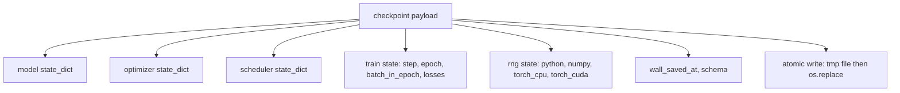
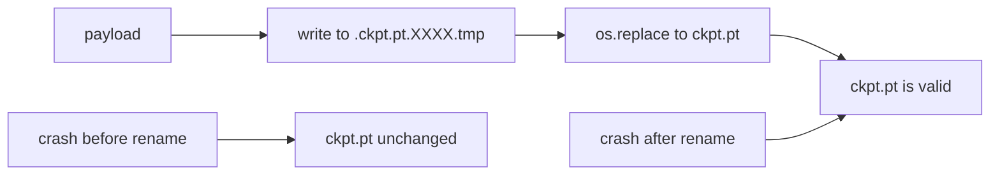
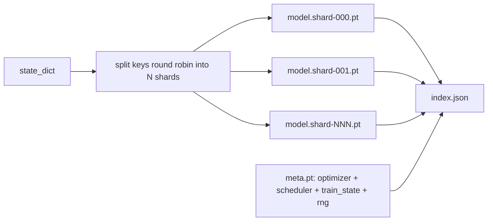

# 检查站 保存与恢复

> 训练中断会杀死运行;检查点 让它们可以继续――原子化保存模型、优化器、调度器、损失历史、步骤计和RNG状态,这样任何时刻都会停止,磁盘上都会留下一个有效文件――

**Type:** Build
**Languages:** Python
**Prerequisites:** Phase 19 lessons 42 to 45
**Time:** ~90 minutes

## 学习目标

- 让它重新加载到全新的过程中.
- 使用先写入时间重命名的方式实现原子保存,确保崩永远不会留下写到一半文件.
- 恢复Python、NumPy 和 PyTorch的RNG状态,使恢复后的损失匹配未断的基线――
- 为了不再可以放入单个文件的模型 构建分块化检查点布局,包含通过哈希验证的分块和一个JSON索引.

## 问题

你设置了一个训练任务,预计运行18小时――墙钟上限是4小时――第11小时,集群重启,因为某个比你薪资级别更高的人批准了内核升级――没有检查点,你就要从头开始――没有恢复,你也会丢失前11小时学到的优化状态,所以即使模型重量 留下来,AdamW时刻也已经消失了,下一步突然朝训练轨迹已经跳过了方向――

正确的文物是单一文件,其中保存继续训练所需的一切:模型参数、优化状态、调度状态、用于绘制损失历史、当前步骤和时代以及批次时代计数,还有每个随机来源的RNG状态──没有RNG状态,恢复后的损失曲线就会是另一条曲线──同一个模型、相同的数据、不同的混动、不同的落后面具、达什上板不同的数字──

原子保存是本合同的另一半.直接写入最终文件名意味着,在写入中发生了崩.将留下腐败文件;恢复会读到垃圾.写入同一目录中的临时文件,然后重新命名,意味着,在写入中发生了崩.之前的好文件不会被触碰.在 POSIX文件系统上是原子的重新命名.

## 概念



### 五个国家桶

| Bucket | 为什么重要 |
|--------|------------|
| Model | Weights 和 buffers；也就是 model 本身。 |
| Optimizer | Momentum 和 adaptive moments；没有它们，下一步就是另一个 Optimization 问题。 |
| Scheduler | Learning rate 在 curve 上的位置；cosine schedules 尤其在意这一点。 |
| Train counters | Step、epoch、batch-in-epoch，以及绘制 dashboard 的 Loss history。 |
| RNG state | 为 dropout、data shuffling，以及 model 内部的任何 sampling 提供 determinism。 |

### 原子储存



两条规则──第一,临时文件必须位于目标所在的同一目录中,这样的重命名才会停留在同一个文件系统内;跨设备重命名 不是原子的──第二,临时名称对每次尝试都必须是唯一的,避免两个作者相互覆盖──

### 碎片化检查站

当模型变大时,单文件有效载荷会变得太大,加载不够快,检查不方便,而且在网络共享中读动时非常痛苦.



索引记录碎片数量、每个碎片的 sha256,以及 meta文件的 sha256──当任何哈希不匹配时,载荷器会明确失败──碎片可以落在不同的物理磁盘上;meta 很小,会先读取──

### 简历 从时代中途继续

让简历的时间从几分钟到一天不等.`(epoch, batch_in_epoch)`加 RNG状态――加载之后,训练循环会将随机数生成器 快进过去的当前时代中已经消耗的批量,然后从`batch_in_epoch`继续──本课代码精确完成这一点;断言是恢复后的损失轨迹会在1e-4范围内匹配未断的基线──


```figure
cc-atomic-checkpoint
```

## 建立它

`code/main.py`提供四个原始和一个演示驱动程序.

### 抓获并恢复RNG状态

`capture_rng_state`返回一个字节,包含Python的`random.getstate`      `np.random.get_state`及PyTorch CPU 和 CUDA RNG字节.`restore_rng_state`对于PyTorch的RNG,它是个8字节缓冲器.

### 步骤2:原子储存

`atomic_save`将有效载荷 写入目标目录中的临时文件,然后使用`os.replace`将其交换到最终名称.`atomic_write_json`执行相同操作.

### 完整的检查站回路

`save_checkpoint`将模型,优化器,调度器,列车状态和RNG 打包到一个指令中.`load_checkpoint`反向恢复它,并返回一个`TrainState`△方案字段是升级:未来格式变化会递增版本字符串,而载体会进行发送──

### 步骤4:碎片变体

`save_sharded_checkpoint`以圆方式把参数键分为N个分片中,用各自的原子保存写入每个分片,写入包含优化器和列车状态的一个元文件,并写入包含分片 Sha256 的JSON索引.`load_sharded_checkpoint`现在我们要把每一个碎片都结合起来.

### 步骤5:恢复演示

`run_resume_demo`会将一个小模特 训练`total_steps`在`interrupt_at`保存检查点,然后继续运行――第二个过程 会恢复检查点并运行剩余步骤――该函数 返回断路点后两条损失轨迹的最大绝对差异――有RNG恢复,差异为零或浮点噪音――

运行它:

```bash
python3 code/main.py
```

单文件和碎片的演示都断言最大差距 小于1e-4──摘要会写入`outputs/resume-demo.json`,我知道.

## 用它

生产训练会把检查点作为教练的一部分交付──形状相同:模型+优化器+调度器+计数器+RNG,以原子方式写入,并按步骤命名,便于找到最新文件── 分享布局 通过并行阅读 支持大型模型加载;`index.json`这就是让这个事实成立的一部分.

强制执行三种模式:

- **Schema 是 payload 中的一个 string。**根据它分支.没有它,你就无法在不破坏旧运行的情况下发展.
- **对每个 shard 计算 Sha256。**静默截断的下载是最糟糕的错误;
- **让 checkpoint cadence 保持诚实。**每个N步骤一次保存,并且每隔几分钟保存一次,取更短者――否则,崩发生在一个很长的步骤上时,会浪费整个窗口的工作――

## 运送它

`outputs/skill-checkpoint-save-resume.md`是任何新训练脚本的配方:付费形式,原子写,RNG捕获,缩写索引.把这个技能放进备份,在定期保存网站中.`save_checkpoint`启动中 接入`load_checkpoint`运行就能杀死.

## 运动

1. 用按参数组 分片替换圆碎片`.weight`结尾的层与`.bias`什么时候每种布局更合适?
2. 扩大保存循环,保留最后的K 个检查点,并清理更旧的点――当磁盘很小时,合适的K 是多少?
3. 添加一个`--ckpt-every-seconds`标志,按墙钟间隔 触发保存,而不仅仅按步骤计数.
4. 添加一个检查总数验证路径,在启动中运行,扫描目录中的每个检查点,并报告哪些已经腐败了──
5. 实现一个`migrate_v1_to_v2`函数,向用负载 添加一个新字段,并递增图案字符串――让负载 同时兼容两个版本――

## 关键词

| Term | 人们常说 | 实际含义 |
|------|----------|----------|
| Atomic save | “写入然后祈祷” | 写入同一目录中的 temp file，然后用 os.replace 放入 target name |
| State dict | “Weights” | Model parameters 和 buffers，按 parameter name 作为 key |
| Sharded checkpoint | “大 model file” | 多个文件，每个 shard 一个，加上一个 meta file 和一个包含 sha256 的 JSON index |
| RNG state | “Random seed” | python random、numpy、torch CPU、torch CUDA 的捕获状态；不只是 seed |
| Mid-epoch resume | “Restart” | 快进 RNG，并从同一 epoch 中的下一个 batch 继续 |

## 进一步阅读

- 子`rename`语义,用于支 `os.replace`原子性要求所依赖的
- 关于 鱼`torch.save`和 `torch.load`文件,包括用于跨设备恢复的`map_location`,我知道.
- 第19阶段课程46 涵盖本课的检查点实用负载可以跨越保存的梯度积累.
- 第19阶段课程48 涵盖了本方案兼容的状态规定格式对应分布式包装.
- Linux内核`fsync`核改名后续续性保证的说明文件.
