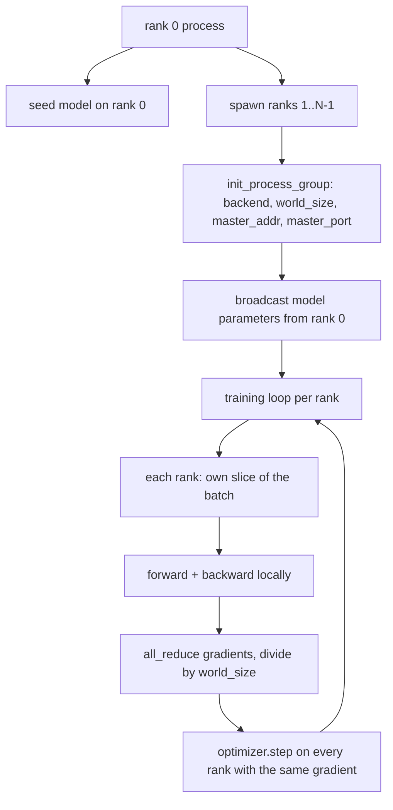
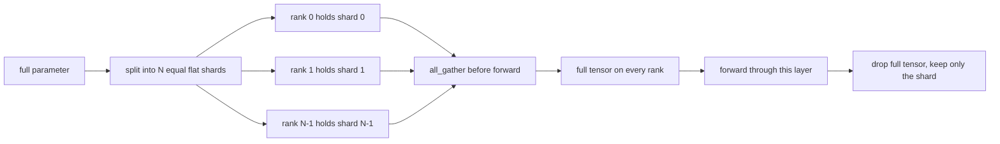

# 从零构建分布式数据并行和FSDP

> 多级训练是两个集体和一条规则. 启动时,广播参数,后退 后平均梯度,永远不要让每个级别对自己处于哪一步产生分歧.

**Type:** Build
**Languages:** Python
**Prerequisites:** Phase 19 lessons 42 to 45
**Time:** ~90 minutes

## 学习目标

- 使用 `gloo`后端 启动跨N 个级别的过程组,不需要特殊硬件.
- 实现最小的DDP包装,在施工时播放参数,并向后 后全部降低梯度──
- 证明每级梯度的全减匹配 连接输入 上的单过程梯度――
- 勾勒FSDP参数分碎:每个级别 持有一个切片,前进通过 时收集全子,之后下降.

## 问题

模型能放进一个设备――数据设置 放不下――优化预算 要求你在每秒钟内看到N 倍样本――第一个杆是数据平行:每个级别在批次的不同片段上运行同一个模型,然后在优化步骤之前的平均梯度――第二个杆是FSDP:模型本身也放进一个设备,所以每个级别都持有每个参数的一部分,并通过 期间逐步重建完整的杆――

痛点在会计管理中. 如果参数在排名之间漂移,这次运行会静默损坏. 如果你平均梯度,但没有平均损失,仪表板就会撒谎.

本课在CPU上运行.`gloo`随着每一个PyTorch构建 一起提供,并接受`torch.multiprocessing`工人;相同代码切换到多GPU节点上`nccl`时,结构无需改变.

## 概念



### 两个重要的集体

| Collective | 做什么 | 何时使用 |
|------------|--------------|------|
| `broadcast` | 将一个 tensor 从一个 rank 复制到所有其他 rank | Parameter init、scheduler state、任何 one-to-all sync |
| `all_reduce` | 在所有 rank 间对一个 tensor 求和（或 mean、或 max），每个 rank 都得到结果 | Backward 后的 Gradient averaging |
| `all_gather` | 每个 rank 贡献一个 tensor，每个 rank 都得到 concatenation | Logits collection、FSDP parameter unshard |

建设项目合同`broadcast`后退`all_reduce`〔FSDP图片〕 在每一层前进通过 前加入`all_gather`,我知道.

### 匹配单个过程梯度平均

在N个级上使用B个样本的批量训练模型,必须产生与单个过程在N*B的批量上训练相同的梯度──是对每级梯度求和并除以N,得到平均损失梯度,这正是减少交叉缩的平均含量. 在全批量上会产生结果──教训代码会在手动中进行所有降低梯度和参考单个过程梯度之间断定.`max-abs-diff < 1e-3`,我知道.

### FSDP的草图



记忆获取是精确的:每级参数记忆 降至1/N──代价是收集,每次前进通过都必须支付──生产FSDP会将收集与上层的计算重叠,所以墙钟成本比简单核算预测小得多──本课对每个参数做回路,并声称重建与原始比特等等──

### 处理器和黑色后端

虽然CUDA是生产目标,但CPU上也存在相同的代码路径.`gloo`它是CPU集体后端.`nccl`慢几个数量级,但API表面完全相同.`backend="gloo"`始化,并用 `torch.multiprocessing`没有子.`torchrun`两者最终都会调用相同的`torch.distributed`△在多GPU节点上,唯一的变化是`backend="nccl"`器器以及使用`torchrun`启动.


```figure
cg-allreduce-ring
```

## 建立它

`code/main.py`是可运行的文物.

### 步骤1:启动过程组

```python
os.environ["MASTER_ADDR"] = "127.0.0.1"
os.environ["MASTER_PORT"] = str(port)
dist.init_process_group(backend="gloo", rank=rank, world_size=world_size)
```

`MASTER_ADDR`和 `MASTER_PORT`是 rendezvous:每一个级别都拨到同一机器上一个机器.

### 步骤2:建设 时广播

`MinimalDDP.__init__`遍历每个参数和缓冲,并调用`dist.broadcast(tensor, src=0)`列表 0 的值成为了正义的初始.没有这个步骤,每个阶段将使用自己的种子初始化,从第一步开始分歧.

### 后全降低梯度

```python
def all_reduce_grads_(module, world_size):
    for p in module.parameters():
        if p.grad is None:
            p.grad = torch.zeros_like(p.data)
        dist.all_reduce(p.grad.data, op=dist.ReduceOp.SUM)
        p.grad.data.div_(world_size)
```

每个排名最终得到相同的平均梯度――优化步骤现在是每个排名上基于相同输入的函数,这就是为什么整个运行中保持参数的同步――

### 步骤4:证明价格等价性

`manual_all_reduce_matches_single_process`在0级上构建同一个模型,并将后-全部降低梯度与单个过程在连接输入上会计算出的梯度进行比较.

### 步骤5:FSDP回程

`fsdp_round_trip_sketch`平每一个参数,到`world_size`倍数,切片,全部集合,再解散――每个级别的重建都等于原始――这是未切片步骤;其反之则――前进后重新切片)就是从收集的子中取一个切片――

运行:

```bash
python3 code/main.py
```

默认世界规模是2――两个CPU过程生育,通过`gloo`互通,并以零 退出,输出`outputs/ddp-demo.json`捕获每个级别的参数总数,全部减少后的梯度规范,FSDP回路结果以及手动对参考梯度差异.

## 用它

调用相同的原始人──PyTorch 的`DistributedDataParallel`增加了:后向后梯度,用于将全部减少与后向重叠;子所有减少,将多个小梯度合并为一次集体;以及课46 使用过的`no_sync`环境

PyTorch 的 FSDP 增加了:每个层一个平面参数视图,让每个排列 拥有连接缓冲;下层未分类与当前层计算的重叠;以及可选的碎片 CPU 卸载──

形状保持不变:启动时播放,后退 后减少,参数放不下时进行分片.

## 运送它

`outputs/skill-distributed-fsdp-ddp.md`携带新训练脚本的食谱:用`gloo`启动CPU的进程组,用`nccl`启动GPU的过程组,将模型包装在DDP中,在建设时播放并没有倒退后减少,按需使用FSDP草图中的所有_集成模式对参数分片──

## 运动

1. 使用 `--world-size 4`运行,并确认整个运行中参数扩散 保持在 1e-3 以下。
2. 将手动平均 替换为`dist.all_reduce(op=dist.ReduceOp.AVG)`时间差异
3. 给DDP包装 添加后退式,让所有减少与后退的剩余部分重叠;测量墙钟 改善──
4. 实现FSDP重组分段步骤:前进通过后,再次使用本地分段 替换全度.
5. 在 CUDA 机器上将后端切换为`nccl`记录环境变量变化,保持不变的变量.

## 关键词

| Term | 人们的说法 | 实际含义 |
|------|-----------------|------------------------|
| Backend | "gloo or nccl" | 实现 collective ops 的 library；gloo 是 CPU，nccl 是 GPU |
| World size | "Total ranks" | group 中的 process 数量；group 是 collectives 操作的 unit |
| Rank | "Worker id" | group 内的 process identifier，从零开始索引 |
| All-reduce | "Sum the grads" | 在所有 rank 间对一个 tensor 求和，每个 rank 最终得到相同结果 |
| Unshard | "Gather the params" | 通过 all_gather 从 per-rank slices 重建 full tensor |

## 进一步阅读

- 火器`torch.distributed`了解本课依赖的集体语义――
- `gloo`图书馆的集体列表,其形状与CUDA支持`nccl`基本的相同.
- 阶段19课46 了解将DDP全减`no_sync`中的梯度积累模式
- 阶段19课时47:了解可在DPDP和FSDP中运行的存活检查点布局.
- 了解这里的图片的参数分片的生产实施.
