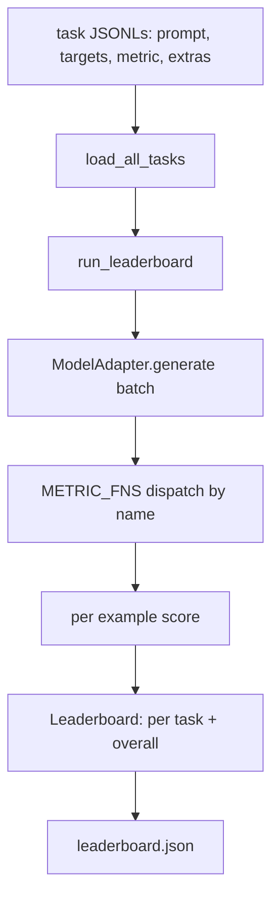
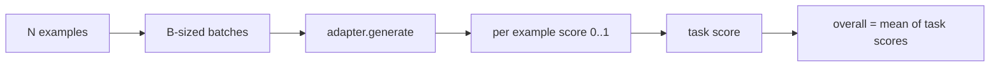

# 语言模型评测 带

> 如果一个模型在你无法定义的任务上表现得很好,那它只是巧合表现得很好.

**Type:** Build
**Languages:** Python
**Prerequisites:** Phase 19 lessons 42 to 45
**Time:** ~90 minutes

## 学习目标

- 将一个任务定义为JSONL文件,每个例子包含`prompt`,我知道.`targets`,我知道.`metric`及可选的`extras`,我知道.
- 实现五个指标:精确匹配,红色-I F1 执行检查,多种选择和子字符串含有.
- 构建一个运行器,按任务 批量处理示例,并分发给可替换的模型适配器──
- 输出排名表 JSON,包含每个任务的分数,延迟以及可复现的总体平均值.

## 问题

诚实问题是:在哪个方面表现好?诚实答案是你自己写的排名榜,因为供应商的排名榜正是他们调优过的.

如果你的 repo 里没有运行,你只能感觉比较两个模型. 如果有运行,你就能在固定任务集合上固定测量,比较它们,并得到可以不同的JSON输出.

陷是让杆 过适合单个模型――修复方式是反过来使用同一个陷:杆 小到十五分钟能读完,任务小到可以随着 repo 发布,指标从零编写以便同事审计,而适配器是唯一放置模型特定代码的地方――替换适配器,领袖板会变化;替换任务,领袖板会变化――其他一切不应该变――

## 概念



### 任务规范

每个例子是一行JSONL:

```json
{"id": "arith-00", "prompt": "compute: 2 + 2", "targets": ["4"], "metric": "exact_match"}
```

对于需要评分助手的指标,`extras`携带旁路的有效载荷:

```json
{
  "id": "code-00",
  "prompt": "python: write a function f that doubles its input",
  "targets": ["ok"],
  "metric": "code_exec",
  "extras": {"io_pairs": [[1, 2], [3, 6]]}
}
```

一个任务是`outputs/tasks/`下一个`.jsonl`文件──文件名就是任务名称── 一个文件中的所有例子 共享同一个指标──

### 五个固定任务

| Task | Metric | 测试内容 |
|------|--------|---------------|
| arithmetic | exact_match | 对确定性答案的 Token 级正确性 |
| summary | rouge_l | 针对单行 reference summary 的 longest common subsequence F1 |
| code-exec | code_exec | 可执行测试：预测出的 function 必须满足一组 input-output pairs |
| multiple-choice | multiple_choice | prediction 的首字母必须匹配允许的 letter |
| generation | substring_contains | Free-form text 必须包含至少一个 target substring |

### 计量合同

每个指标都是一项函数:`(prediction, targets, extras) -> float in [0.0, 1.0]`△利用每例分数平均得到任务分数,再对任务分数平均得到总体――

- `exact_match`转小写、折叠白色空间、判断平等――
- `substring_contains`类似的正常化,做子字符串测试――
- `multiple_choice`接着,我开始写作.
- `rouge_l`计算精度和回忆的F1──
- `code_exec`: 在受限命名空间中执行预测,对每个输入输出对调用`f(x)`统计匹配.

编码_执行测量 会在精简后的内置名字空间 中运行预测――本课的测试断言`import os`会失败,因为`os`不在名字空间中;你无法从代码预测访问文件系统.

### 模型适配器

```python
class ModelAdapter(Protocol):
    def generate(self, prompts: Sequence[str]) -> List[str]: ...
    @property
    def name(self) -> str: ...
```

适应器是接点.`ToyAdapter`实际适配器将调用模型并返回输出.

### 跑步者

`run_task`每批处理`batch_size`个提示,并分发给了测量函数.`run_leaderboard`通过每个任务并寻求平均.`write_leaderboard`输出带图案字符串的JSON,这样未来格式 变化不会静默破坏仪表板──




```figure
eval-harness-matrix
```

## 建立它

`code/main.py`是可运行的文物.

### 步骤1:种子固定任务

`seed_fixture_tasks(target_dir)`写入五个`.jsonl`文件──第一次运行`main.py`如果目录空,它会播放这些文件.

### 步骤2:负载任务

`load_all_tasks(task_dir)`读取每个人都`.jsonl`返回从任务名称到`Example`列表的记录`#`开头的评论线和空白线将被跳过,因此贡献者可以注释这些文件.

### 步骤3:执行指标

每个指标都是一小函数,并带有单元测试.本课的测试套件包含13个案例,覆盖了正常化,部分重叠,代码执行和不安全的代码拒绝.

### 步骤4:写出运行者

`run_task`代批量,并生成一个`TaskResult`包含分数,正确数量,总数和延迟.`run_leaderboard`遍历所有任务,并产生带整体平均的`Leaderboard`,我知道.

### 步骤5:发射JSON

`write_leaderboard`会议序列化委员会`--include-per-example`标志会导出每例记录,这样当分数变化时,你可以把预测与前一次运行做不同的.

运行它:

```bash
python3 code/main.py
```

脚本第一次运行时会种子装置,用玩具适配器 (它会对每个装置进行反应)打分,并写入`outputs/leaderboard.json`△使用玩具适配器 时总分为1.0;`test_main.py`中的接器测试 显示当接器无法回答时,同一个带会产生0.0──

## 用它

要接入真实模型,写一个适应器.

```python
class HttpAdapter:
    name = "vendor.v1"

    def __init__(self, endpoint, api_key):
        self.endpoint = endpoint
        self.api_key = api_key

    def generate(self, prompts):
        out = []
        for prompt in prompts:
            response = http_post(self.endpoint, prompt, self.api_key)
            out.append(response["text"])
        return out
```

在`main()`顶部把`ToyAdapter`换成`HttpAdapter`,任务,指标和排名表都保持不变.

在真实项目中发布杆时,需要强制执行三个模式:

- **Pin task files。**否则任务文件一变分数就会变化,而你无法判断是哪个变化了.
- **Diff predictions，不只是 diff scores。** `--include-per-example`旗让你看得分 下降当天模型最终说什么.
- **限制 batch size。**真实适配器有限量量――小批量大小 可以让使用 兼容不同供应商――

## 运送它

`outputs/skill-lm-eval-harness.md`携带配方:JSONL任务规格,5个指标可替换适配器,批量运行器,带图案字符串的排名表 JSON。`outputs/tasks/`中部任务文件是固定件;把它们复制成真实项目中的起点.

## 练习

1. 添加第六个任务,并使用你从零编写的自定义指标,类似于蓝色的重叠,类似于蓝色的参考分数,或任何合同的清晰东西)
2. 扩展`code_exec`抓住失败并接受一组预期失败作为目标
3. 添加一个排名表差命令:给定两个 `leaderboard.json`文件,印制 发生变化以及变化程度的任务
4. 限制每个例子的延迟――使用时间外包适配器调用; 在排名表中暴露一个单独的`timeouts`列
5. 在排名板中使用 sha256 脚任务内容,这样未来的读者可以验证他们评价相同的任务.

## 关键术语

| Term | 人们的说法 | 实际含义 |
|------|-----------------|------------------------|
| Task spec | “eval format” | JSONL 文件，每个 example 包含 prompt、targets、metric 和可选 extras |
| Metric | “你怎么打分” | 从 (prediction, targets, extras) 到 [0, 1] 内 float 的函数 |
| Adapter | “model client” | 带有 generate(prompts) -> list[str] method 的对象；唯一的模型特定代码 |
| Leaderboard | “scoreboard” | 包含 per-task scores、total counts、latency 和 overall average 的 JSON |
| Code exec metric | “运行它并检查” | 在受限 namespace 中执行 prediction，并与 input-output pairs 比较 |

## 延伸阅读

- 原始的IM-评估-利用可作为生产级参考,规模大得多,但形状相同.
- 拥抱脸的光是同一个合同的另一种实现.
- 第19阶段课46 覆盖了杆评测的训练堆中使用的梯度积累模式──
- 第19阶段课时47 覆盖了你评测所针对的检查点格式; 在排名表中,
- 第19阶段课时48 覆盖了生成被测模型的分布式训练堆.
