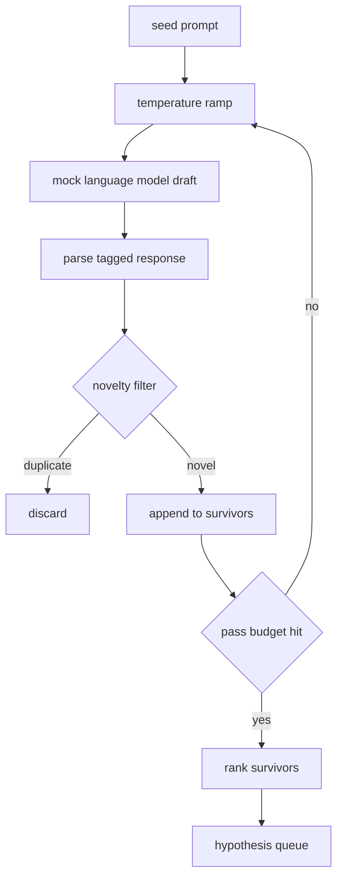

# 假设生成器

> 一个研究代理如果再问两次同样的问题,就是浪费的代币.

**Type:** Build
**Languages:** Python
**Prerequisites:** Phase 19 Track A lessons 20-29
**Time:** ~90 分钟

## 学习目标
- 从种子提示驱动样本,并将其输出转换为带类型的假设记录.
- 在每次通过上升样品温度,让下一个草案比上一个漂移更远.
- 用一个小型嵌入模型和近似重复项.
- 用混合新奇性,特异性和可测试性的评分函数对幸存项排列.
- 让每一步都保持确定性,使同一个种子总是产生相同的队列.

## 为什么先生成,再过

一个规划者调用一个模型一次,只能得到一个假设――这对工作的例子来说没问题――但对研究循环来说形状不对――循环需要一个有深度的排列队列,这样当第一个假设失败时,运行者已经准备好了下一个,不必再支付一次完整的样本测试通过的成本――

两个想法组合起来产生这个队列.第一是温度升级:每次通过样品器 时都把温度升高一点,让后面的草案更愿意游走.第二是新奇的过:每次的草案 之后,发电机测量它与每个前者生存的嵌入距离,并拒绝任何落在集群内部的内容.

本课提供了一个模拟语言模型,它将针对固定提示返回脚本化的代币序列.

## 假设形状

```text
Hypothesis
  id             : int           (monotonic within a run)
  text           : str           (the claim)
  variables      : list[str]     (what changes between conditions)
  metric         : str           (what the runner will measure)
  baseline_ref   : str | None    (which paper or run the comparison cites)
  draft_pass     : int           (which sampler pass produced this)
  temperature    : float         (the sampler setting at draft time)
  novelty_score  : float         (distance from prior survivors, 0..1)
  rank_score     : float         (weighted sum used for ordering)
```

`variables`和 `metric`没有自由文本. 解析者会从带标签的反应中提取它们. 第五十二课中的运行者在构建实验的配置时会直接读取这些段落.

`baseline_ref`对于测量,需要一个基线进行比较. 如果假设省略了它,评估者会回归同一指标上一次运行.


```figure
cg-novelty-ramp
```

## 架构



这一环很直接. 意思是,每个盒子都有严格的合同.

## 温度

从`t_min`开始,到`t_max`结束,步骤为`(t_max - t_min) / (n_passes - 1)`△每次通过都用当前温度调用样本,从`GeneratorConfig.schedule()`产生`n_passes`个均间隔的值.`(prompt, temp_bucket)`索引的脚本化反应 之间切换来遵守温度.桶是开区间,因此温度的小幅变化会选择不同的桶,并产生不同的草案.`temperature=t`,我知道.

默认时间表是从`0.2`到了`1.2`六次足以填满队列,不必为新奇的过器反正会拒绝样本 付费.`0.2`时,模型会复述种子.`1.2`时,响应往往偏离主题并导致解析者失败.

## 新品过器

每个草案被解析后,生成器会嵌入文本,并与每个已接受的假设相比较.嵌入是小型化包的词代币,并正常化到单元长度.`1 - dot(a, b)`如果被提名到任何前生存者, 最小距离高于`novelty_threshold`通过它.`0.25`,我知道.

哈希嵌入并非高级――它是确定性的、零依赖,并足以捕捉显而易见的情况:两个草案 共享大多数名词――生产部署 会换成小型句子模型――接口 保持不变――

## 排名分数

```text
rank_score = w_novelty * novelty_score
           + w_specificity * specificity_score
           + w_testability * testability_score
```

没有任何其他方法.`novelty_score`是与前一个幸存者最小的嵌入距离.`specificity_score`是假设中具体变量的数量除以目标数量.`testability_score`在假设同时指定指标和基线 时为一,只指定指标 时为二分之一,否则为零.

默认权重是`0.4`,我知道.`0.3`,我知道.`0.3`△权重位于发电机配置中,因此下游课程可以调整它们,而不必叉代码──

## 假语模型

```python
class MockLLM:
    def sample(self, prompt: str, temperature: float, seed: int) -> str:
        ...
```

给定`(prompt, temperature, seed)`时,样本是确定性的.`(prompt_signature, temperature_bucket)`索引的脚本化响应表. 如果表没有某个键的输入,样本会返回一个让解析器失败的倒退. 其中一个测试将覆盖这个倒退路径.

种子会混入反应,因此同一个`(prompt, temperature)`配上不同种子会产生不同的草案.测试中我们固定种子,以保持结果可复现.在真实部署中,种子会来自系统钟或计量器.

## 输出排列

输出是按`rank_score`降序排序的`Hypothesis`记录列表――第五十二课中的跑者 弹出头,运行实验,第五十三课中的评价者 写回判决――如果判决说假设 错了,跑者就弹出下一个――

队列是有限的. 当它为空时,乐团员可以扩大种子提示并再次运行发电机,或者停止并报告预算耗尽.

## 如何阅读代码

`code/main.py`定义`Hypothesis`,我知道.`MockLLM`,我知道.`HypothesisGenerator`和一个确定性演示器`run(seed_prompt)`返回排序后的排列;通过数量从 `GeneratorConfig.n_passes`读取,而不是作为一个论点传入.嵌入是化代币袋. 新奇性过器是一个单独的函数.`numpy`由于数学是纯粹的课程,因此本课保持便携式.

`code/tests/test_generator.py`覆盖线路"",重复拒绝路径"",解析器故障路径"",温度坡路界限和排名排序"",

## 它在哪里?

第五十三课读取两者的结果并写出判决. 第五十一课组合成一个没有人参与的研究循环.人可以在任何边界介入.
