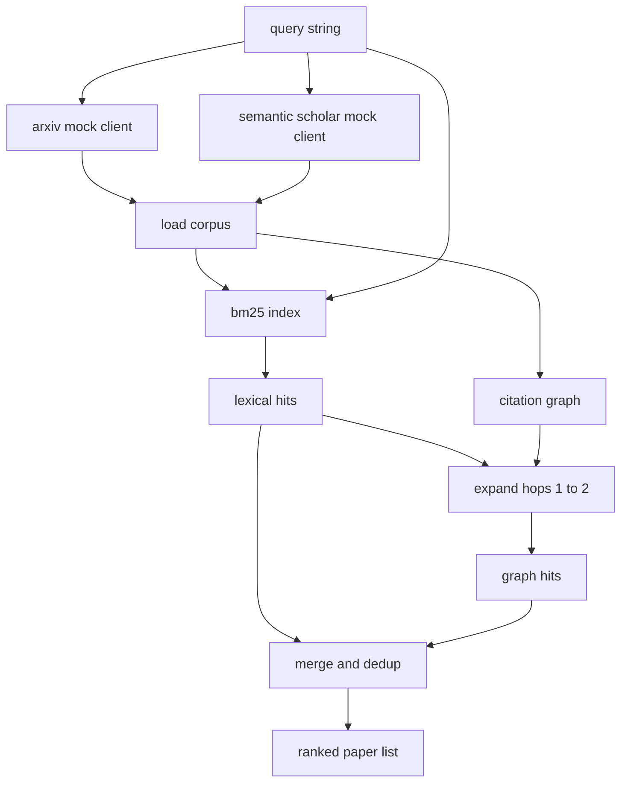

# 文献检索

> 假设很便宜.知道有人已经证明了它,才是昂贵的部分.

**Type:** Build
**Languages:** Python
**Prerequisites:** Phase 19 Track A lessons 20-29
**Time:** ~90 分钟

## 学习目标
- 用循环下游会读取的字段,为一个小的纸张记录
- 仅使用stdlib 数据结构,在摘要上构建BM25指数.
- 遍历引用图,浮现词典搜索遗漏的论文──
- 通过稳定的纸 id,对词汇和图形 两轮命中结果去重
- 将两个假的外部API包装在单个客户端后面,这样真实终端点 接入时,上游电话网站 保持不变――

## 为什么需要两轮检索

对于摘要做关键词搜索,会回来与查询共享词汇的论文. 这涵盖了大部分表层情况.但它会错过两类情况.

本课会构建这两轮──摘要 上的BM25 捕获词汇的成功──引用图的穿越从种子集 出发,向前和向后扩展一到两跳──二者的并集按纸 id 去重,并使用一个小型的组合分数 排序──

## 纸质形状

```text
Paper
  id          : str           (稳定 identifier，mock corpus 中为 "p001")
  title       : str
  abstract    : str
  year        : int
  authors     : list[str]
  references  : list[str]     (这篇 paper 引用的 paper ids)
  citations   : list[str]     (引用这篇 paper 的 paper ids)
  source      : str           (提供它的 mock api，"arxiv" 或 "s2")
```

引用和引用 字段形成有向引用图.`id`它们是的.


```figure
cg-citation-hops
```

## 建筑



检索客户端 拥有这两轮和 merge──调用者传入一个查询,并拿回一个排名列表;其中每个条目都携带每张纸质分数 字段(`bm25_score`,我知道.`graph_distance`,我知道.`recency_score`,我知道.`final_score`),用于解释排序.

## 从零实现 BM25

实现使用标准 Okapi BM25,默认参数为`k1=1.5`,我知道.`b=0.75`指数是两个词典:`term -> doc_frequency`和 `term -> list of (doc_id, term_count)`△文件长度是抽象的标记数量.△平均文件长度在索引构建时计算一次.△对查询 打分时,会对查询术语 求和:`idf * tf_norm`在其中`tf_norm`是标准BM25 长度归归一化术语频率──

标志者是先`lower`没有做出决定. 生产系统将转换为一个小的投票.

```text
idf(t)      = log((N - df + 0.5) / (df + 0.5) + 1.0)
tf_norm(t)  = (f * (k1 + 1)) / (f + k1 * (1 - b + b * dl / avgdl))
score(d, q) = sum over t in q of idf(t) * tf_norm(t)
```

## 引用图的穿越

从一篇论文指向它的引用――从一篇论文指向它的引用――反向是宽度的第一搜索,以顶部BM25击中为种子,最多两跳――

两跳是刻意设置的上限. 一跳太浅;代理常常需要直接的祖先或后代. 三跳会让连接图的结果规模膨胀,并且容易偏离主题. 本课把跳跃限制暴露在一个配置键,这样下游循环可以紧紧紧它.

## 排名

两轮会回归重叠集合――合并 使用纸 id 作为关键――每篇纸的最终分数是加权混合――

```text
final_score = w_bm25 * bm25_score_norm
            + w_graph * graph_score
            + w_recency * recency_score
```

`bm25_score_norm`是BM25分数除了合并组中最大的BM25分数.`graph_score`对直接词汇的打击 为一,一跳为`0.6`两跳为`0.3`否则为零.`recency_score`是从最小的零到最大的年份之间的线性坡.

默认重量是`0.5`,我知道.`0.3`,我知道.`0.2`△重量是配置的;旧话题可能会调低近期,而快速变化的话题会提高它.

## 假冒的体体

百篇论文,由`build_corpus()`生成──每篇论文都有一个手写标题和摘要,主题来自五类之一:注意力稀缺性、检索增强性、低级适配器、数据集蒸和评估利用力──引用和引用已连线,让每个主题都形成一个连接的子图,并带有少量跨主题边缘──

两个假的API客户端`ArxivMockClient`,我知道.`SemanticScholarMockClient`读取同一个文本,但暴露不同字段──Arxiv 返回标题、抽象、年、作者──语义学家 增加引用和引用──检索客户端 按 id 取并集;跨客户端领域的分歧处理 留到后续课程──

## 第52课和第53课会读取什么

课52中中的跑步者 会读取 `paper.id`,我知道.`paper.title`作为实验的背景,以及抽象的前三个句子.`paper.year`和 `paper.references`根据本文的基础,将归因于某篇具体的论文.

检索客户端 返回一个 `RetrievalResult`并且包含排名列表和每次查询的指标:击中数量,平均分数,顶点分数,总墙时间.

## 如何阅读代码

`code/main.py`定义了`Paper`,我知道.`ArxivMockClient`,我知道.`SemanticScholarMockClient`,我知道.`BM25Index`,我知道.`CitationGraph`,我知道.`RetrievalClient`和一个确定性演示. 和模拟客户和体积 放在同一个文件中,这样课程保持可移植.

`code/tests/test_retrieval.py`覆盖词汇路径,图形路径,并,解散和空查询.

## 它在什么位置

课五十 产生一个假设――课五十 一 搜索文献,判断该假设 是否已经有定论――如果没有,课五十二 运行实验――课五十三 读取检索结果 和实验指标,写出判决――检索客户是四个阶段中最便宜的,并且会在乐队中首先运行――
