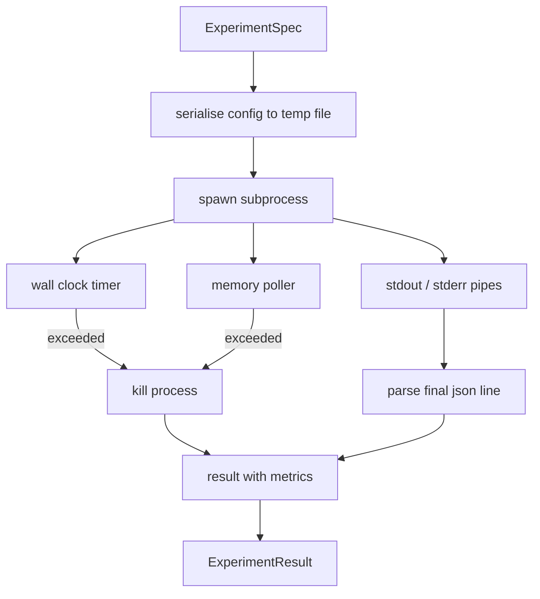

# 试验运行者

> 循环的诚实程度取决于它的测量――构建运行器:它接收一个规范,在沙盒子子中执行,并发出一个评估者 可以信任的 json测量器blob――

**Type:** Build
**Languages:** Python
**Prerequisites:** Phase 19 Track A lessons 20-29
**Time:** ~90 分钟

## 学习目标
- 试验将编码为一个类型的规格,运行者可以将其串行给子进程.
- 启动一个带硬墙钟时间和软内存帽的子进程,并将将二者都暴露于终端条件.
- 将ddout,stderr和结构化指标的块 捕获到单个结果记录 中.
- 构建缩表,在固定基准上一次扫一下配置按.
- 给定种子时,让每个结果都保持确定性,这样评估者在多次运行中看到相同的数字.

## 为什么使用子工艺

研究循环 会运行不值得信赖的代码――假设来自样本,实验脚本也来自同一个路径;把其中任一个作为安全的过程中的代码,都在等待一次会拖管弦仪的崩――子进程是语言自带的最简单的孤立:一个独立的过程、一个独立的地址空间,以及父母侧的信号处理――

这里的跑步者没有实现完整的沙盒.没有cgroup,没有seccomp过器,也没有命名空间重组. 它拥有墙钟时间限度,用于检查内存增长的投票循环,以及在任一限上终止过程的杀戮路径.

## 实验 形状

```text
ExperimentSpec
  spec_id        : str            (stable id，"exp_001")
  hypothesis_id  : int            (链接回 lesson 50 中的 queue)
  script_path    : str            (要运行的 python script 路径)
  config         : dict           (作为一个 json arg 传给 script)
  seed           : int            (experiment 的 deterministic seed)
  wall_timeout_s : float          (hard timeout，超出则 kill)
  memory_cap_mb  : int            (soft cap，轮询；超出则 kill)
  metric_keys    : list[str]      (evaluator 会读取的字段)
```

脚本存在磁盘上;运行器会把配置 写入一个临时文件路径,脚本再读取它.脚本应该在 stdout 上打印单个 json 线,其键是`metric_keys`它们会被捕获,但测量分析师会忽略它们.


```figure
cg-runner-limits
```

## 建筑



跑步是一个类,带着一个主要方法. 波勒是一个小线程,每隔一个投票间隔 醒来一次,并在可用时从 proc文件系统 读取子进程的`psutil`类似;当平台不暴露它时,退化为没有 op──

## 为什么软的内存帽

需要硬件内存盖`resource.setrlimit`通过POSIX上工作.本课程提供了一个便携式的方法:从平台轮询居民设置尺寸,如果超过限量,就会杀死子进程.

在没有过程检查支持的系统上,民调员会记录一次性警告并禁用自己.

## 捕获和

跑步者会在完成时读取并排空两条管子―― 停下来会逐行扫描;最后一个能够解析为JSON 并且包含所有必要的`metric_keys`的线 会被视为指标blob──更早的 json线 会保留在结果中作为 `intermediate_metrics`评估者可以使用它们绘制学习曲线.

首先会原样捕获到结果中──跑者永远不会因为非零出口代码而提高;它将代码记录在结果中──任何非零出口都标记为`"crash"`尽管脚本印了指标,因此评估员默认将部分运行当作失败.

## 排放表

```python
def ablate(base: ExperimentSpec, knob: str, values: list[Any]) -> list[ExperimentSpec]:
    ...
```

给定基准和按名称,该辅助器会返回每个值对应的一个规格,并覆盖`config[knob]`每个特点都会得到一个派生.`spec_id`(`f"{base.spec_id}_{knob}_{value}"`提供一个`AblationRunner`按顺序运行这些规格,并返回一个按值为关键的`AblationTable`,我知道.

为什么一次只改变一个按──全因子扫描 会指数级膨胀,并产生评估者 无法解释的结果──一次一次一次一次会产生评估者 能绘制清晰轴──本课只把多按扫描 支持由调用组合的重复单个按的废除──

## 确定性

每个标志都带着一个种子. 运行者会通过配置命令将种子转发到脚本.`config["__seed"] = spec.seed``code/experiments/`中的假实验脚本 会尊重种子,并跨运行 产生相同的指标――课53 中的评价者依赖于这一点;没有确定性,所谓的"回归"可能只是不同的随机初始化――

## 假实验脚本

本课提供一个实验脚本:`code/experiments/sparsity_experiment.py`△它是一个真实脚本,会读取自己的配置文件,使用无数随机通行 模拟一个小型训练运行,并打印一个Json指标blob──脚本 支持`sleep_s`按 用于测试时间,也支持`allocate_mb`按 用于测试记忆测试器.

模拟并没有真正训练任何东西――它是一个数字计算,模仿训练循环的形状:损失曲线、最终困惑、墙时间――本课重点是跑步,而不是模拟――真实实实验脚本会进口一个模型――

## 结果形状

```text
ExperimentResult
  spec_id              : str
  hypothesis_id        : int
  exit_code            : int
  terminal             : "ok" | "timeout" | "oom" | "crash"
  wall_time_s          : float
  peak_rss_mb          : float | None
  metrics              : dict
  intermediate_metrics : list[dict]
  stdout_tail          : str
  stderr_tail          : str
```

评价员 会先读取 `metrics`和 `terminal`如果终端不是`"ok"`测量器的判决会自动生成.否则,测量器会传入意义测试.

## 如何阅读代码

`code/main.py`定义了`ExperimentSpec`,我知道.`ExperimentResult`,我知道.`ExperimentRunner`,我知道.`AblationRunner`和一个确定性演示――子进程管理 是一个类――记忆测量器 是一个小线――消灭辅助器 是一个单独的功能――

`code/experiments/sparsity_experiment.py`是测试使用的模拟实验. 它从 argv 读取配置文件路径,并在完成时写出单个json指标行.

`code/tests/test_runner.py`覆盖成功路径,时间过关路径,崩路径,除除取表以及跨两次运行的确定性检查.

## 它在什么位置

第五十五课 生成假设―― 第五十一课 过掉文献 已解决的内容―― 第五十二课 针对剩余部分运行实验―― 第五十三课 读取结果,运行意义测试,并写出编辑器 存储到假设 id 上的判决――
