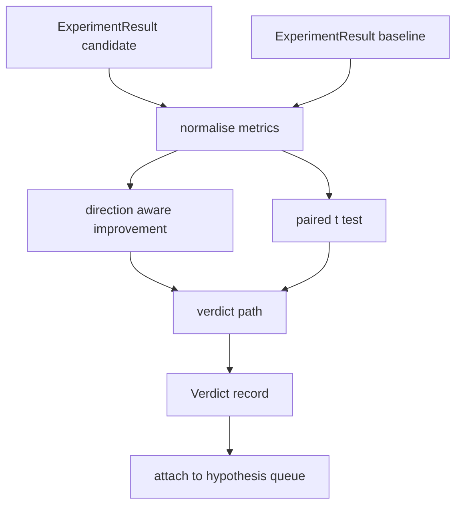

# 结果评估器

> 运行者 产出数字――评价者 判断这些数字代表改进,回归,还是噪音――构建一条判决 路径,把测量 转换成一句结论――

**Type:** Build
**Languages:** Python
**Prerequisites:** Phase 19 Track A lessons 20-29
**Time:** ~90 minutes

## 学习目标
- 使用带方向的改善和固定门,将候选人运行与基线进行比较.
- 从头上每种种子的测量上运行对对的 t测试,并读取得到的p值.
- 对于日志规模的指标做正常化,让下游报告可以将它们与线性指标混合.
- 输出每个假设的判决,让乐队主持人可以将其添加到第五十课队列.
- 让每一步都保持纯洁,使相同的输入总是产生相同的判决.

## 为什么要做双重测试

运行者给出的单个数字无法说明变化是否真实. 同一个配置换一个种子会得到不同的困惑.变化可能只是噪音. 正确的比较方式是对对:相同的种子,相同的数据,一次运行与候选人,一次运行与基线.

本课从开始实现测试.`scipy.stats`△数学足够小,一屏就能读完.

```text
diffs    = [a_i - b_i for i in seeds]
mean     = sum(diffs) / n
variance = sum((d - mean) ** 2 for d in diffs) / (n - 1)
t_stat   = mean / sqrt(variance / n)
df       = n - 1
p_value  = two_sided_p(t_stat, df)
```

通过使用Lentz继续分数,使用使用使用了整个实现只是六十行的数学.

## 方向意识的改善

有些指标变大时表示改进 (精度,吞吐量) 其他变小时表示改进 (损失,乱,墙时间) 评估员在每个指标上携带一个`direction`字段.

```text
if direction == "higher_is_better":
    improvement = (candidate - baseline) / abs(baseline)
elif direction == "lower_is_better":
    improvement = (baseline - candidate) / abs(baseline)
```

改善是有符号的. 对较高的比较好,负的改善表示候选更差.

一个固定的门`improvement_threshold=0.02`无论 p 值如何,判断都是"噪音";这个循环不关心用户测量不出来的变化.


```figure
cg-paired-verdict
```

## 建筑



评估者运行三个独立计算,并判定 路径中把它们合并并──每个计算都是没有共享状态的纯函数──

## 记录规范

乱相对于损失是指数关系――损失降低0.1 会让乱出现更多的降低――直接在两个配置之间比较乱没有问题,但如果要在单个报告中把它与线性指标混合,就需要正常化――

本课会对`scale`字段为`"log"`任何测量在计算上得到改善 前取自然的日志――门 随后会在日志空间中应用――杂从32降到28下,在较低的比较更好 上是`log(28) - log(32) = -0.133`百分之二的门远高于百分之二的门.

```text
if scale == "log":
    a = log(candidate)
    b = log(baseline)
else:
    a = candidate
    b = baseline
```

`scale="linear"`它们的代码路径同时处理两者.

## 每种种子对对测试

第五十二课的跑步者会为每次跑步输出一个最终的测量分数. 对对测试,评估者需要候选人. 每种种子,一个分数,一个分数. 每种种子,一个分数.`ExperimentResult`记录交给评估员.

评估者按种子配对`result.metrics["seed"]`),然后通过请求的指标. 如果两组列表中的种子不匹配,评估员会抛出.`PairingError`团团员应该重新运行.

## 判决的形状

```text
Verdict
  hypothesis_id          : int
  metric                 : str
  direction              : "higher_is_better" | "lower_is_better"
  scale                  : "linear" | "log"
  candidate_mean         : float
  baseline_mean          : float
  improvement            : float       (signed, fraction; see direction rules)
  p_value                : float | None  (None if n < 2)
  significance_threshold : float
  improvement_threshold  : float
  verdict                : "improved" | "regressed" | "noise" | "failed"
  rationale              : str
```

判决路径是一张小决策表:

```text
1. If any candidate result has terminal != "ok": verdict = "failed"
2. else if |improvement| < improvement_threshold:  verdict = "noise"
3. else if p_value is None or p_value > significance: verdict = "noise"
4. else if improvement > 0:                          verdict = "improved"
5. else:                                             verdict = "regressed"
```

理性是一个可以读到的人类的句子,乐队员可以根据假设进行记录到记录.

## 如何读取代码

`code/main.py`定义了`MetricSpec`,我知道.`Verdict`,我知道.`Evaluator`、t统计和不完整的beta辅助器,以及一个确定性测试.

`code/tests/test_evaluator.py`覆盖改善路径、退回路径、噪音路径(小改进)、噪音路径(低n)、失败终端路径、记录正常化路径、与已知参考值对比的t测试,以及对对错误──

## 在哪里这个插槽

第五十二课在多种种种子上使用候选人和基线配置运行实验. 第五十三课读取这些运行并写出判决.

```text
for hypothesis in queue:
    literature = retrieval.search(hypothesis.text)
    if literature_settles(hypothesis, literature):
        attach(hypothesis, verdict="settled")
        continue
    candidates = runner.run_all(specs_for(hypothesis))
    baselines  = runner.run_all(baseline_specs_for(hypothesis))
    metric_spec = MetricSpec("perplexity", direction=LOWER, scale=LOG)
    verdict = evaluator.evaluate(hypothesis.id, metric_spec, candidates, baselines)
    attach(hypothesis, verdict)
```

这四个课程通过各自定义的数据类组合进去,不需要任何额外的粘合剂.
