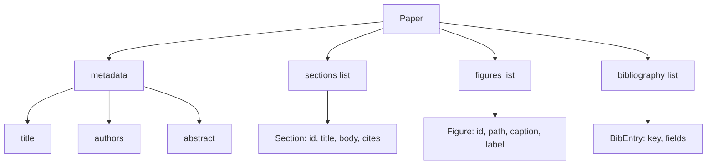
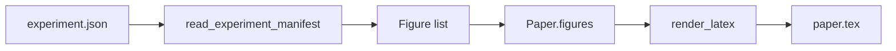
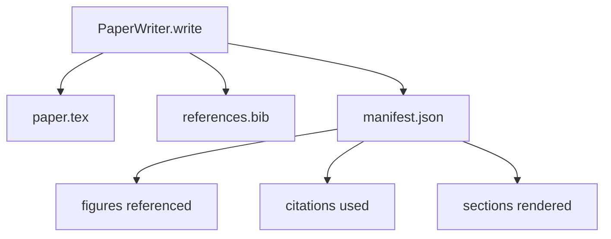

# 论文写作器

> 拉特克斯骨格是研究人员与类型设置者之间的合同. 如果合同被破坏,文档就无法编译,而且失败会很明显.

**Type:** Build
**Languages:** Python
**Prerequisites:** Phase 19 lessons 50-53
**Time:** ~90 minutes

## 学习目标

- 将研究论文视为具有已知部分图的结构化文物,而不是自由形式的文档.
- 在写任何散文之前,生成一个声明抽象的部分,数字插槽和图书馆的拉德克斯骨格.
- 通过确定性槽机制,将实验输出 (路径和字幕) 中的数字注入骨架.
- 连接一个嘲弄的散文发电机,它从结构的轮填写每个部分,让使用可以在没有模型的情况下测试.
- 输出单个`paper.tex`一个`references.bib`再加一个列出每个引用的图像和每个使用的引用的表单.


```figure
ch-paper-skeleton
```

## 为什么要先做一个骨

从散文开始的草案 会积累结构债务――介绍 增长出三段本应放到相关作品内容――某个数字在定义之前就被引用――图书写作 最终为同一篇论文产生三个关键――等作者注意到,重写成本已经高于写费――

骨架会反转这一点――结构先以数据 形式声明――部分是带名和序列的插槽――数字是带 id 和标题的插槽――图书馆关键在顶部声明,并带有它们指向的条款――文章会一次一个插槽 地生成进去――字符可以在写任何散文 之前验证:每个数字都有插槽,每个引用都有条款,每个部分都出现在内容表中――

这与前面课程的应用到计划,工具调用和追踪上学科相似.

## 纸质的形状



每个字段都是普通的Python数据.`Paper`到Latex字符串的纯函数──harness 可以在 render前内视纸:统计部分,列出缺失的数字文件,检查每个 `\cite{key}`它们都相匹配.`BibEntry`,我知道.

## 交换合同

造器保证三个属性. 第一,骨架中每一个数字的插槽都输出一个.`\begin{figure}`块,并带有稳定标签,格式为`fig:<id>`第二,每个部分都输出一个`\section{}`带有稳定标签,格式为`sec:<id>`通过这些链接可以工作.`\bibliography`区块,其`references.bib`精确包含纸上声明的条目,不多也不少.

违反任何条款都是输出错误,而不是警告.

## 实验中的图像注射

本轨 前面的课程把实验输出生成为JSON表现.每个表现带着一个文物列表,包含路径和简体标题.`Figure`记录



图片的标签 由实验名加上单调计器派生──标题 来自 manifest──Paths 会相对于纸的输出目录做正常化,因此即使实验输出 位于磁盘其他位置,LaTeX 也可以编译──

## 刺的散文发电器

本课不会调用模型.`MockProseGenerator`读取轮形,并确定性 地输出散文――轮形是每个节目 一条短字符串――生成器 会将该字符串扩展成两个短段落,并把节目标题 编织进去――生成散文 只会在轮 声明时名字-滴数字 和引用――

这足以测试作家的每一种行为──真实实现将发电机换成模型调用──周围的利用不需要改变──这就是说散文发电机声明为可调用的价值:测试换成确定性发电机,生产换成模型版本,管道其余部分保持一致──

## 显现输出

写作者 会向输出目录输出三个文件.



简单的表达是下游评价者或评论员循环 读取的内容――它不解析Latex;它读取表达. 下一课评论员循环将这个表达作为输入,并产生反列表. 这就是为什么表达是合同的一部分,而Latex不是.

## 验证门

之前运行四个门.

1. 每个图片的纸张都是唯一的.
2. 每个部分的`cites`字段引用的图书馆关键已在纸上上声明.
3. 抽象非空──
4. 标题 非空──

失败的门会抛出`PaperValidationError`没有部分写:要么输出全部三个文件,要么也没有一个输出.

## 如何读取代码

`code/main.py`定义了`Paper`,我知道.`Section`,我知道.`Figure`,我知道.`BibEntry`,我知道.`PaperValidationError`,我知道.`MockProseGenerator`,我知道.`PaperWriter`另外一个`render_latex`功能`write`接收输出目录,并输出`paper.tex`,我知道.`references.bib`和 `manifest.json`,我知道.`read_experiment_manifest`助手 会将实验表现列表 转换为 `Figure`记录

`code/tests/test_paper_writer.py`覆盖:没有部分 时的骨格染、带两个部分 和两个数字的完整染、缺失引用口、复制图像身份口、显现内容,以及LateX字符串合同(每个部分输出一个`\section{}`每个数字都输出一个`\begin{figure}`

## 走得更远

实际实现需要两个扩展.`Paper`图形可以编译为博客文章的标记,以及预览使用的HTML.`Paper`上的策略──第二,引用丰富:给定本地DOI缓存,作者从引用键获取BibTeX录像──两者都有价值,也可以在不触摸骨架合同的情况下添加──

骨架是这次下注;;部分,数字和引用 以数据形式声明,散文生成到插槽中,表现与Latex 一起输出──其他每个改进都可以在其组合──
