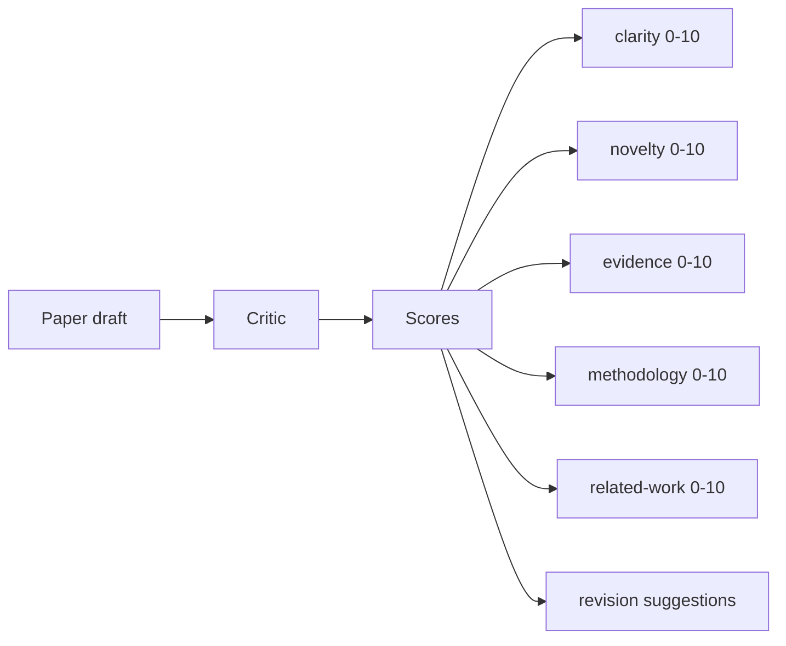
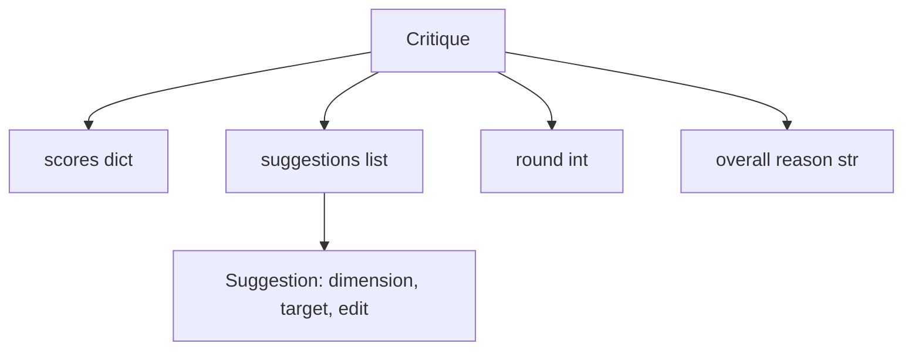
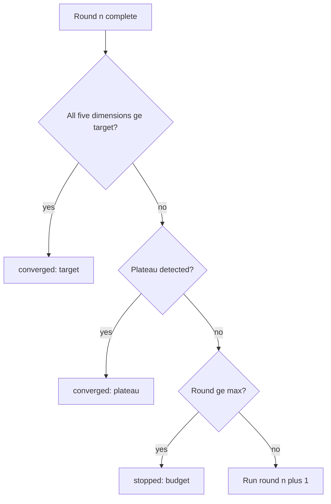
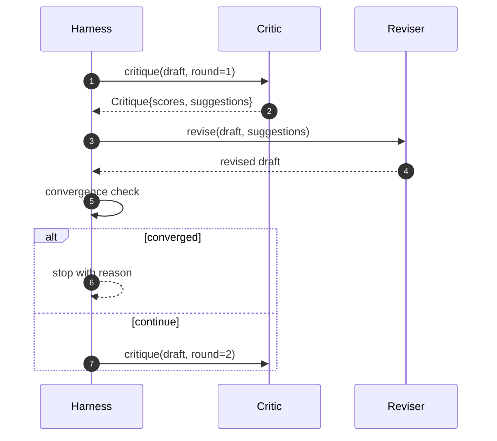

# 批评者循环

> 首先,回复"看起来很好"的批评者是坏的.永远回复"需要工作"的批评者也是坏的.有意的批评者是会收到的,而你必须工程化实现这种收到.

**Type:** Build
**Languages:** Python
**Prerequisites:** Phase 19 lessons 50-53
**Time:** ~90 minutes

## 学习目标


```figure
ch-critic-converge
```

- 按五个固定维度为论文草稿打分:清晰度,新奇性,证据,方法学,相关工作――
- 将每一轮批评应用于结构化修改,而不是自由形式的重写.
- 通过比较多轮分数检测收收;在高原地达目标或预算耗尽时停止
- 用最大的言 预算限制轮数,避免不收的批评 永远运行.
- 输出轮流追踪,让仪表板或下一阶段可以染分数轨迹.

## 为什么使用五个固定维度

自由形式的批评是回复建议段落的模型. 下一轮修订会把这个段落当作环境上下文.

五维度给带一个契约.



分数是一个向量――,会观察每个维度在多轮中的变化――一个提高清晰度,但让证据大幅下降的修订,是证据上回归,转化检查会看到它――只靠模型的批评者无法提供这种保证――

## 结构的批评



每个建议都包含了改进的尺寸,目标部分,以及可应用的修改者.`edit`指令――审稿人也是一款可调用的. 本课提供确定性审稿人,它将编辑指令解释为对节的附加到节的操作. 由模型驱动的审稿人将将同一个字段解释为提示.

## 化规则,按顺序执行

关键循环会在三个条件中任意一个触发时终止.



目标是最严格的情况:五个维度 (清晰度,新奇性,证据,方法,相关工作) 必须达到每一个.`>= target_score`(默认)`8.0`),循环才会回归成功――平均值很高,但一个弱度不够――板块检测会比较当前轮平均值和上轮平均值――如果连续两轮的改善低于`plateau_epsilon`(默认)`0.1`),循环会以`plateau`退出.预算是轮数的硬上限.`5`),并以`budget`退出.

顺序很重要.目标 优先于高原,高原 优先于预算. 如果第三轮在同一时代中既达到目标,又会触发高原,结果是`target`没有`plateau`,我知道.

## 为什么高原检测 跨两轮运行

单轮平原是噪音. 实际的批评者即使面对固定草案,每代也会回来有不同的分数,因为确定性评分仍然取决于应用的建议以及应用顺序.

## 本课中的确定性评论家

本课不调用模型――提供的评论是可调用的,将基于三个信号给草案打分:平均部分 正文长度(清晰度) 数字数和引用数(证据),以及纸质元数据上`originality_tag`字段(新奇) │ │ │ │ │ │ │ │ │ │ │ │ │ │ │ │ │ │ │ │ │ │ │ │ │ │ │ │ │ │ │ │ │ │ │ │ │ │ │ │ │ │ │ │ │ │ │ │ │ │ │ │ │ │ │ │ │ │ │ │ │ │ │ │ │ │ │ │ │ │ │ │ │ │ │ │ │ │ │ │ │ │ │ │ │ │ │ │ │ │ │ │ │ │ │ │ │ │ │ │ │ │ │ │ │ │ │ │ │ │ │ │ │ │ │ │ │ │ │ │ │ │ │ │ │ │ │ │

```text
clarity      在平均 section 正文长度增加时增长
novelty      在 originality_tag 设置为 "high" 时增长
evidence     在某个 section 的 figure_refs 非空时增长
methodology  在存在标题为 "Method" 且有正文的 section 时增长
related-work 在存在标题为 "Related Work" 且有正文的 section 时增长
```

经过一轮的测试,可观察分数上升.

## 完整循环 契约



持有圆的计数,跟踪和融合检查,批判,持有分数,审核者,持有差异,三者都不会碰到彼此的状态.

## 追踪输出

每轮都会输出一个跟踪事件,包含圆数、分数矢量、建议数和融合判决──完整的跟踪会与最终草案 一起返回──下游仪表板可染逐轮分数图──下课代程安排器 会读取跟踪,决定这个分支是否值得保留──

## 防止坏批评的预算

一个永远无法提升分数的建议的评论家将循环锁定到最高的限制.`budget`△用户将其解释为批评错误,而不是草案错误.

## 如何阅读代码

`code/main.py`定义了`Critique`,我知道.`Suggestion`,我知道.`Critic`协议`Reviser`协议`CriticLoop`另外一个`make_deterministic_critic_pair`工厂,它会回归确定性评论和匹配的修改者.`Paper`结构,让本课可以独立运行.

`code/tests/test_critic_loop.py`覆盖:第一轮后单调改进,调整草案 上面目标融合,两轮后平面检测,没有建议可以改进的预算耗尽,对建议的应用进行审核,以及跟踪结构.

## 进一步探索

真实实现会需要两个扩展.第一,维度权重:研讨会论文会更重视新奇而不是方法;期刊则相反.`Critique`结构之上.

关键注是分数向量. 一旦批评被结构化,所有其他改进,融合规则,仪表板,对批评,都可以在不变循环的情况下接入.
