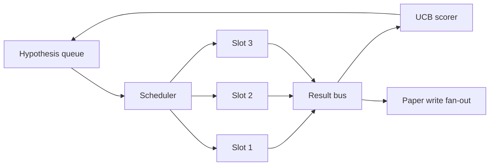
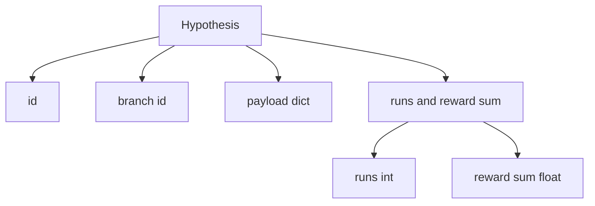
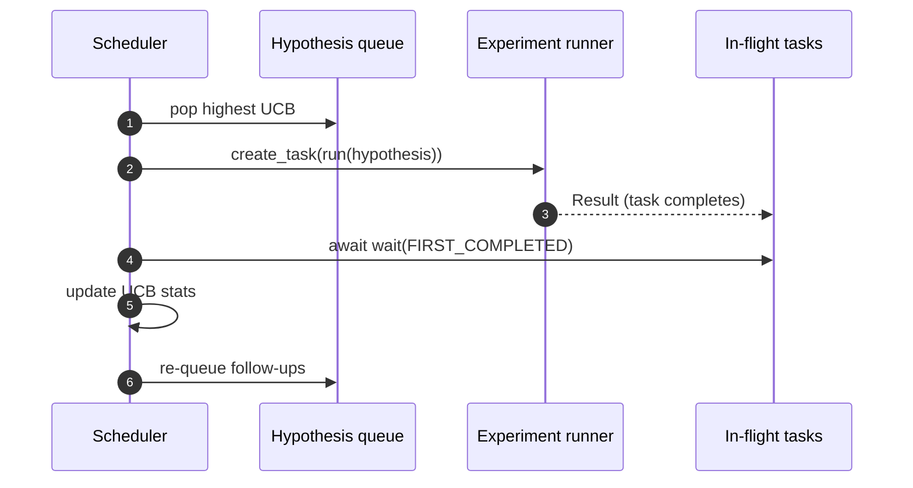

# 复制时间表

> 没有时间表的研究循环,就是一个带着妄想的队列.

**Type:** Build
**Languages:** Python
**Prerequisites:** Phase 19 lessons 50-53
**Time:** ~90 minutes

## 学习目标


```figure
ch-ucb-scheduler
```

- 通过将研究工作流程构建成一个假设队列,它会给并行实验的空隙,结果再反弹.
- 随着这个过程,我们开始运行多个实验,让时间表可以保持所有空中忙碌.
- 用UCB为每个假设分支,让规划者可以在不放弃探索的情况下剪切低产出分支.
- 完成的结果将扩展到纸质写作阶段和排队阶段,让高产出分支生长后续假设.
- 暴露每次代的痕迹,包含分支分数,槽占用量和剪裁决定.

## 为什么是安排器,而不是工作列表

平面工作列表 会按提交顺序运行工作. 当每个工作都独立时,这没有问题.研究不独立:实验三的发现会改变实验四和五的优先级.

有意思的设计选择是得分规则――贪心得分者总是选择当前领导者,永远不探索――平均得分者永远不利用――UCB (上部信心限制) 是中间路径:利用领导者,同时为尝试较少的分支保留容量――

## 系统结构



排列保存假设――调度员 在插槽中 释放时选择UCB最高的假设――每个插槽 异步运行一个实验――完成的实验将结果将将把粉丝到巴士上――巴士会更新来源分支上的UCB统计数据,并在某个分支的收益 跨越门时粉丝到纸质写的阶段――

## 假设 结构



`branch`是 UCB统计的关键. 多种假设可以共享一个分支.`runs`是该部门完成的实验的计数,`reward_sum`博会读取第二个.

## 欧元联储的分数

本课使用的 UCB公式是经典的 UCB1──

```text
ucb(branch) = mean_reward(branch) + c * sqrt( ln(total_runs) / runs(branch) )
```

`total_runs`是所有分支 上已完成的实验总数.`c`是探索重量;本课默认值为`sqrt(2)`为了零的分支会得到`+inf`没有尝试的分支总是先调调.高分支支支支支支支支支支支支支支支支支支支支支支支支支支支支支支支支支支支支支支支支支支支支支支支支支支支支支支支支支支支支支支支支支支支支支支支支支支支支支支支支支支支支支支支支支支支支支支支支支支支支支支支支支支支支支支支支支支支支支支支支支支支支支支支支支支支支支支支支支支支支支支支支支支支支支支支支支支支支支支支支支支支支支支支支支支支支支支支支支支支支支支支支支支支支支支支支支支支支支支支支支支支支支支支支支支支支支支支支支支支支支支支支支支支支支支支支支支支支支支支支支支支支支支支支支支支支支支 支 支 支 支 支 支 支 支 支 支 支 支 支 支 支 支 支 支 支 支 支 支 支 支 支 支 支 支 支 支 支 支 支 支 支 支 支 支 支 支 支 支 支 支 支 支 支 支 支 支 支 支 支 支 支 支 支 支 支 支 支 支 支 支 支 支 支 支 支 支 支 支 支 支 支 支 支 支 支 支 支 支 支 支 支 支 支 支 支 支 支 支 支 支 支 支 支 支 支 支 支 支 支 支 支 支 支 支 支 支 支 支 支 支 支 支 支 支 支 支 支

切割门与采集器分离.`prune_after_runs`下一次试验`3`)后平均奖励 低于绝对的地板`0.2`时,切割将将该分支从未来的安排中移除.

## 使用同步的并行槽

时间表使用 `asyncio.create_task`驱动实验. 每个任务运行实验运行.`async def`调用式,并返回一个`Result`△主循环 使用`asyncio.wait(..., return_when=asyncio.FIRST_COMPLETED)`等待飞行任务 集合,并在每次完成时触发得分更新.



三个插槽并发行. 主循环 永远不会阻在单个实验上. 编程器 会在插槽上 一释放时立即启动新任务,直到队列为空且没有任务在飞行中.

## 风:纸质触发器

当某个部门的平均奖励 跨越`paper_threshold`(默认)`0.7`),且该分支 尚未出炉,编程师将将一个`paper.trigger`在本课中,触发器会被捕获到列表中,方便测试断言.

## 扩散:后续假设

当高产出结果到达时,调度器可以调用用户提供的`expander`在同一分支上生成一个或多个后续假设.`Result`到了`list[Hypothesis]`纯函数――本课提供一个确定性扩展器,将为任何奖励超过纸质门的结果产生两个后续.

## 预算

两个预算会保护时间表,避免逃跑循环.

```text
max_experiments    : 跨所有 branches 运行的 experiments 总数
max_seconds        : wall-clock cap (asyncio time)
```

当任何一个触发时,调度器会停止调度新任务,等待飞行任务完成,并返回最后的痕迹――痕迹包含一个`stop_reason`,我知道.

## 追踪和最终报告

每个安排决定都会输出一个事件. 终结报告 会汇总每分支统计. 总运行. 总墙钟以及触发的纸质触发器. 下一课 结尾演示会读取这个报告 来驱动纸质作家.

## 如何阅读代码

`code/main.py`定义了`Hypothesis`,我知道.`Result`,我知道.`BranchStats`,我知道.`IterationScheduler`另外一个`make_deterministic_runner`工厂,它会回来一个带有可预测的奖励的无机实验运行者――运行者会睡觉 固定的`delay_ms`(默认)`5ms`让同步可观察──

`code/tests/test_scheduler.py`覆盖:UCB 优先选择未尝试分支,并行槽占用,跨越门的纸质触发器,低产出试验,后的分支剪裁,粉丝随访假设,以及预算退出,

## 进一步探索

真实实现将需要三个扩展. 第一,跨会议的持久化 UCB统计:当前统计数据存在内存里;真实安排者会检查点 它们,让重新启动保留已经花掉的探索预算. 第二,多目标分数:每个结果不再输出一个规模奖励,而是输出一个向量,UCB 变成帕雷托式选手.

计划器是研究的地方. 一旦UCB接好,
