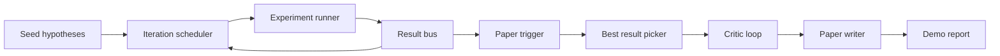
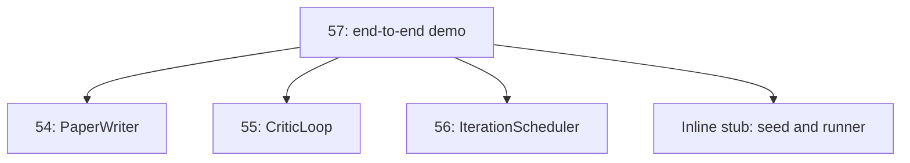
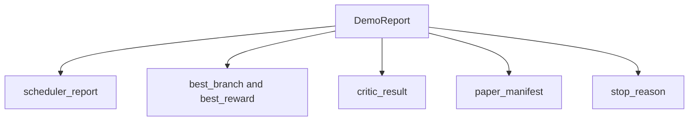

# 终端研究演示

> 任何一个合同都必须合并.只要其中一个泄露,

**Type:** Build
**Languages:** Python
**Prerequisites:** Phase 19 lessons 50-53
**Time:** ~90 minutes

## 学习目标


```figure
ch-research-pipeline
```

- 通过自动研究循环 端到端串连起来:假设种子,实验运行者,安排者,批判循环,论文作家.
- 通过普通Python进口课程中的原始物,而不是通过框架.
- 运行循环直到自行终止,并输出一个列表每个阶段输出单个演示报告.
- 保持示范确定性,使测试套件可以断定最终形状.
- 当任何阶段的合同破坏时,暴露清晰的失败模式,避免下一个阶段使用破损输入 继续运行.

## 这里是什么组合



五个阶段――种子是三条假设的列表――安排器使用三个平行槽在它们之间运行六个实验――bus 报告一个或多个纸引发器――picker 选择单个最佳结果――批判循环 基于该结果 构建草案 进行代――纸作家 输出最终的 LaTeX、BibTeX 和表现――

## 为什么进口而不是复制

之前的每节课都会交付一个带有公共数据类和功能的`main.py`◎ 通过调整`sys.path`它们不是框架线程,与前课中的测试文件相似.



学生可以通过调整两个进口,将在线 stub 替换为那些课程中的真实原始的子和一个同步的奖励函数.

## 确定性保证

演示在构建上就是决定性――实验运行者 使用种种数Py――批判循环的修改器按固定顺序穿过固定维度――纸作家的散文生成器是第54 课中的嘲弄版本――安排器的UCB选手在代顺序上打破联系,而不是随机选择――

给定相同的种子,Demo 会输出相同的报告.

## 演示报告的形状



每个字段都来自上游阶段. 演示不转换任何输出.

## 处理失败模式

每个阶段都需要成功,要么提高一个键字错误.

```text
Scheduler ........ returns SchedulerReport with stop_reason
                   in {queue_empty, max_experiments, deadline}
Best-result pick . raises NoTriggerError if no paper trigger fired
Critic loop ...... returns LoopResult with status converged or stopped
Paper writer ..... raises PaperValidationError on contract break
```

任意阶段的失败都会使用输入的例外短路演示.`test_no_triggers_raises_typed_error`和 `test_best_picker_raises_when_no_triggers`断言当没有分支 触发触发触发 时,选手会提高`NoTriggerError`现在,`BestResultError`写作者永远不会被调用.

## 最好的结果选手

调节器 会按分支输出纸动触发器──选手 选择所有触发器 中中平均奖励 最高的分支──绑定按分支 id 的字母顺序打破,使得Demo 确定性──选手 是一个小型纯函数;测试 使用固定的调节器报告 固定它的行为──

## 串接批评循环

第55课中的批判循环作用于`MiniPaper`通过选用分支,构建一个.`MiniPaper`根据分支的平均奖励设置`originality_tag`(如果`>= 0.8`如果是高的`>= 0.6`为中,否则为低)

随后修改者将草案 代到融合――输出 会进入论文作家――

## 串接纸写作

第54课中的论文作者作用于包含数字和图书写的完整性`Paper`通过 模拟`mini_to_full_paper`升级融合`MiniPaper`根据评论家建议的引用密钥并集构建小型合成图书馆.

## 如何阅读代码

`code/main.py`定义了`BestResultError`,我知道.`NoTriggerError`,我知道.`DemoReport`,我知道.`pick_best_branch`,我知道.`build_mini_paper`,我知道.`mini_to_full_paper`和 `run_demo`△ 顶部进口量将一次调整`sys.path`并从各自的课程中拉取`PaperWriter`,我知道.`CriticLoop`和 `IterationScheduler`,我知道.

`code/tests/test_e2e.py`覆盖:Demo端到端运行并输出一个五个字段 全部填报;两次运行之间的确定性;没有分支 过了门 时的NoTriggerError;作者合同 破坏时的 PaperValidationError;纸质公告 包含选定的分支的数字;以及安排器停止原因是预期值之一.

## 继续扩展

当演示变绿后,有三个值得串连的扩展――第一,恒定状态:每个阶段的结果 写入一个小型的JSON存储,使重新启动 可以不运行便宜的阶段 就恢复――第二,仪表板:调度器 和评论员循环的追踪事件 染为单一的时间线――第三,真实模型调用:将嘲笑散文生成器 和确定性评论员 替换为模型驱动的版本;线程不需要改变――

演示的任务是证明构成就是建筑.
