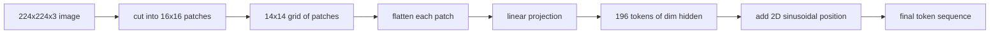

# 视觉编码器 补丁

> 读取像素的视觉模型需要像素分词器――补丁嵌入就是那个分词器――将图像切成正方形网格,展平每个正方形,将其投影到一个线性层,然后添加2D位置信号,以便变压器知道每个正方形在原始图像中的位置――

**Type:** Build
**Languages:** Python
**Prerequisites:** 第19期第30-37课（B轨基础）
**Time:** ~90 分钟

## 学习目标

- 将图像转换为固定长度的补丁嵌入序列.
- 实现基于`Conv2d`面片投影,该投影与展开然后线性的数学相匹配.
- 构建确定性 2D 正弦位置嵌入,以便令序编码空间位置──
- 验证合成装置 上面的补丁 数量、嵌入形状和 `Conv2d`展开等效性

## 问题

变压器接收一系列向量――图像是一个3通道网格――将每个像素作为代码读取导致序列长度爆炸:224x224 RGB 图像是150,528个代码,这是12层变压器无法承受――将图像读取为一个巨大的平面向量会丢弃局部性,而注意层无法从中恢复――编码器前端的工作是将像素网格压缩成数百个代码,每个代码概括一个正方形区域――

补丁嵌入通过线性投影解决了这个问题.将224x224 图像切成16x16块,生成包含196个块的14x14网格.`(3, 16, 16) = 768`像素值展平为一个向量,然后线性层将其映射到模型的隐藏维度.`hidden`网络的剩余部分可以借鉴的序列.

## 概念



### 为什么是补丁而不是像素

注意力是序列长度的二方. 196个符号的序列每层每头花费.`196 * 196 = 38,416`关注力分数; 150,528个代币序列的成本为`150,528 * 150,528 = 22.6 billion`补丁可以减少注意力计算量590,000倍,并且单个16x16区域可以承载足够的信号来执行高级视觉任务. 补丁的成本是细粒度空间细节的损失,这就是为什么下游多模态堆通常在精细定位很重要,运行第二个高分辨率分支.

### 为什么线性投影就足够了

每个补丁都被视为一个独立的向量.`768 * 768 = 589,824`参数) 并且训练速度很快. 存在更深的卷积茎 (混合ViT),但平坦的线性投影是标准的,而且大多数现代开放重量编码器都具有这种精确的形状.

### `Conv2d`技巧

没有填充`Conv2d(in_channels=3, out_channels=hidden, kernel_size=patch_size, stride=patch_size)`给出与展开后线性相同的数值结果,因为每个输出位置将补丁像素与一个波器进行点积.卷积是补丁投影,大多数生产代码库都以这种方式提供,因为它在GPU上速度更快,并且使用重塑次数更少.

### 位置嵌入

两个D正弦嵌入为每个代币提供一个固定信号,用于编码它`(row, col)`位置──嵌入维度的一半是使用正弦/余弦在多频率下编码行位置;另一半是编码列位置──编码是确定性的,因此你可以交换分辨率而无需重新训练,并且它可以干净插入模型中从未见过的网格──

|组件|形状|参数|
|-----------|-------|------------|
|补丁投影（`Conv2d`）| `(hidden, 3, patch, patch)` | `3 * P * P * hidden + hidden` |
|位置嵌入（固定）| `(num_patches, hidden)` | 0（计算，未学习）|
| CLS token（已学习）| `(1, hidden)` | `hidden` |

对于224分辨率的ViT-Base/16:投影中有590,592个参数,CLS代币中有768个参数,正弦位置为零. 下一课 (59) 在该前端顶部堆叠了一个12层变压器.

### 作为健康检查的效率等效性

补丁步骤有两种拼写:`Conv2d`投影和显式展开然后线性――它们必须以相同的重量产生相同的输出――如果没有这样做,则展开数学是错误的,编码器的剩余部分是建立在沙子上――本课中的测试练习了这种等价性――


```figure
ch-patch-tokenizer
```

## 构建它

`code/main.py`实现:

- `PatchEmbed`没有任何`nn.Module`包装`Conv2d`为了补丁投影.
- `sinusoidal_2d(grid_h, grid_w, dim)`构建 2D 位置表的无状态函数.
- `VisionFrontEnd`后者将补丁嵌入,CLS前置和位置添加组合到一次前向传输中.
- 一个`synthesize_image(seed)`助手,可从`numpy.random`构建确定性 224x224x3固定式
- 一个演示,通过编码器前端运行一张固定图像,并打印输出形状、CLS代币范数和一行位置嵌入──

运行它:

```bash
python3 code/main.py
```

输出:224x224固定被编码为形状`(1, 197, 768)`序列――第一个标志是CLS;接下来的196个是补丁标志――位置嵌入范数在一行内是统一的,这就是正弦签名――

## 使用它

同样的补丁前端出现在每个现代视觉语言模型中:CLIP ViT-L/14、SigLIP、DINOv2、Qwen-VL 系列和InternVL 堆都从`Conv2d`补丁投影加上位置信号开始──下游各系列之间的差异(CLS与无 CLS 池化、注册代码、不同的补丁大小 14 和 16 通过插值位置进行动态分辨率)──本课程的前端是每个模型所依赖的基础──

## 测试

`code/test_main.py`涵盖:

- 补丁量匹配`(image_size / patch_size) ** 2`
- 输出形状匹配`(batch, num_patches + 1, hidden)`
- `Conv2d`投影等于在小型装置上手动展开然后线性投影
- 正弦位置表在调调之间具有确定性
- 通过批次播放而不会泄露的CLS代币

运行它们:

```bash
python3 -m unittest code/test_main.py
```

## 练习

1. 用学习到的`nn.Parameter`换正弦位置,并比较小综合分类任务的第一纪元损失――学习位置以固定分辨率获胜;当你在训练后改变分辨率时,正弦曲线获胜――

2. 将`Conv2d`替换为显式`nn.Unfold`加  `nn.Linear`并且说输出匹配在浮动容量差范围内.

3. 增加对非方形补丁大小的支持 (例如,宽屏输入为32x16),并验证位置表处理非方形网格.

4. 分析补丁步骤――补丁投影很少是瓶;下游的注意力层占主导地位――

5. 在 4 类合成形状数据集中,将前端训练为结征提取器.

## 关键术语

|术语 |这意味着什么 |
|------|---------------|
|补丁|图像的方形子区域，通常为 14x14 或 16x16 |
|补丁嵌入 |一个扁平面片到hidden dim区域的线性投影 |
|序列长度|补丁token化后的 token数量，通常加上 CLS |
|正弦位置 |修复了编码 2D 网格坐标的 sin/cos 信号 |
| CLS token |学习向量作为池化头添加到序列前面 |

## 进一步阅读

- 对于原始补丁嵌入框架,图像值为16x16个字符 ((ViT,2021) 』
- 关注是你需要的 (2017) 的正弦位置公式在此适用于2D.
- 根据注册代币的DINOv2论文,你可以添加一个扩展作为练习 6.
