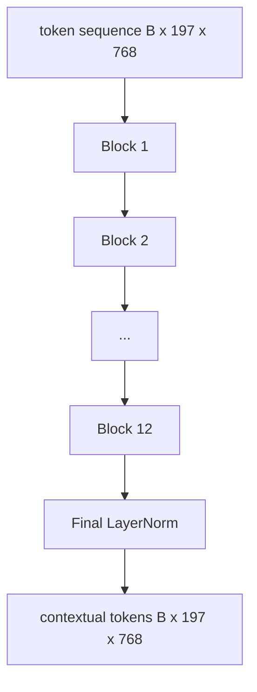
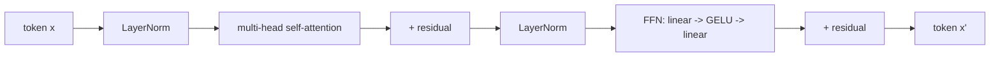

# 视觉变压器编码器

> 补丁单独看不到――具有12个注意力头的12层预备LN变压器将补丁代币序列转换为上下文代币序列,其中CLS代币最终隐藏状态中池化整个图像特征――本课程是每个现代视觉语言模型的引擎室――

**Type:** Build
**Languages:** Python
**Prerequisites:** 第19期第30-37课（B轨基础）
**Time:** ~90 分钟

## 学习目标

- 实现具有多头自注意和前子层的预 LN 变压器块──
- 堆叠12个块,形成了VT-Base编码器.
- 将第58课中的补丁前端连接到编码器并运行前向传递.
- 验证CLS标志是否聚合了每个补丁的信息.

## 问题

补丁嵌入生成一系列197个代币,每个代币都是一个向量,不知道任何其他补丁. 一张猫的图片需要每个补丁才能知道哪些补丁包含胡须,哪些包含背景,哪些包含眼睛.

标准配方为12块深度,12块宽,具有预层Norm 放置、GELU 激活和4倍前扩展──该配方是CLIP ViT-L、SigLIP、DINOv2、Qwen-VL 系列、InternVL以及2025-2026年所有其他开放权重视觉编码器的支柱──该配方足够稳定,您可以阅读任何这些论文并假设该形状的块,除非它们明确有另一个说明──

## 概念





### 后面和后面

原始变压器将LayerNorm 放置在残差之后―― Pre-LN(每个子层前的LayerNorm) 是每个现代视觉语言模型使用的版本,因为它不需要学习率预热技巧即可稳定训练――区别在前向通道中的一条线,深度12+处的梯度流是夜间和白天――

### 更多自觉注意力

每个头都将投影向量为自己的尺寸`head_dim = hidden / num_heads`的`(query, key, value)`没有一个.`hidden = 768`和`heads = 12`每个人都有`dim = 64`△12个头条并行参与,然后它们的输出连接回768个维并通过输出投影.

### 为什么要进行4倍的扩张?

为了`hidden -> 4 * hidden -> hidden`由于这种情况,MLP是模型存储的大部分学到的事实,而更广泛的中间部分是它们所在的地方.

|组件| ViT-Base 规模的参数 |
|-----------|------------------------------|
|每个块的 qkv 投影 | `3 * 768 * 768 = 1.77M` |
|每个块的输出投影| `768 * 768 = 590K` |
|每块 FFN（4 倍扩展）| `2 * 768 * 4 * 768 = 4.72M` |
|每块的 LayerNorm | `4 * 768 = 3K` |
|每块总计 |约 710 万 |
| 12 块 |约85M |
|加前端|总计约86M |

根据2026年标准,这个值很小. 根据2026年标准,这个值很小.

### 面具与否?

视觉变压器仅包含编码器且是双向的:代码器`i`可以参与任何对象的交易.`j`△没有面具. 第61课中的解码器端交叉注意力将使用因果掩码,但在视频编码器内部,注意力是完全连接的.

### 们已经学到了什么?

从学习参数开始,没有自己的补丁内容,并通过每个块的注意力来积累信息.到最后层,CLS行是整幅图像的向量总结;下游头将这个单个向量投影到类逻辑,对嵌入或文本解码器的交叉注意键中.


```figure
ch-cls-funnel
```

## 构建它

`code/main.py`实现:

- `MultiHeadSelfAttention`具有`qkv`和输出投影、缩放点积注意力数学和形状断言──
- `FeedForward`升4倍的升
- `Block`,一个预先的LN块,由注意力和带有残差的前子层组成.
- `ViT`只有12个块的堆积,具有最终的层规则.
- `VisionEncoder`现在,它会`VisionFrontEnd`从第58课连接到`ViT`堆,并公开返回下文序列和池化 CLS向量`forward()`,我知道.
- 一个演示,通过完整的编码器运行合成的224x224固定图像,并每隔一层打印输入形状、输出形状、参数计数和CLS范数──

运行它:

```bash
python3 code/main.py
```

输出:固定编码为`(1, 197, 768)`张量――CLS 范数随着层的组合漂移上,然后稳定在最终层标准――总参数报告约为86M――

## 使用它

这里定义的编码器在宽度和深度上与2025-2026年每一个开放重量VLM提供的块堆相同.

- **宽度和深度。**    `hidden=1024, depth=24, heads=16`;siglipso400m 是`hidden=1152, depth=27, heads=16`同一个块.
- **池化头。**学生们的学习能力和学习能力.
- **位置处理。**固定正弦曲线 (第58课) 与学习的1D、ALiBi与2D RoPE──块数学没有改变──
- **注册token。**现在,我们需要一个新的代码.

接下来的课程将在此基础上进行.

## 测试

`code/test_main.py`涵盖:

- 单个块保留形状,对输入批量大小不变
- 按关键轴的注意力分数总和为1(软最大理智)
- 剩余路径已连接(零输入仍通过CLS代币产生非零输出)
- 四层堆积前向传递产生正确的形状
- 梯度从CLS 输出流向面片投影

运行它们:

```bash
python3 -m unittest code/test_main.py
```

## 练习

1. 添加寄存器标记(CLS 后添加4个学习向量) 并重新运行──通过最后层的软max 分布来比较注意力图的平滑度──

2. 将LN前替换为LN后,并在合成形状分类器上训练一个时代――观察哪个在没有 LR 热身的情况下训练稳定――

3. 实现了这一目标`attn_mask`参数,以便同一块可以重新使用解码器块.`(seq, seq)`,下三角形――

4. 使用 `torch.profiler`分析批量大小为1、8、64的前向传递―― MLP层主导于墙时间,而不是注意力――

5. 用低阶级LoRA 适配器取代一个注意力头的Q-k-v 投影,结结其余部分,并验证梯度仅在您的预期位置流动.

## 关键术语

|术语 |这意味着什么 |
|------|---------------|
|预 LN | LayerNorm 应用在每个子层之前而不是之后 |
|自我关注 |每个token都以相同的顺序关注其他所有token |
|多头|隐藏的dim分布在 `H` 独立注意头中 |
| FFN 扩展 |前馈层在收缩之前加宽至 `4 * hidden` |
| CLS 池 |使用第一个token 的最终隐藏状态作为图像摘要 |

## 进一步阅读

- 对于编码器配方来说,一张图像值16x16个单词.
- 登记标志和自监督预训目标.
- 标LIP (2023),用于第62课中使用的平均池变体和标moid对比损失
